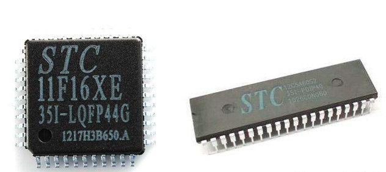
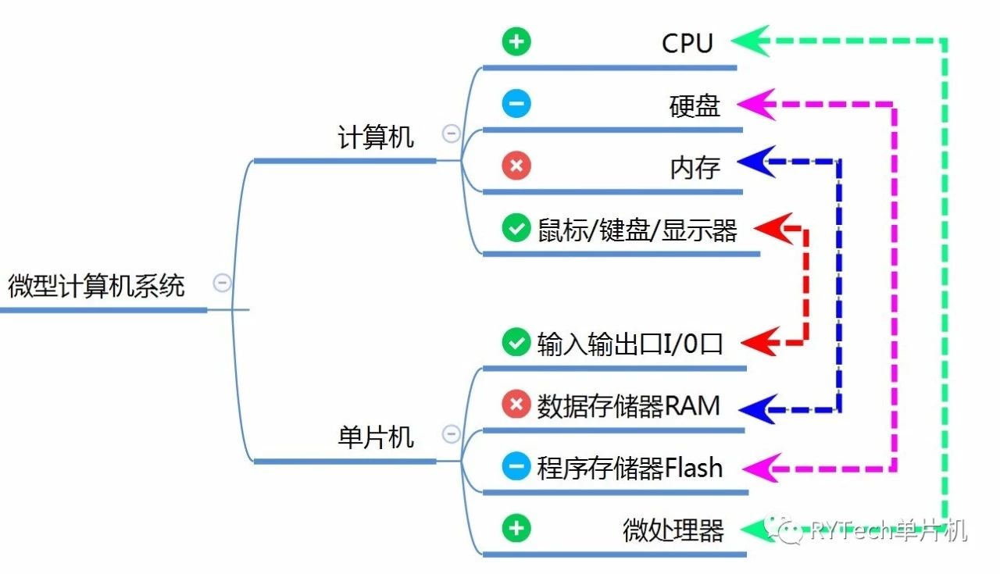

# 前言

对于刚刚接触单片机的初学者来说，会迫切想要知道单片机的功能，掌握单片机的原理，恨不得一口气学完单片机的所有知识。正是这种对新鲜事物的好奇，对知识的渴望，让我们在开始阶段充满了激情，愿意夜以继日，废寝忘食的一头扎进知识的海洋。随着时间的流逝，激情慢慢消耗殆尽，激情不再，转而去寻找更刺激的新鲜事物，造成半途而废，一知半解的后果。不知道你是不是这样，至少我是这样的。

刚刚接触单片机时，心理上或多或少都会产生恐惧心理，满屏都是专业词汇，心里不禁战战兢兢，总在想我一个外行人真的能学会单片机？我该从哪里下手？最常见的方法是百度百科搜索单片机，然后对他的介绍仔仔细细，认认真真的啃一遍，四十分钟至一个小时的时间终于啃完了。回顾一下这一个小时的内容，你突然发现除了认识很多的专业名词和术语，自己好像什么都没看懂，这时会觉得单片机好难，我到底还要不要学？

我想这不是单片机有多难，而是它包含了太多的知识，我们大脑无法短时间内处理如此巨大的信息，因此造成了恐惧心理。你是否还在因为恐惧，而徘徊在单片机门外？

作为初学者，我们应该怎么学习单片机？我的经验是：

**1.总体把握，挑重点**

**2.深入学习，抠细节**

首先我们要对单片机有一个总体的把握，挑出重点和关键词。当我们对他有了总体把握之后，开始对某一个功能深入的学习，将每一个细节抠的越深越好。

我们再回到百度百科里面的单片机介绍，只需要看它的第一段话，其他暂时可以不用看了。第一段话我们可以提炼出 2 个关键字，芯片，微型计算机。

## 它是芯片

也就是说单片机其实是一种芯片，同时它又是一种微型计算机。既然是芯片，那单片机长什么样？我们到网上随便搜单片机的图片，简直就是多如牛毛，我们挑两种看看，如下图所示，这里不必深究，到这里我们对单片机的外型有了直观的认识。直白一点，你可以把它当成一个小黑盒，外面有很多金属引脚。

## 它也是微型计算机

上面我们已经理解了，单片机其实就是一种芯片，直观的讲就是一个小黑盒，那我们看看这个小黑盒里面又有些什么东西。

下面我们看第二个关键词，微型计算机，顾名思义，单片机和计算机之间有某种联系，是的，它就是阉割版的计算机。

众所周知，计算机至少包括几大要素：**CPU，硬盘，内存，鼠标/键盘/显示器。** 同样的，单片机也具备上述几大要素，只不过名称不一样罢了。单片机的 CPU 我们习惯叫微处理器，单片机的硬盘称之为程序存储器 Flash，数据存储器 RAM
就是单片机的内存，输入输出 I/O
口类似于计算机的鼠标/键盘/显示器了。对于计算机而言，这些要素都是集成在一个硕大的机箱里面，而对于单片机而言，它们全都集成这个小小的芯片黑盒子里。既然这些硬件，基础设施都是相似的，那么我们很容易就联想到他们的工作方式也应该区别不大。

## 工作方式对比

那么计算机的工作方式是怎么样的？这里我们以 QQ 软件为例。首先，我们把 QQ 软件安装到电脑的硬盘上，安装好之后，在计算机的 CPU 上运行 QQ 软件，通过鼠标键盘打字，即输入信息，接着显示在显示器上。

单片机的工作方式和计算机如出一辙，我们以单片机点亮一个 LED 小灯为例，首先我们把自己编好的程序下载到单片机的程序存储器 Flash（即硬盘）中，然后在单片机的微处理器（即 CPU）运行程序，通过 I/O(类似显示器)点亮 LED 小灯。

唯一的区别是单片机程序由我们自己设计，点亮小灯的功能没有 QQ 那么复杂。单片机开发，无非就是开发一些特定功能的程序来控制输入输出 I/O 口罢了。单片机知识学习，最终都是以开发有价值的程序为目的。

到这里，我们已对单片机有了一个总体的把握。那么，我们开发单片机程序、下载程序需要用到哪些工具软件？编写程序代码又需要掌握单片机内部的哪些知识？这些将是我们下一阶段的目的。
