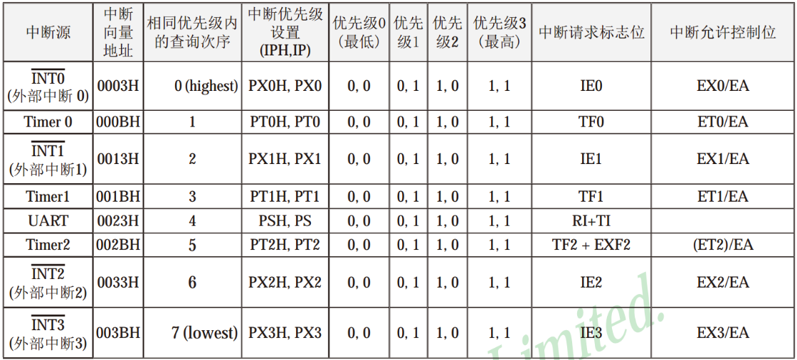
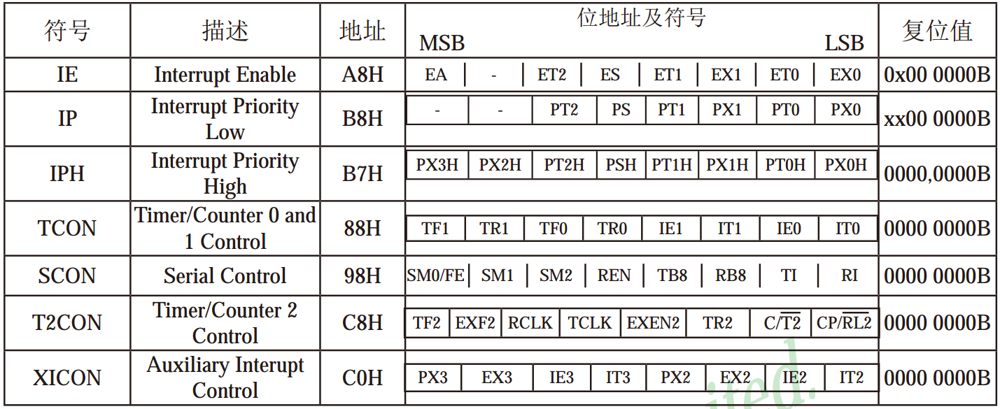
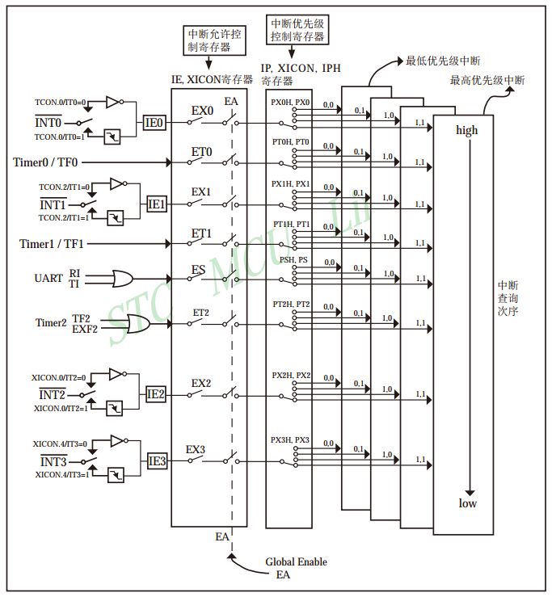
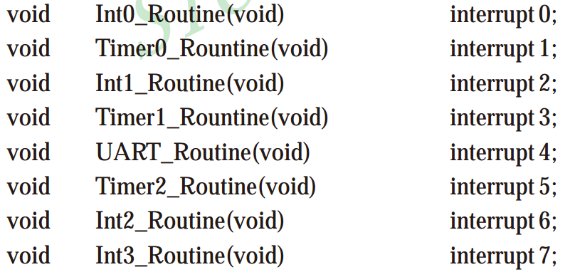
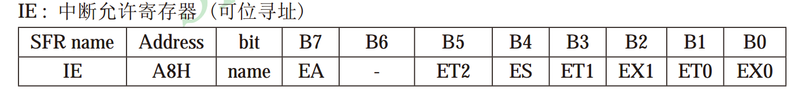
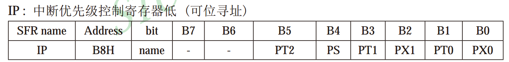
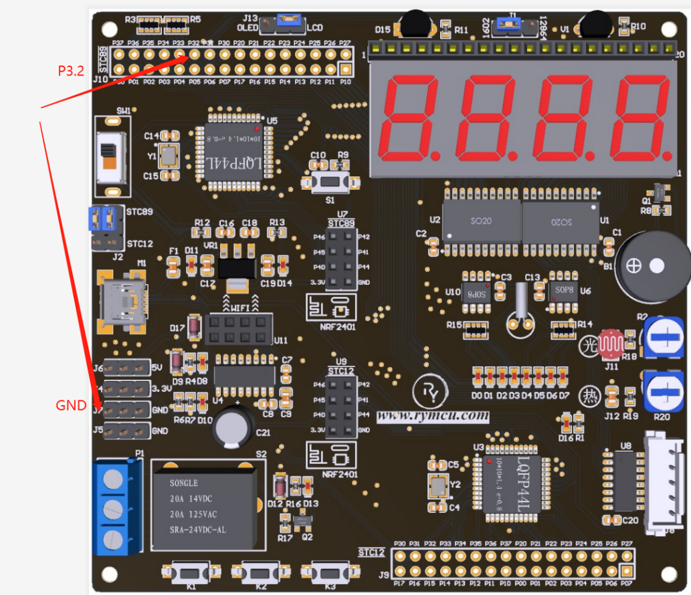
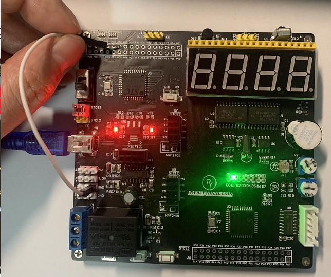

#  第11章 外部中断实验

## 11.1 中断系统知识介绍

在单片机中有两个重要的概念分别叫做中断、中断系统，那么他们分别又代表什么意义呢？当单片机CPU正在运行主程序时外界发生了紧急事件请求，要求单片机停止当前的工作，而去处理这个紧急事件，处理完成之后，再回到主程序原来的地方继续执行，这样的过程称之为中断，实现中断功能的部件称为中断系统。

一般单片机中都有多个中断源，当多个中断源同时发出请求的时候，单片机应该先响应哪一个呢？在单片机中可以设置中断源的优先级，同时出现时，单片机将优先响应优先级高的中断源。另外一种情况，当单片机CPU正在响应某个中断时，一个更高优先级的中断请求产生了，这时CPU将暂停响应当前低优先级的中断，转而去响应高优先级的中断源，响应完成后继续处理低优先级中断，之后再回到主程序继续运行，这个过程称之为中断嵌套。

我们这里举一个生活中的例子来解释中断嵌套的过程。当你正在家中打扫卫生的时候，家里座机响了，这时你便会先放下手中的活，然后拿起电话接电话，在打电话的时候有人按门铃了，这是你暂时先放下电话去开门，开完门之后你接着拿起电话继续讲，当挂断电话后，你紧接着刚才继续打扫卫生了。例子中打扫卫生相当于单片机CPU执行的主程序，电话相当于低优先级的中断，门铃相当于高优先级的中断。在打电话的时候先去开门相当于中断嵌套。

STC89C52单片机提供了8个中断请求源，分别为：

1.  外部中断0（INT0）；

2.  定时器0中断；

3.  外部中断1（INT1）；

4.  定时器1中断；

5.  串口（UART）中断；

6.  定时器2中断；

7.  外部中断2（INT2）；

8.  外部中断3（INT3）。

8个中断请求源可以设置为4级中断优先级，每一个中断源都可以通过软件设置为四级优先级的任一级。高优先级的中断可以打断低优先级的中断，反之则不可。同一优先级的中断同时来临时，则根据中断查询的顺序进行中断响应。

表11-1 中断查询顺序表

  

如上表所示，在相同优先级内 ，外部中断0的查询次序最高，外部中断3的查询次序最低。举例说明：

**第一种情况：**

假设在程序中将INT0(外部中断0)优先级设置为优先级3，INT1(外部中断1)优先级设置为优先级2，那么，此时INT0的优先级高于INT1。

当两个中断同时到达时，单片机优先处理INT0，处理完了INT0，再去处理INT1。

当程序正在处理INT1中断时，INT0中断来了，这时程序跳出来先去执行INT0的中断，处理完了再回来，就是因为INT0的优先级更高，处处都得让着它。

**第二种情况：**

假设在程序中将INT0、INT1的中断优先级设置为一样，都为优先级3。当他们同时到来时，单片机将会先去处理INT0，因为INT0的查询次序高于INT1，如上表所示。

当单片机正在处理INT1的中断时，INT0中断来了，此时，会继续处理INT1中断，等处理完了再去处理INT0中断，就是因为他两的优先级一样，不能相互打断。

我们可以将上述8种中断源分为3大类：

1.  第一种外部中断（INT0、1、2、3）；

2.  第二种定时器中断（Timer0，1，2）；

3.  第三中串口中断（UART）。

每种类型中断的使用方式都是相同的，只不过设置的寄存器不同罢了。前面定时器讲解的就是第二种的定时器0中断。所有中断的控制寄存器如下表所示，包括7个八位的寄存器。如下表所示，IP、IPH寄存器在单片机复位后值均为0，结合表11-1可知，在不对这两个寄存器进行重新设置时，所有中断均为优先级0。

表11-2 中断控制寄存器

  

在分析上述7个寄存器之前，我们先来看一下单片机中断系统结构图，如下图所示。

  

图11-1 中断系统结构图

1.  每一个中断都有一个单独中断允许开关，例如，INT0开关为EX0，Timer0为ET0。如果这个开关没有关闭的话，中断是进入不了单片机的。

2.  之后有一个中断允许总开关EA，这个开关如果断开的话所有的中断都进入不了单片机。

3.  上图中的IE0，IE1，IE2等分别是INT0，1，2的中断标志位，也就是说对应的中断来了他们会被置1。

根据上图举例说明：

首先，当INT0中断来临时，他的中断标志位IE0=1。随后，如果中断允许开关EX0和中断总开关同时都闭合的情况下，INT0中断才会进入单片机内部，这时单片机根据它的优先级高低开始处理了。

在C语言编程中，中断又是怎么来实现的呢？首先在主程序初始化中设置好中断的工作方式，然后允许中断，接着程序执行主程序，当中断来临时，程序跳转到对应的中断子函数中执行相应的操作，执行完之后继续回到主程序。在C语言中，8个中断源对应这8个中断子程序函数，如下图所示，将中断要实现各功能编辑到相应的函数中即可。

  

图11-2 单片机中断函数

如图11-2所示，前面函数的名字可以根据需要进行更改，关键字interrupt x决定了这个函数属于哪个中断，前面讲到的定时器0中断，那么它对应为"interrupt 1"。interrupt 0对应INT0，interrupt 3对应定时器1中断。当中断来了之后，我们具体要干什么工作，将具体的代码写到上述对应的函数中即可。

## 11.2 中断寄存器

STC89C52系列单片机对中断源可开放或屏蔽，是由内部的特殊功能寄存器IE（中断允许寄存器）进行控制的，IE寄存器格式如下：

### 11.2.1中断允许寄存器IE

  

中断允许寄存器IE各位功能定义如下表所示：

表11-3 寄存器IE位定义

--------------------------------------------------------------------------
**控制位**   **功能**
------------ -------------------------------------------------------------
EA           中断允许控制位

               EA=1，单片机CPU开放中断。EA=0，CPU屏蔽所有中断请求。

ES           串行口1中断允许位

               ES=1，允许串行口1中断。ES=0，禁止串行口1中断。

ET2          定时器/计数器T2的溢出中断允许位

               ET2=1，允许T2中断。ET2=0，禁止T2中断。

ET1          定时器/计数器T1的溢出中断允许位

               ET1=1，允许T1中断。ET1=0，禁止T1中断。

ET0          定时器/计数器T0的溢出中断允许位

               ET0=1，允许T0中断。ET0=0，禁止T0中断。

EX1          外部中断1中断允许位

               EX1=1，允许外部中断1中断。EX1=0，禁止外部中断1中断。

EX0          外部中断0中断允许位

               EX0=1，允许外部中断0中断。EX0=0，禁止外部中断0中断。
--------------------------------------------------------------------------

单片机STC89C52复位后会将寄存器IE清零，由户对IE中相应的位清"0"或置"1"来实现中断请求的允许或屏蔽。

**总结一下：**

1.  **EA为中断总开关，EA=1允许中断，EA=0禁止任何中断进入单片机；**

2.  **其他均为各个中断的开关，1表示允许中断，0表示禁止中断；**

3.  **ET0-ET2分别代表定时器0-2，ES代表串口中断，EX0-EX1代表INT0-1。**

### 11.2.2中断优先级控制寄存器IP

传统51单片机具有两级中断优先级，可实现中断嵌套。通过中断优先级寄存器IP可实现优先级的控制。IP寄存器格式如下：

  

中断优先级控制寄存器IP各位功能定义如下表所示：

表11-4寄存器IP位定义

+--------------+-------------------------------------------------------+
| **控制位**   | **功能**                                              |
+==============+=======================================================+
| PT2          | 定时器2优先级控制位                                   |
|              |                                                       |
|              | PT0=0，定时器2中断为低优先级                          |
|              |                                                       |
|              | PT0=1，定时器2中断为高优先级                          |
+--------------+-------------------------------------------------------+
| PT1          | 定时器1优先级控制位                                   |
|              |                                                       |
|              | PT0=0，定时器1中断为低优先级                          |
|              |                                                       |
|              | PT0=1，定时器1中断为高优先级                          |
+--------------+-------------------------------------------------------+
| PT0          | 定时器0优先级控制位                                   |
|              |                                                       |
|              | PT0=0，定时器0中断为低优先级                          |
|              |                                                       |
|              | PT0=1，定时器0中断为高优先级                          |
+--------------+-------------------------------------------------------+
| PS           | 串口中断优先级控制位                                  |
|              |                                                       |
|              | PS=0，串口中断为低优先级                              |
|              |                                                       |
|              | PS=1，串口中断为高优先级                              |
+--------------+-------------------------------------------------------+
| PX1          | 外部中断1优先级控制位                                 |
|              |                                                       |
|              | PX1=0，外部中断1为低优先级                            |
|              |                                                       |
|              | PX1=1，外部中断1为高优先级                            |
+--------------+-------------------------------------------------------+
| PX0          | 外部中断0优先级控制位                                 |
|              |                                                       |
|              | PX0=0，外部中断0为低优先级                            |
|              |                                                       |
|              | PX0=1，外部中断0为高优先级                            |
+--------------+-------------------------------------------------------+

单片机复位后，优先级控制寄存器IP将清零，即所有中断请求均为低优先级。

**总结一下：**

**IP寄存器的各个位是用来设中断具体优先级的。**

### 11.2.3中断优先级控制寄存器TCON

TCON寄存器在第八章定时器中断时讲解过，其中寄存器的高5位为与定时器/计数器相关的功能位，这里不再赘述。这里介绍与外部中断相关的控制位：

  

特殊功能寄存器TCON低4位功能介绍：

表11-5 TCON外部中断位功能定义

-----------------------------------------------------------------------------------------------
**控制位**   **功能**
------------ ----------------------------------------------------------------------------------
IE1          外部中断1请求源（INT1/P3.3）

               IE1=1，外部中断1向CPU请求中断，当CPU响应该中断是由硬件清"0"

IE0          外部中断0请求源（INT1/P3.2）

               IE0=1，外部中断0向CPU请求中断，当CPU响应该中断是由硬件清"0"

IT1          外部中断1中断源类型选择

               IT1=0，INT1/P3.3引脚上的低电平信号可触发中断，IT1=1，外部中断1为下降沿触发方式。

IT0          外部中断0中断源类型选择

               IT0=0，INT0/P3.2引脚上的低电平信号可触发中断，IT0=1，外部中断0为下降沿触发方式。
-----------------------------------------------------------------------------------------------

**总结一下：**

1.  **IE0-IE1分别为外部中断INT0-INT1的中断标志位，当对应中断来临时，IE0或IE1等于1；**

2.  **IT0-IT1为外部中断INT0-INT1的中断触发方式，0表示低电平，1表示下降沿触发方式。**

**中断触发方式：**

中断INT0-INT1的输入引脚分别对应单片机的P3.2，P3.3引脚。以INT0为例子进行讲解。

低电平触发方式，当P3.2引脚的电平为0时，将产生INT0中断。

下降沿触发方式，当P3.2引脚的电平从高跳变到底，即从1跳变到0时，将产生INT0中断。单片机电路会自动捕获这个跳变的过程。

## 11.3 INT0外部中断0应用

当单片机P3.2引脚，从高电平跳变到低电平时，流水灯流动一下。建立工程，并编写int0.c代码如下：

1.  /*******************************************************************

2.  *            数码管显示测试

3.  * ******************************************************************

4.  * 【主芯片】：STC89SC52/STC12C5A60S2

5.  * 【主频率】: 11.0592MHz

6.  *

7.  * 【版  本】： V1.0

8.  * 【作  者】： stephenhugh

9.  * 【网  站】：https://rymcu.taobao.com/

10. * 【邮  箱】：

11. *

12. * 【版  权】All Rights Reserved

13. * 【声  明】此程序仅用于学习与参考，引用请注明版权和作者信息！

14.           

15. * 【功  能】INT0外部中断,下降沿触发实验

16. *******************************************************************/

17. #include<reg52.h>  

18.   

19. #define uint unsigned int  

20.       

21. uint Move = 0;

22.   

23. void main()

24. {

25.     IT0 = 1;//设置INT0为下降沿触发方式

26.     EX0 = 1;//允许INT0中断

27.       

28.     EA = 1;//开全局中断

29.       

30.     while(1);

31. }

32.   

33. //INT0中断函数

34. void int0_r() interrupt 0

35. {

36.     P1 = ~(0x01<<Move);//进入一次中断，流动一次

37.   

38.     if(Move>=8) Move = 0;

39.     else              Move++;

40. }

图11 -3 外部中断0实验代码

**实验操作方法：**

如下图左上角，已经把P3.2通过焊盘引出来了，可以使用杜邦线一端连接GND，另一端触碰P3.2的焊盘模拟下降沿。每触碰一下，流水灯将向前流动一位。

  

图11-4 外部中断0位置

实际操作及流水灯效果如下：

  

图11 -5 外部中断0试验

## 11.4 本章小节

本章详细介绍了单片机中断系统的工作原理以及部分中断寄存器功能的定义。介绍了外部中断0功能C语言程序的编写。
