# 第 13 章 1602 液晶显示实验

## 13.1 LCD1602 液晶显示模块简介

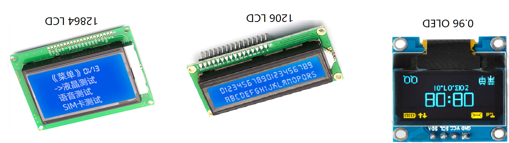

图 13-1 1602 液晶显示模块

16 02 液晶显示模块是一种通用的工业液晶显示模块，专门用来显示字母、数字、符号等的点阵型液晶显示模块。从名字就可以看出该液晶显示模块有2行，每行 16 个字符，共可以显示 32 个字符。

每个字符是由 5x7 或者 5x11 的点阵位组成，我们这里讲解的为 5x7 模式的模块。模块显示界面结构尺寸如下图所示：

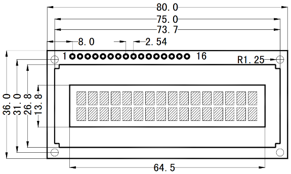

图 13-2 LCD1602 液晶显示模块

与数码管相比，不需周期性的对显示进行刷新，只需将字符按照时序要求发送给 1602 液晶显示模块便可一直显示，有效的节省了单片机的系统资源。

如上图左上角所示， 16 02 模块共有 16 个引脚，包括了电源，数据，控制等引脚，单片机通过这些引脚来控制 16 02 显示相关的内容，我们这一章详细讲解如何控制 16 02 ，并写好相应的底层驱动代码，在后续章节需要使用 16 02
的时候，不需要再来学习它的工作原理，只需调用相应的函数即可，不必再重复造轮子。

表 13-1 LCD1602 引脚定义

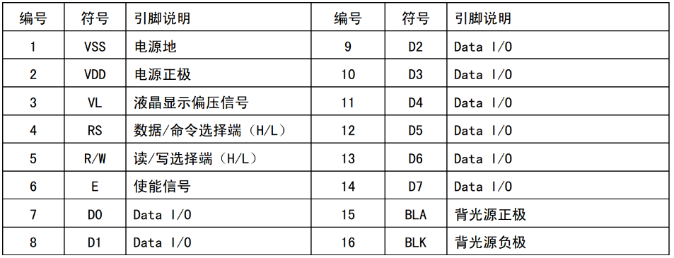

第1，2引脚：VDD、VS S为 1602 供电的正负极，最佳供电电压为 5V。

第3引脚：VL 液晶显示偏压信号，即为显示屏的对比度调节端，当接电源时对比度最高，接地时对比度最低，在使用中往往接一个可变电阻来调节显示对比度。

第4引脚： RS 为数据/命令选择端，当 RS =1时，选择操作 1602 内部的数据寄存器，当 RS =0时，选择操作内部指令寄存器。

第5引脚： R/W 为读写选择端，当 R/W =1时，对 1602 进行读数据操作，当 R/W =0时，对 1602 进行写操作。

第6引脚：E为 1602 液晶显示模块使能端，与 RS， R/W 配合使用在高电平时读取信息，负跳变时执行指令。

第7~14 引脚：为8位的双向数据端口 D0~D7。

第 15， 16 引脚： BLA 背光源正极， BLK 背光源负极。 BLK 接地， BLA 接电源 VDD 时， 16 02 液晶背光点亮，接 GND 时，背光熄灭。

Nebula Pi 单片机开发板 1602 液晶显示模块的电路连接图如下图所示：

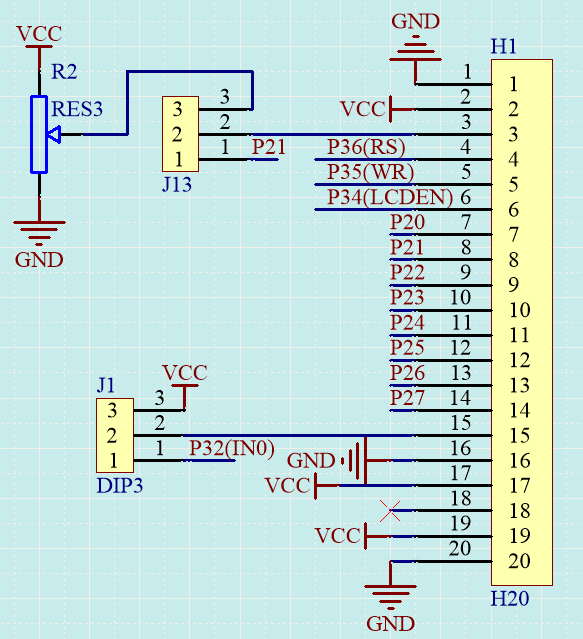

图 13-3 LCD1602 电路连接图

我们结合表 13-1 的引脚定义和图 13-3 的电路原理图来进行详细的分析。电路右侧的接插件 H1 为一个 20 个孔的排孔，如下图右上角所示， 1602 只用到了 1-16 孔，第 17- 20
这里用不到，暂时不管他，只需把液晶模块插入到电路板上即可。

a. 在 1602 的引脚定义中，1、2分别为地和电源正，原理图中1接 GND，2接 VCC；

b. 3为液晶显示偏压信号，用来调节显示对比度的，原理图中3连接到了一个可变电阻 R2 ，调节这个电阻 R2 可以调节显示对比度了，位置如下图右下所示；

c. 4，5，6分别为 1602 的控制信号，电路中连到了单片机的 P36、P35、P34；

d. 7-14 位液晶显示器的数据 D0-D7 引脚，电路中直接连接到了单片机的 P2 口；

e. 15， 16 分别为 16 02 的液晶背光电源和地，电路图中直接连接到了 VCC 和 GND。

**重点：**

**只需要控制单片机的引脚 P36， P35， P34， P2 口，便可以实现对 1602 的控制了。**

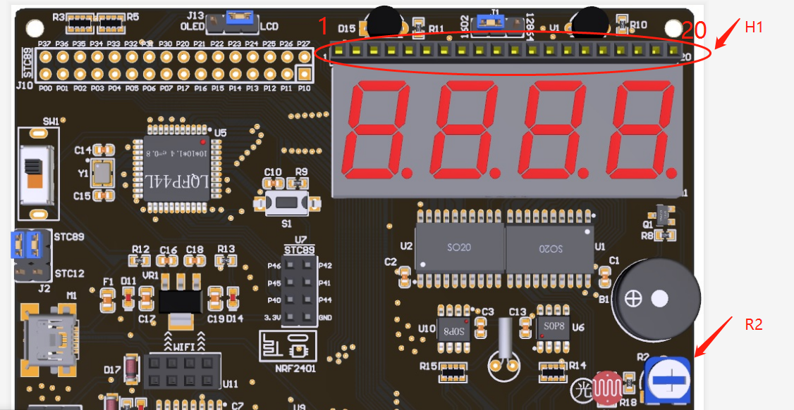

图 13-4 LCD1602 PCB 布局

## 13.2 1602 读、写操作时序解析

如何操作 1602 ，在它的数据文档中说的非常清楚，我们这里结合 1602 的数据文档，将他变成代码。

下面讲解如何读取或向 1602 写入一个字节。

### 13.2.1 单片机读取 1602 的一个字节

通过查找 1602 的数据手册，读、写时序如下图所示：

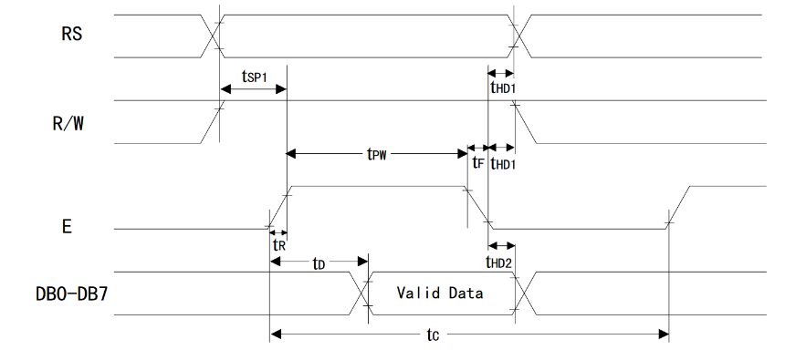

图 13-5 读操作时序

读操作时序解析如下：

上图中， RS 对应 P36， R/W 对应 P35，E对应 P34， DB0-DB7 对应 P2。

a. 将 R/W 拉高进入读操作模式，同时 RS 要么为高电平、要么为低电平，高电平时为读数据操作，低电平时为读状态操作；

b. 经过t~SP1~时间之后才可将使能信号E拉高，并且E的高电平维持时间为t~PW~，在使能信号E拉高之后不超过t~D~时间内， 1602 液晶显示器将数据放在 DB0~DB7 数据线上；

c. 这时我们将数据读取并将使能E拉低，整个数据或状态的读取就完成了。

编写读状态函数 RD_sta()代码如下：
```c
sbit  RS_1602 = P3^6; //1602， RS、R/W，E引脚定义
sbit RW_1602 = P3^5;
sbit EN_1602 = P3^4;
  
unsigned char RD_sta()// 读状态函数
{
    unsigned char sta;
  
    RS_1602 = 0;
   RW_ 1602  = 1;// 进入读 1602 状态模式
 
   EN_1602 = 1;// 拉高使能信号
   sta = P2;   // 将 1602 状态数据读取
   EN_1602 = 0;// 拉低使能，完成读操作
 
   return sta; // 将状态值返
}
```

图 13-6 RD_sta()函数代码

a. 第 1-3 行为引脚定义，核心代码为第 9- 第 16 行；

b. 首先将 RS 拉低，表示要读取 1602 的状态，即第9行 RS _ 1602 = 0;

c. 然后将 R/W 拉高，即 RW_1602 = 1;，接下来将使能信号E高，即 EN_1602 = 1;

d. 上面两条语句的时间间隔要求不低于t~SP1~，查询数据表格可知t~SP1~最小值为 30ns，而我们开发板执行一条语句的时间大约为 1us，因此远远能满足要求，如果我们在执行语句比较快的系统运行时，为了保证时序要求，可以在第 10
行和第 12 行两条语句之间插入软件延时。

e. E的高电平维持时间t~PW~最小值为 150ns，而我们E维持高电平约为 1us，满足要求。t~D~最大值为 100ns；

f. 因此，可以直接将 DB0-DB7，即 P2 的数据读取，接着将E拉低完成状态读取，代码如第 13-14 行所示，最后第 16 行函数返回读取的数据 sta。

时序要求，如下表所示：

表 13-2 时序参数

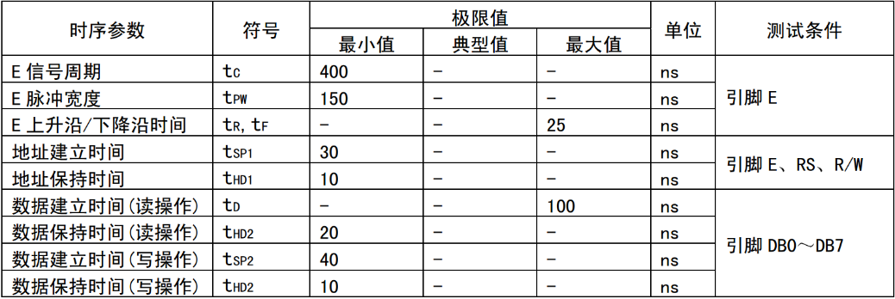

### 13.2.2 单片机向 1602 写入一个字节

写操作时序与读操作的基本一致，唯一不同的是，在使能信号E拉高t~SP2~之前，单片机必须把需要写的数据送到数据端口上。当 RS=1时，表示将要往 1602 写数据，当 RS=0时，表示将要往 1602 里面写指令。

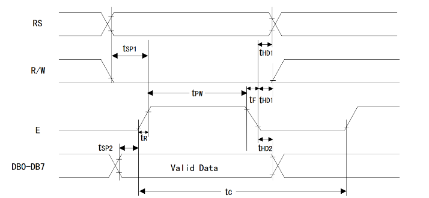

图 13-7 写操作时序

我们分别把写数据、写指令分别放到函数 WR_Cmd(unsigned char cmd)、 WR_Dat(unsigned char dat)中。

```c
void WR_Cmd(unsigned char cmd)// 写指令函数
{
    Ready();    // 检测 1602 是否处于空闲状态
      
    RS_1602 = 0;
    RW_1602 = 0;// 进入写指令模式
  
    P2 = cmd;   // 将指令数据输出
  
   EN_1602 = 1;// 拉高使能信号
   EN_1602 = 0;// 拉低使能，完成写操作
}
void WR_Dat(unsigned char dat)// 写数据函数
{
   Ready();    // 检测 1602 是否处于空闲状态
 
   RS_1602 = 1;
   RW_1602 = 0;// 进入写数据模式
 
   P2 = dat;   // 将数据输出
 
   EN_1602 = 1;// 拉高使能信号
   EN_1602 = 0;// 拉低使能，完成写操作
}
```

图 13-8 写指令函数代码

在上述函数中，增加了一个 Ready()函数，这个函数的作用为查询 1602 是否处于空闲状态，当为空闲状态时，才开始写操作。到目前为止，我们已经完成了对 1602
最底层的数据读写操作，下面我们只要按照数据手册的要求调用这三个函数便可实现各种类型的显示功能。

对于 1602 而言，读状态函数 RD_sta()，的返回值数据格式如下：

表 13-3 状态字说明

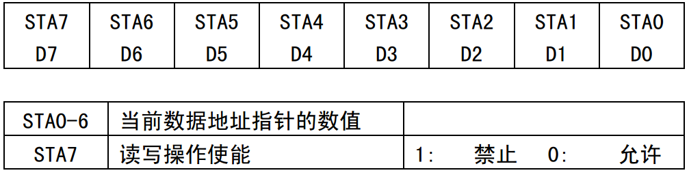

如上表所示，返回状字的低六位为当前数据地址指针的数值，最高位读写操作使能，当返回值为1时，表示 1602 正处于忙的状态，不允许读写操作，当返回值为0时，表示可以对 1602 进行读写，因此，在读写前进行判断，我们将忙检测函数如下：
```c
void Ready() // 空闲检测函数
{
    while(RD_sta() & 0x80);//bit7 等于1表示忙，一直检测到0为止
}
```

图 13-9 忙检测函数

## 13.3 1602 液晶显示初始化

前面讲解的读取或写入1个字节是接下来所有操作的基础。在使用 1602 进行显示前，首先要通过写一系列的指令对 1602 进行初始化，各指令码及功能定义如下所示：

表 13-4 指令码及功能定义

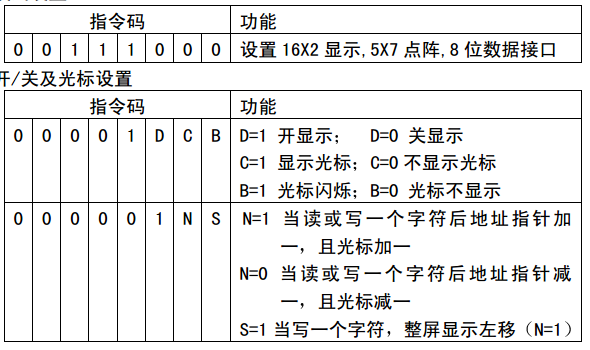  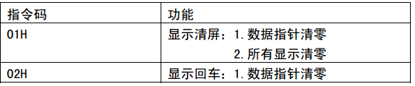

**初始化如下：**

1. 写指令 38H：设置 16x2 显示， 5x7 点阵，8位数据接口；

2. 写指令 0CH：开显示，关闭光标；

3. 写指令 06H：读或写完一个字符后，地址指针、光标均加1；

4. 写指令 01H：数据指针清零、所示显示清零

将初始化程序放到初始化函数 Init_1602()中，代码如下图所示：

```c
void Init_1602() //1602 初始化函
{
    WR_Cmd(0x38);// 设置 16x2 显示， 5x7 点阵，8位数据接口
    WR_Cmd(0x0C);// 开显示，关闭光标
    WR_Cmd(0x06);// 读或写完一个字符后，地址指针、光标均加1
    WR_Cmd(0x01);// 数据指针清零、所示显示清零
}
```

图 13-10 初始化函数

## 13.4 1602 液晶显示字符操作

当我们开始要往 1602 里面写字符的时候，我们首先得告诉 1602 我们要从哪个地方开始写，也就是写数据开始地址， 1602 共可以显示2行 32 个字符，那么每个字符的地址是多少呢？ 1602 内部控制器有 80 字节的 RAM
缓冲区， RAM 地址与 1602 显示模块的对应关系如下图所示：

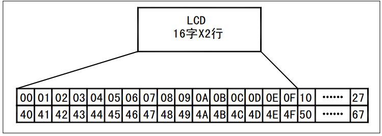

图 13-11 RAM 地址映射图

如图所示，地址 00H~0FH 的 RAM 与显示模块的第一行一一对应。地址 40H~4FH 的 RAM 与显示模块的第二行一一对应。这里要特别注意的是，第一行到第二行的地址不是连续的。通过写指令可以告诉 1602
我们将要从哪里开始写字符了，写地址指令码及功能定义如下表所示：

表 13-5 地址指令码即功能定义

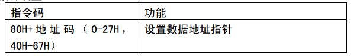

例如，需要往第二行的第一列开始写字符，首先应该写指令 WR_Cmd(0x80 + 0x40)。接下通过调用写数据函数 WR_Dat( dat )将对应的字符显示到 1602 了。写数据函数中的 dat 为字符对应的字符码，字符码可以通过查询
1602 的标准字符库，如下图所示，行坐标为字符码的低4位，纵坐标为字符码的高四位。例如，我们要将 "C" 显示到 1602 ，需要调用 WR_Dat(0x43)完成显示。

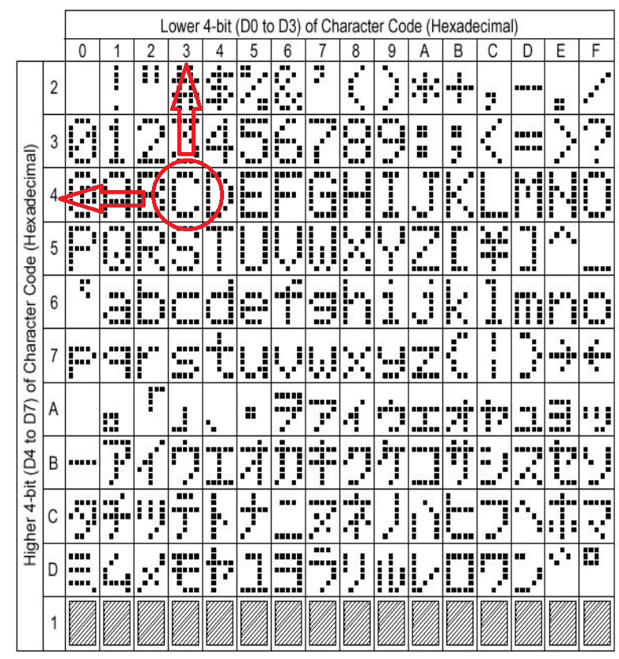

图 13-12 标准 1602 字符字库

如上图所示，要显示一个字符需要每次都查表，显得特别的麻烦。如果我要显示C，可不可以直接 WR_Dat('C')，来替代 WR_Dat( 0x43)，这样的话就非常容易理解了，答案是肯定，数字 0-9，字母 a-z， A-Z
都可以这么表示，原因为你代码中'C'是以 ASCII 码存储在单片机中的，而这个 ASCII 码就是 0x43，所以上面的两种写法是等价的。标准 ASCII 码对照表如下所示：

表 13-6 标准 ASCII 码对照表

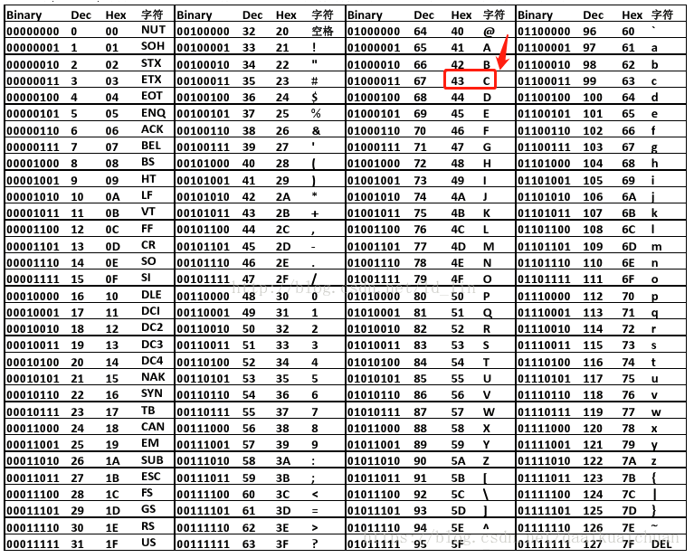

对照图 13-11 和表 13-6 常用的数字 0-9，字母 a-z， A-Z 是一一对应的，这是 1602 液晶厂家为了应用方便而特意这么设计的。

根据上面的原理，我们可以设计一个这样的函数：功能为从第 row 行，第 column 列开始显示字符串 str，函数代码如图所示：

```c
// 字符串显示功能：从第 row 行，第 column 列开始显示字符串 str
void Disp_1602_str(unsigned char row,unsigned char column,char *str)
{
    unsigned char addr;
  
    addr =  (row-1)*0x40 + (column-1);// 组合成地址
    WR_Cmd(0x80+addr);// 写地址命令
  
    while(* str )// 判断 str 字符串是否已结束
   {
       WR_Dat(* str ++);// 将 str 字符串数据依次写入
   }
}
```

图 13-13 字符串显示函数代码

后续，我们只需要调用这个函数便可以让 1602 显示数据了，我们将上述所有的函数定义放到 Drive_ 1602 .h文件中，函数具体实现均放到 Drive_ 1602 .c文件，这就是我们前面所讲的 1602
驱动文件，在工程中添加这两个文件就可以愉快的调用 1602 显示函数了。

```c
#ifndef __1602_H__  
#define __1602_H__  
  
// 字符串显示函数声明
extern void Disp_1602_str(unsigned char row,unsigned char column,char *str);
extern void Init_1602();//1602 初始化函数声明
  
void Ready();// 空闲检测函数声明
void WR_Cmd(unsigned char cmd);// 写指令函数声明
void WR_Dat(unsigned char dat);// 写数据函数声明
unsigned char RD_sta();// 读状态函数声明
 
#endif 
```

图 13-14 Drive_1602.h文件
```c
#include <reg52.h>  
#include <Drive_1602.h>  
  
sbit  RS_1602 = P3^6; //1602， RS、R/W，E引脚定义
sbit RW_1602 = P3^5;
sbit EN_1602 = P3^4;
  
// 字符串显示功能：从第 row 行，第 column 列开始显示字符串 str
void Disp_1602_str(unsigned char row,unsigned char column,char *str)
{
   unsigned char addr;
 
   addr =  (row-1)*0x40 + (column-1);// 组合成地址
   WR_Cmd(0x80+addr);// 写地址命令
 
   while(* str )// 判断 str 字符串是否已结束
   {
       WR_Dat(* str ++);// 将 str 字符串数据依次写入
   }
}
 
void Init_1602() //1602 初始化函
{
   WR_Cmd(0x38);// 设置 16x2 显示， 5x7 点阵，8位数据接口
   WR_Cmd(0x0C);// 开显示，关闭光标
   WR_Cmd(0x06);// 读或写完一个字符后，地址指针、光标均加1
   WR_Cmd(0x01);// 数据指针清零、所示显示清零
}
void Ready() // 空闲检测函数
{
   while(RD_sta() & 0x80);//bit7 等于1表示忙，一直检测到0为止
}
 
unsigned char RD_sta()// 读状态函数
{
   unsigned char sta;
 
   RS_1602 = 0;
   RW_ 1602  = 1;// 进入读 1602 状态模式
 
   EN_1602 = 1;// 拉高使能信号
   sta = P2;   // 将 1602 状态数据读取
   EN_1602 = 0;// 拉低使能，完成读操作
 
   return sta; // 将状态值返
}
void WR_Cmd(unsigned char cmd)// 写指令函数
{
   Ready();    // 检测 1602 是否处于空闲状态
     
   RS_1602 = 0;
   RW_1602 = 0;// 进入写指令模式
 
   P2 = cmd;   // 将指令数据输出
 
   EN_1602 = 1;// 拉高使能信号
   EN_1602 = 0;// 拉低使能，完成写操作
}
void WR_Dat(unsigned char dat)// 写数据函数
{
   Ready();    // 检测 1602 是否处于空闲状态
 
   RS_1602 = 1;
   RW_1602 = 0;// 进入写数据模式
 
   P2 = dat;   // 将数据输出
 
   EN_1602 = 1;// 拉高使能信号
   EN_1602 = 0;// 拉低使能，完成写操作
}
```

图 13-15 Drive_1602.h文件

## 13.5 1602 显示应用实例

我们结合上面讲解的各个函数，实现从 1602 液晶显示模块第1行第3列开始显示字符串 "Nebula-Pi"。第二行第3列开始显示 "LCD 1602 Test!"，建立工程，编写 MainLCD 1602 .c代码如下：
```c
/*******************************************************************
*  液晶 LCD1602 显示测试
* ******************************************************************
* 【主芯片】：STC89SC52/STC12C5A60S2
* 【主频率】: 11.0592MHz
*
* 【版  本】： V1.0
* 【作  者】： stephenhugh
* 【网  站】：https://rymcu.taobao.com/
* 【邮  箱】：
*
* 【版  权】All Rights Reserved
* 【声  明】此程序仅用于学习与参考，引用请注明版权和作者信息！
*
*******************************************************************/
#include <reg52.h>  
#include <Drive_1602.h>  
 
sbit DU = P0^6;// 数码管段选定义
 
void main(void)
{
   P2 = 0x00;// 关闭所有数码管
   DU = 1;
   DU = 0;// 锁存段
     
   Init_1602();//1602 初始化
     
   Disp_1602_str(1,3,"Nebula-Pi");// 第1行第3列开始显示 "RongYi Mini-51"
   Disp_1602_str(2,3, "LCD1602 Test!");// 第2行第3列开始显示 "LCD1602 Test!"
 
   while(1);
}
```

图 13-16 LCD1602 主程序代码

第 17 行包含了 1602 的驱动头文件，第 23-25 行先关闭所有数码管，因为数码管和 1602 共用 P2，防止数码管乱跳显示。

安装好 LCD 1602 硬件模块，并将程序下载单片机，扭动可变电阻 R2 调节 LCD 的对比度，效果如下图所示。

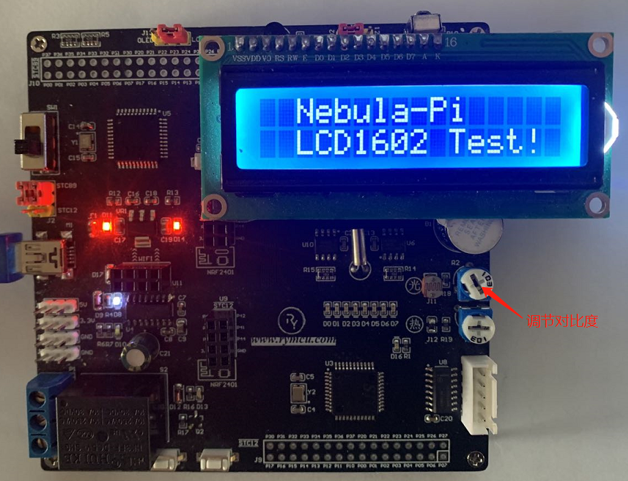

图 13-17 LCD1602 运行结果

## 13.6 本章小结

本章完成了液晶显示模块 LCD1602 的原理讲解，并且完成了驱动文件的编写，后续可以直接调用函数来显示数据了。
