#  第15章 I^2^C总线与AT24C256试验

在单片机应用系统中，串行通信总线技术是非常重要的通信手段。常用的串行总线通信方式包括异步串行通信UART、I2C（Inter IC BUS）、单总线(One WIRE BUS)以及SPI总线（Serial Peripheral Interface BUS）等。单片机的串口通信为UART的一种，DS18B20的通信方式为单总线。采用I2C总线通信方式的常用器件包括E2PROM存储器件AT24C256，这章内容主要讲解I2C总线通信工作原理并结合AT24C256进行应用试验。

## 15.1 I^2^C总线通信原理

I2C(Inter-Integrated Circuit)总线是由PHILIPS公司开发的两线式串行通信总线，由于连接主机以及外围设备。两根数据线一个为时钟线SCL，另一根为数据线SDA，可实现数据的发送或接收。通常将I2C通信速率分为：低速模式100Kbit/s、快速模式400Kbit/s以及高速模式3.4Mbit/s，I2C器件为向下兼容模式，一般所有I2C器件均支持低速模式。I2C通信器件典型电路如下图所示：

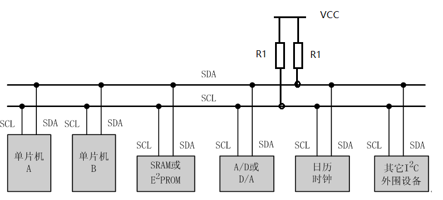  

图15-1 I2C器件典型应用原理图

如上图所示，在I2C总线上挂载多个外围器件，总线与电源之间配置了上拉电阻，使所有器件之间形成了"线与"的逻辑关系，任何一个器件将总线拉低，总线将保持低电平，因此任意一个器件都可以当成主设备或者从设备。

I2C通信最底层的时序操作包涵四种类型的信号，所有基于I2C总线的外围器件都是在这五种底层信号的基础上进行数据的读写，这五种信号分别是：

1.  起始信号；

2.  停止信号；

3.  写字节信号；

4.  读字节并发送应答信号；

5.  读字节并发送非应答信号。

### 15.1.1 I^2^C通信起始、停止信号

起始信号，功能为通知I2C器件可以开始进行数据操作，操作时序为：当SCL为高电平时，SDA由高电平向低电平跳变。停止信号，功能为通知I2C器件数据操作已结束，操作时序为：当SCL为高电平时，SDA由低电平向高电平跳变。时序如下图所示：

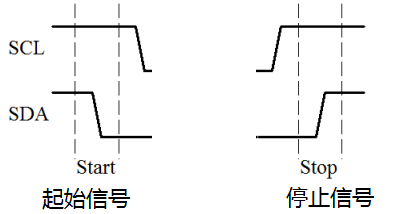  

图15-2 I2C起始信号、停止信号时序

I2C起始信号Start_I2C(void)、停止信号Stop_I2C(void)时序，C语言函数如下图所示：

1.  sbit SCL_I2C = P0^1;//总线管脚定义

2.  sbit SDA_I2C = P0^2;

3.    

4.  void Delay_I2C(void)

5.  {//延时函数，设置传输速率

6.      _nop_();

7.      _nop_();

8.      _nop_();

9.      _nop_();

10.       

11. }

12. //总线起始信号

13. void Start_I2C(void)

14. {

15.     //SCL高电平期间，拉低SDA

16.     SCL_I2C = 0;

17.     SDA_I2C = 1;//在SCL低电平期间先将SDA拉高，为起始信号做准备

18.     Delay_I2C();

19.     SCL_I2C = 1;

20.     Delay_I2C();

21.     SDA_I2C = 0;//拉低SDA，发送起始信号

22.     Delay_I2C();

23.     SCL_I2C = 0;

24. }

25. //总线停止信号

26. void Stop_I2C(void)

27. {

28.     //SCL高电平期间，拉高SDA

29.     SCL_I2C = 0;

30.     SDA_I2C = 0;//在SCL低电平期间先将SDA拉低，为停止信号做准备

31.     Delay_I2C();

32.     SCL_I2C = 1;

33.     Delay_I2C();

34.     SDA_I2C = 1;//拉高SDA，发送停止信号

35.     Delay_I2C();

36.     SCL_I2C = 0;

37. }

图15-3 I2C起始信号、停止信号C语言函数代码

### 15.1.2 I^2^C写字节信号

I2C写字节信号，功能为向总线写入1字节的数据，操作时序下图所示：

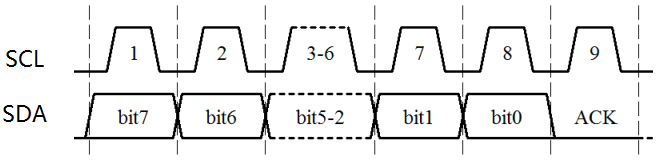  

图15-4 I2C写字节信号时序

在写入数据的过程中，数据顺序为从高位到低位，最先写入的数据为bit7，依次到bit0共8位数据。如果接收器件收到了上述1字节的数据，会在SCL的第9个周期的高电平期间将SDA拉低为"0"，这个第9位数据称为应答位ACK，作用为通知主机已经收到了1字节的数据。因此，在主机程序中通过ACK位判断1字节数据是否写入成功。在写数据的过程中要求，数据在SCL高电平期间要保持SDA数据稳定，在SCL低电平期间，SDA可由高电平变为低电平或者低电平变为高电平，如下图所示。

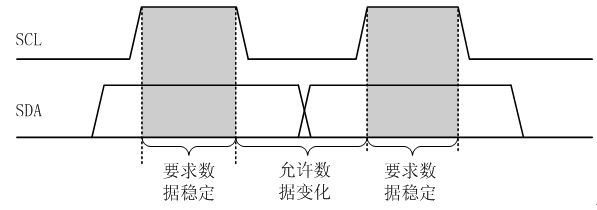  

图15-5 I2C数据有效性时序规定

I2C写字节信号Wr_I2C(unsigned char dat)， C语言函数代码如下图所示：

1.  //I2C写入字节dat,返回应答信号

2.  bit Wr_I2C(unsigned char dat)

3.  {

4.      bit ack; //存储应答位

5.      unsigned char mask; //探测字节内某一位值的掩码变量

6.    

7.      for(mask=0x80;mask!=0;mask>>=1)//从高位依次到低位

8.      {

9.          if((mask & dat)==0) SDA_I2C=0;

10.         **else**                SDA_I2C=1;

11.   

12.         Delay_I2C();

13.         SCL_I2C = 1;

14.         Delay_I2C();

15.         SCL_I2C = 0;  //完成一位的传送

16.     }

17.   

18.     SDA_I2C=1;  //主机释放总线

19.     Delay_I2C();

20.     SCL_I2C = 1;

21.     ack = SDA_I2C;//获取应答位

22.     Delay_I2C();

23.     SCL_I2C = 0;

24.   

25.     return ack; //返回0写入成功，返回1写入失败

26. }

图15-6 I2C写字节信号C语言函数代码

### 15.1.3 I^2^C读字节并发送应答信号

I2C读字节并发送应答信号时序与图15-4基本相同，只不过bit7-bit0由I2C从器件给出，在SCL高电平期间主机将数据读取，第9位应答信号ACK由主机给出，ACK为"0"表示主机后续还要继续读取数据，为"1"时主机不再读取后续数据，可以结束通信。C语言函数如下图所示：

1.   //I2C读操作,并发送应答信号

2.  unsigned char RdACK_I2C(void)

3.  {

4.      unsigned char mask; //探测字节内某一位值的掩码变量

5.      unsigned char dat;

6.    

7.       SDA_I2C=1;//确保主机释放SDA

8.      for(mask=0x80;mask!=0;mask>>=1)//从高位依次到低位

9.      {

10.         Delay_I2C();

11.         SCL_I2C = 1;

12.         if(SDA_I2C==0) dat &= \~mask;//为0时，dat对应位清零

13.         **else**           dat |=  mask;//否则置1

14.          Delay_I2C();

15.          SCL_I2C = 0;

16.      }

17.     SDA_I2C=0;   //8位数据传送完后，拉低SDA发送应答信号

18.     Delay_I2C();

19.     SCL_I2C = 1;

20.     Delay_I2C();

21.     SCL_I2C = 0;

22.   

23.     return dat;

24. }

图15-7 I2C读字节并发送应答信号函数

### 15.1.4 I^2^C读字节并发送非应答信号

与读字节并发送应答信号相同，唯一的区别为主机发出非应答信号，即ACK=1，主机不再读取后续数据，可以结束通信。C语言函数如下图所示：

1.  //I2C读操作,并发送非应答信号

2.  unsigned char RdNAK_I2C(void)

3.  {

4.      unsigned char mask; //探测字节内某一位值的掩码变量

5.      unsigned char dat;

6.    

7.       SDA_I2C=1;//确保主机释放SDA

8.      for(mask=0x80;mask!=0;mask>>=1)//从高位依次到低位

9.      {

10.         Delay_I2C();

11.         SCL_I2C = 1;

12.         if(SDA_I2C==0) dat &= \~mask;//为0时，dat对应位清零

13.         **else**           dat |=  mask;//否则置1

14.          Delay_I2C();

15.          SCL_I2C = 0;

16.      }

17.     SDA_I2C=1;    //8位数据传送完后，拉高SDA发送非应答信号

18.     Delay_I2C();

19.     SCL_I2C = 1;

20.     Delay_I2C();

21.     SCL_I2C = 0;

22.   

23.     return dat;

24. }

图15-8 I2C读字节并非应答信号函数

将上述5个底层I2C总线操作函数放到文件"Dri/e_I2C.c"以及"Dri/e_I2C.h"。"Dri/e_I2C.c"文件前4行代码如下图所示。其它代码与上面的函数相同，这里不再赘述。

1.  #include<reg52.h>  

2.  #include<intrins.h>  

3.  sbit SCL_I2C = P0^1;//总线管脚定义

4.  sbit SDA_I2C = P0^2;

图15-9 I2C总线底层驱动函数Dri/e_I2C.c部分代码

"Dri/e_I2C.h"代码如下图所示：

1.  #ifndef __I2C_H__  

2.  #define __I2C_H__  

3.    

4.  **extern** void Start_I2C(void); //起始信号

5.  **extern** void Stop_I2C(void);  //停止信号

6.  **extern** unsigned char RdACK_I2C(void); //读字节并发送应答信号

7.  **extern** unsigned char RdNAK_I2C(void); //读字节并发送非应答信号

8.  **extern** bit Wr_I2C(unsigned char dat); //读字节信号

9.    

10. #endif  

图15-10 Dri/e_I2C.h代码

### 15.1.5 I^2^C一次通信时序

所有基于I2C总线通信设备都是以上面5条最底层操作为基础的，完成一次完整的I2C通信时序如下图所示：

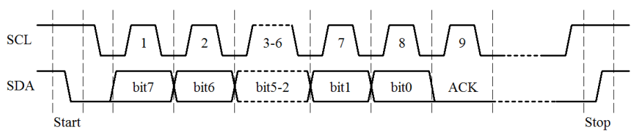  

图15-11 I2C一次通信时序图

如图所示，一次完整的I2C总线通信至少包含起始信号 、一次字节读或写，或者多次读或写，以及停止信号。在起始信号与停止信号之间读或写的具体内容与I2C器件本身的上层通信协议有关。接下来我们将讲解基于I2C总线通信技术的E2PROM存储器AT24C256的上层通信协议以及具体使用实例。

## 15.2 E2PROM存储器AT24C256应用

AT24C256是Atmel公司生产的一款E2PROM数据存储器，容量为32768字节，具有掉电不丢失的功能。在单片机中也有存储器，一种为数据存储器RAM，一种为程序存储器，在掉电的情况下RAM内的数据会丢失，而程序存储器一般不支持在线编程。然而在很多应用场合我们希望把运行过程中重要的数据存储下来，而在掉电的情况下数据不丢失。AT24C256能满足这样的要求，它与单片之间通过I2C总线通信实现信息的交换。

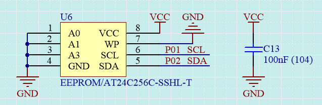  

图15-12 片外存储器原理图

下面介绍一下芯片管脚：

a.  A0\~A2为地址输入引脚，每一个AT24C256可以设置一个独立的器件地址，通过A0\~A2的高低电平来设置，单片机通过这个器件地址来区分挂在总线上的AT24C256；

b.  SDA、SCL为I^2^C总线接口，分别连接到了单片机的P01，P02引脚上。

c.  /CC，GND分别为电源和地

d.  WP为写保护管脚，当WP接高电平时，禁止外部对它进行写数据，只能读取它的数据。如上图所示，将WP接地，单片机即可对它进行读也可以写，原理图中将WP接地了。

AT24C256的容量为32768Byte，即0x8000Byte，在器件内部给每一个字节的存储空间安排了一个地址，并且从0开始，因此，地址的最大值为：0x8000-1=0x7FFF，即需要2个字节的地址空间，地址的高字节称为First Word Address，低字节称为Second Word Address，单片机就是通过这个地址来读取和存储数据的。

### 15.2.1 单片机往AT24C256写入一个字节

AT24C256写字节如下图所示：

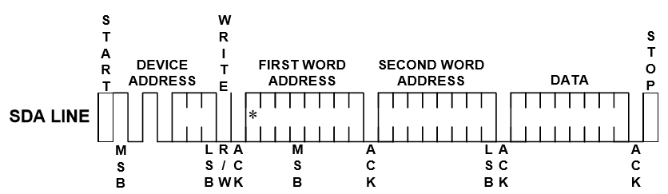  

图15-13 写字节操作

如上图所示，AT24C256的写字节时序步骤如下：

1)  起始信号；

2)  写器件地址；

3)  写存储地址，First Word Address；

4)  写存储地址，Second Word Address；

5)  写存储数据；

6)  停止信号。

当I2C总线上挂载多个从器件时，单片机通过器件地址来区别器件，那在我们开发板上的AT24C256的器件地址是多少呢？AT24C256器件地址如下所示：

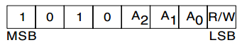  

图15-14 AT24C256器件地址定义

如上图所示，地址的高4位为"1010"固定值，即0xA，后四位分别由A2\~A0、R/W决定，在Nebula Pi开发板上将器件的A2\~A0都接地，如图15-12所示，因此为"000"，最后一位为读写方向位。当R/W=0时，表示我们接下来写数据，当R/W=1时，表示我们接下来要读数据。很显然我们这里是要写数据，因此R/W=0。合并起来，要写的地址为0xA0。第3步为写存储器地址，AT24C256总共有32768字节的存储器，它的地址分别为0x0000\~0x7FFF，因此可以选择任一地址存入数据。第4步为写存储数据，即为你写存储的8位数据。总结上述，往AT24C256写入一个字节数据函数如下所示：

1.  //往AT24Cxx地址addr写入单字节数据dat

2.  void WrByte_AT24Cxx(unsigned int addr,unsigned char dat)

3.  {

4.      Start_I2C();

5.      Wr_I2C(0x50<<1);//通知地址50的器件，接下来写操作  0x50<<1=0xA0

6.        

7.      Wr_I2C(addr>>8);      //写入要操作的地址addr高字节

8.      Wr_I2C(addr);   //写入要操作的地址addr的低字节

9.    

10.     Wr_I2C(dat);        //向addr写入数据dat

11.     Stop_I2C();

12. }

图15-15 写字节操作函数

### 15.2.2单片机读取 AT24C256一个字节

随机读取AT24C256单字节通信如下图所示：

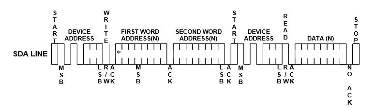  

图15-16 随机读通信协议

随机读取单字节数据通信协议如上图所示，步骤如下：

1)  起始信号；

2)  写器件地址，方向为写；

3)  写存储器地址addr；

4)  起始信号；

5)  写器件地址，方向为读；

6)  读单字节数据，并发送非应答信号

7)  停止信号。

第1步至第3步为告诉AT24C256我将从地址addr处读取数据，第4步到第6步为读取存储器地址addr处的数据，并告诉AT24C256后面不再继续读数据了，第7步结束本次通信。具体函数代码如下图所示：

1.  //读取AT24Cxx存储地址addr处的数据

2.  unsigned char RdByte_AT24Cxx(unsigned int addr)

3.  {

4.      unsigned char dat;

5.    

6.      Start_I2C();

7.      Wr_I2C(0x50<<1);//通知地址50的器件，接下来写操作

8.    

9.      Wr_I2C(addr>>8);      //写入要操作的地址addr高字节

10.     Wr_I2C(addr);   //写入要操作的地址addr的低字节

11.       

12.     Start_I2C();

13.     Wr_I2C((0x50<<1)|0x01);//通知地址50的器件，接下来读操作

14.     dat = RdNAK_I2C();//从地址addr读出数据，读出数据后不应答E2Prom

15.     Stop_I2C();

16.   

17.     return dat;

18. }

图15-17 随机读取单字节函数

到这里我们便完成了对AT24C256单字节的读、写通信函数，按照惯例我们将函数封装到"Dri/e_AT 24Cxx.c"、"Dri/e_AT 24Cxx.h"，如下图所示：

1.  #ifndef __AT24Cxx_H__  

2.  #define __AT24Cxx_H__  

3.    

4.  **extern** void WrByte_AT24Cxx(unsigned int addr,unsigned char dat);//写单字节

5.  **extern** unsigned char RdByte_AT24Cxx(unsigned int addr); //读单字节

6.    

7.  #endif  

图13-18 Dri/e_AT24Cxx.h代码

1.  #include<reg52.h>  

2.  #include\"Dri/e_I2C.h\"  

3.    

4.  //往AT24Cxx地址addr写入单字节数据dat

5.  void WrByte_AT24Cxx(unsigned int addr,unsigned char dat)

6.  {

7.      Start_I2C();

8.      Wr_I2C(0x50<<1);//通知地址50的器件，接下来写操作

9.        

10.     Wr_I2C(addr>>8);      //写入要操作的地址addr高字节

11.     Wr_I2C(addr);   //写入要操作的地址addr的低字节

12.   

13.     Wr_I2C(dat);        //向addr写入数据dat

14.     Stop_I2C();

15. }

16. //读取AT24Cxx存储地址addr处的数据

17. unsigned char RdByte_AT24Cxx(unsigned int addr)

18. {

19.     unsigned char dat;

20.   

21.     Start_I2C();

22.     Wr_I2C(0x50<<1);//通知地址50的器件，接下来写操作

23.   

24.     Wr_I2C(addr>>8);      //写入要操作的地址addr高字节

25.     Wr_I2C(addr);   //写入要操作的地址addr的低字节

26.       

27.     Start_I2C();

28.     Wr_I2C((0x50<<1)|0x01);//通知地址50的器件，接下来读操作

29.     dat = RdNAK_I2C();//从地址addr读出数据，读出数据后不应答E2Prom

30.     Stop_I2C();

31.   

32.     return dat;

33. }

图15-19 Dri/e_AT24Cxx.c代码

如上图所示，所有的代码都是以I2C通信的5个底层函数为基础的，因此我们需要将"Dri/e_I2C.h"文件包含到代码中，如上图第02行代码所示。

### 15.2.3 AT24C256单字节读写应用

下面我们建立一个工程，写一个实例来展示单片机对AT24C256的读写应用。应用的功能为首先往AT24C256存储器地址0x08处写入数据110，然后从该处把数据读出来显示在1602液晶上，以此来验证读写操作的正确性，主文件"MainAT24C256.c"代码如下图所示：

1.  *********************************** * AT24C256(I2C)功能测试

2.  * ******************************************************************

3.  * 【主芯片】：STC89SC52/STC12C5A60S2

4.  * 【主频率】: 11.0592MHz

5.  *

6.  * 【版  本】： 1.0

7.  * 【作  者】： stephenhugh

8.  * 【网  站】：https://rymcu.taobao.com/

9.  * 【邮  箱】：

10. *

11. * 【版  权】All Rights Reser/ed

12. * 【声  明】此程序仅用于学习与参考，引用请注明版权和作者信息！

13. *

14. *******************************************************************/

15. #include <reg52.h>  

16. #include\"Dri/e_AT24Cxx.h\" //包含AT24Cxx头文件  

17. #include\"Dri/e_1602.h\"  

18.   

19. #define uchar unsigned char  

20. #define  uint unsigned int  

21.   

22. sbit DU = P0^6;//数码管段选、位选引脚定义

23. sbit WE = P0^7;

24.       

25. uchar str[10]=0;

26.   

27. void delayms(unsigned int z)//延时函数

28. {

29.     unsigned int x,y;

30.     for(x=z;x>0;x--)

31.         for(y=78;y>0;y--);

32. }

33.   

34. void main()

35. {

36.     uchar dat=0;

37.     Init_1602();

38.   

39.     P2 = 0xff;//关闭所有数码管

40.     WE = 1;

41.     WE = 0;

42.   

43.     //往AT24Cxx存储器地址0x08处写入数字110

44.     WrByte_AT24Cxx(0x08,110);

45.     Disp_1602_str(1,2,\"AT24C0x test!\");

46.     //读和写之间至少需要间隔10ms，增加如下代码达到延时的目的

47.     delayms(10);

48.     //读取AT24Cxx存储器地址0x08处的数据

49.     dat = RdByte_AT24Cxx(0x08);

50.   

51.     str[0]=dat/100+\'0\';

52.     str[1]=dat%100/10+\'0\';

53.     str[2]=dat%10+\'0\';

54.     //将数据显示在1602的第2行第6列处

55.     Disp_1602_str(2,6,str);

56.   

57.     while(1);

58. }

图15-20 主文件代码

将工程编译后，下载到开发板验证功能的正确性。

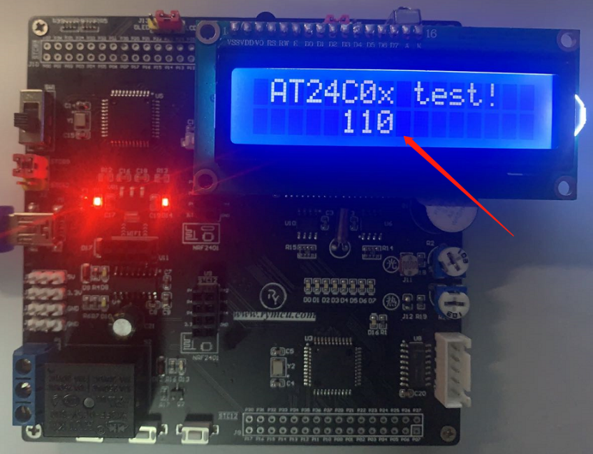  

图15-21 显示结果

AT24C256对写时序有一个特殊的要求，当完成一次数据通信后，需要延迟tWR才能开始下一次起始信号如下图所示，tWR为AT24C256内部处理数据时间，查询AT24C256数据手册可知为10ms。因此，我们在主程序代码第46行与第50行之间插入了第47行的delayms(10); 代码达到延时的目的，我们可以将第47行代码注释掉，将无法正确的读出数据。

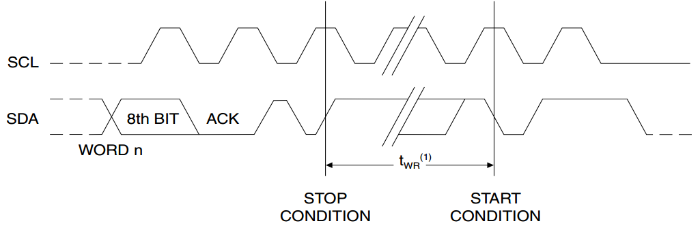  

图15-22 时序约束

上述工程中需要添加1602，I2C，AT24Cxx的驱动文件，如下图所示：

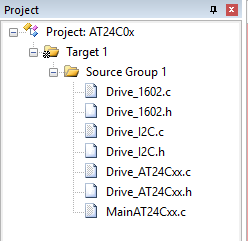  

图15-23 驱动文件

### 15.2.4 AT24C256多字节写通信

根据上面的介绍，大家很容易发现每隔10ms才能进行一次正常的写数据操作是非常浪费时间的，尤其是在进行多个字节写操作的时候。AT24C256提供了另外一种多字节的写模式，为页操作模式。首先介绍一下AT24C256的内部存储器的分页结构。AT24C256总共有32768个字节的存储空间，总共分为512页，每一页总有64各字节。第一页的地址范围为0x0000\~0x0040，依次往下均分为512页。页操作模式通信时序如下图所示：

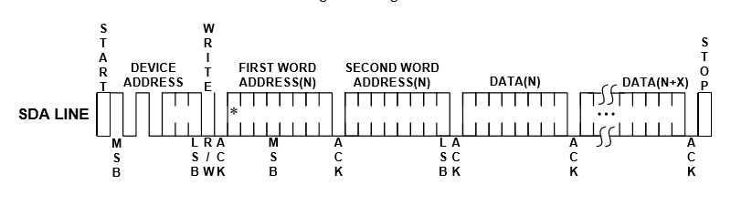  

图15-24页写通信时序

如上如所示，首先发送起始信号、写器件地址、写起始地址，紧接着写入多个字节，写完一个字节，器件内部会将地址自动加1，最后结束信号。这里需要注意的是，连续写的多个字节必须在同一页内，不能进行跨页连续读写，因此一次通信周期内最多可以写入64个字节的数据。如果我们需要写的数据很多，而一页写不下怎么办？首先，启动页写通信，在写的过程中判断是否要写到页的边界了，当到达页边界后停止该次页写通信，再重新发起页写通信将剩余的数据写入，这样便实现了任意个字节的写入，具体函数如下图所示。其中，str为需要写入的字符串，addr为写入AT24C256的起始地址，len为写入字符个数。

1.  //多字节写

2.  void WrStr_AT24Cxx(unsigned char *str,unsigned int addr,unsigned char len)

3.  {

4.      while(len > 0)//检测上一次是否完成所以数据写操作

5.      {

6.          while(1)

7.          {//循环检测器件应答信号

8.              Start_I2C();

9.              if(0 == Wr_I2C(0x50<<1)) **break**;//收到应答，跳出循环

10.             Stop_I2C();//没收到应答，发送停止信号，继续循环检测

11.         }

12.     Wr_I2C(addr>>8);      //写入要操作的地址addr高字节

13.     Wr_I2C(addr);   //写入要操作的地址addr的低字节

14.           

15.         while(len > 0)

16.         {

17.             Wr_I2C(*str++);//写入一个字节，并将字符串指针指向下一个字符

18.             len--;//字符数减1

19.             addr++;//存储地址加1

20.             if(0 == (addr % 64))//检测是否到达了下一页的起始地址，

21.                 **break**;          //即上一个字节已经写到页的最后边界了

22.                             //跳出停止继续写，每页的起始地址为64的倍数，

23.                                         //判断对64取余是否等于0即可。

24.         }

25.         Stop_I2C();

26.     }

27. }

图15-25 多字节写数据

### 15.2.5 AT24C256多字节读通信

多字节读时序如下图所示，与单字节类似，只是在第一个数据紧接着读取多个数据。这里要注意的是：只有最后一个字节的数据发送非应答信号，前面的数据均发送应答信号。这个也很好理解，因为我们读到最后一个字节时要告诉AT24C256我们不再继续读数据了，因此发送非应答信号。

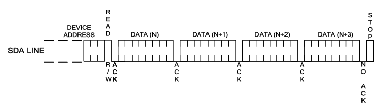  

图15-26 读多字节通讯时序

多字节读取函数代码如下图所示：

1.  //多字节读

2.  void RdStr_AT24Cxx(unsigned char *str,unsigned int addr,unsigned char len)

3.  {

4.      while(1)

5.      {//循环检测器件应答信号

6.          Start_I2C();

7.          if(0 == Wr_I2C(0x50<<1)) **break**;//收到应答，跳出循环

8.          Stop_I2C();//没收到应答，发送停止信号，继续循环检测

9.      }

10.       

11.     Wr_I2C(addr>>8);      //写入要操作的地址addr高字节

12.     Wr_I2C(addr);   //写入要操作的地址addr的低字节

13.       

14.     Start_I2C();//再次发送起始信号

15.     Wr_I2C((0x50<<1)|0x01);//通知地址50的器件，接下来读操作

16.     while(len > 1)

17.     {

18.         *str++ = RdACK_I2C();//读字节并应答

19.         len--;

20.     }

21.     *str = RdNAK_I2C();//最后一个字节，读字节并非应答

22.     Stop_I2C();

23. }

图13-27 多字节读取函数

将上述的多字节写、多字节读取函数添加到驱动文件"Dri/e_AT24Cxx.c"、"Dri/e_AT 24Cxx.h"中，后续应用中只需要将文件添加到项目中，调用相关的函数就可以了。

### 15.2.6 AT24C256多字节读写应用

本小节实现AT24C256多字节的读写应用，先向AT24C256连续写入多字节数据，然后将数据读出显示在1602液晶显示模块上，验证读写的正确性。主程序MainAT24Cxx-01.c代码如下图所示：

1.  /*******************************************************************

2.  * AT24C256(I2C)功能测试

3.  * ******************************************************************

4.  * 【主芯片】：STC89SC52/STC12C5A60S2

5.  * 【主频率】: 11.0592MHz

6.  *

7.  * 【版  本】： 1.0

8.  * 【作  者】： stephenhugh

9.  * 【网  站】：https://rymcu.taobao.com/

10. * 【邮  箱】：

11. *

12. * 【版  权】All Rights Reser/ed

13. * 【声  明】此程序仅用于学习与参考，引用请注明版权和作者信息！

14. *

15. *******************************************************************/

16. #include <reg52.h>  

17. #include\"Dri/e_AT24Cxx.h\" //包含AT24Cxx头文件  

18. #include\"Dri/e_1602.h\"  

19.   

20. #define uchar unsigned char  

21. #define  uint unsigned int  

22.   

23. sbit DU = P0^6;//数码管段选、位选引脚定义

24. sbit WE = P0^7;

25.   

26. uchar str1[]=\"AT24c256 Wr Str!\";

27. uchar str2[20];

28.   

29. void main()

30. {

31.     P2 = 0xff;//关闭所有数码管

32.     WE = 1;

33.     WE = 0;

34.   

35.     Init_1602();//1602初始化

36.   

37.     WrStr_AT24Cxx(str1,0x05,16);//写入16个字节

38.     RdStr_AT24Cxx(str2,0x05,16);//读取16个字节

39.   

40.     Disp_1602_str(1,1,str2); //将数据从第一行第一列开始显示

41.   

42.     while(1);

43. }

图13-29 多字节读写验证试验

从地址0x05开始写入16个字节的数据，有效的验证的多字节的读、写操作。

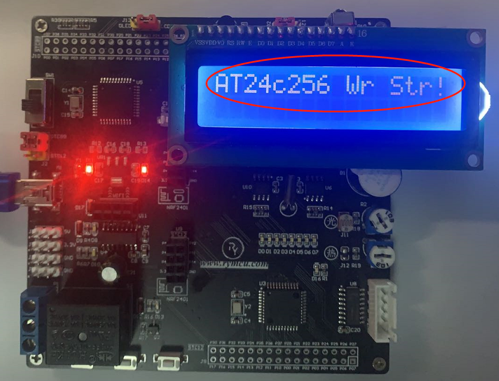  

图15-29 多字节读写试验结果

## 15.3 本章小结

本章学习了I2C通信原理，并且驱动了基于I2C通信的外部存储器芯片AT24C256。
