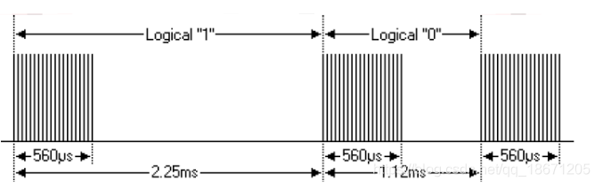
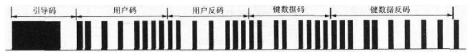
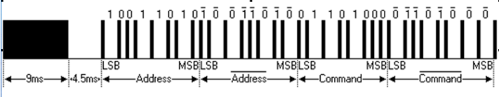
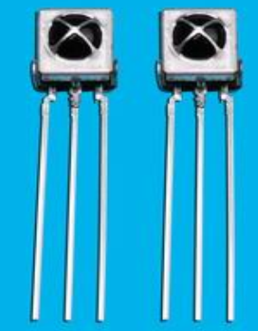
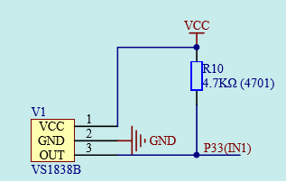
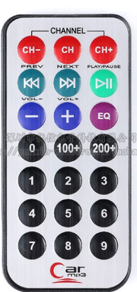
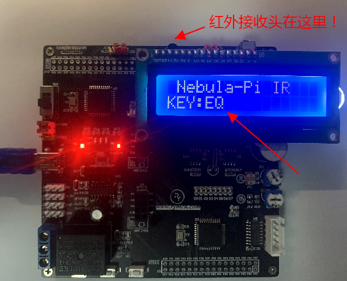

#  第16章 红外通信实验

本章介绍红外遥控通信试验，通过本章的学习掌握红外遥控器的编码原理以及使用。在Nebula-Pi单片机开发板上，配备了一个红外信号接收头，用于接收红外信号，开发板配套了一个红外遥控器，用于发送红外数据。

## 16.1 红外遥控原理简介

红外遥控是一种无线、非接触式数据传输技术、具有成本低、抗干扰能力强的短距离通信技术、被广泛的应用于电子设备遥控通信中，包括电视、空调、手机等多种电子设备中，具有广泛的应用前景。

红外通信原理为将信息加载到红外光波中，利用发射装置发射出去，接收设备接收到红外光后将信息解码并做出相应的操作，便完成了一次红外光通信。我们以一个生活中常见的例子为例，当两个在黑暗中的人，一人拿着手电筒通过不停的开关闪烁手电筒将信息传递给对方。而我们这里使用的是红外光，它的优点为红外光不可见，对周围环境影响较小，另外由于红外光波长远小于其它常用无线电波长，因此，对其它无线通信电子设备无影响。怎样将信息加载到红外光上呢？这就是我们常说的红外遥控编码协议了，目前常用的有Philips RC-5Protocol、Sharp协议、NEC协议等。我们这例重点讲解NEC协议。

在数字通信中最小的信息单位为bit，即为"0"或"1"，那么在红外通信协议中是怎么表示逻辑"0"和"1"的呢？该协议中以发射红外载波的占空比代表信息"0"和"1"。

逻辑"0"的表示法为：560us的连续载波+560us的低电平，总时长为1.125ms。

逻辑"1"的表示法为：560us的连续载波+1680us的低电平，总时长为2.25ms。

其中载波为38KHz的方波，逻辑"0"和逻辑"1"表示法如下图所示：

  

图16-1 NEC协议逻辑"0"和逻辑"1"表示法

传输一帧NEC格式的数据包括以下内容：

a)  同步码头：9ms载波+4.5ms低电平；

b)  用户码：用户自定义的8bit数据；

c)  用户反码：8bit用户码按位取反；

d)  数据码：8bit数据，也称为8位按键数据码；

e)  数据反码：8bit数据码按位取反。

由上面内容可知，实际传输的数据内容为用户码和数据码，上面的反码用于数据校验，确保数据传输的可靠性，数据按低位到高位的顺序一次传输。传输一帧NEC数据格式如下图所示：

  

或者

  

图16-2 NEC传输数据帧格式

上图为NEC发送模块通过红外光发送的数据，当接收模块接收到38KHz的载波时输出低电平，其它情况输出高电平，和发出来的正好相反。

因此，单片机通过测量接收到的电平高低持续时间便可解码数据了。例如当单片机接收到9ms低电平+4.5ms高电平时，即接收到了引导码。当接收到560us低电平+560us高电平表示接收到了数据"0"，当接收到560us低电平+1680us高电平表示接收到了数据"1"，依照上述模式便可完成一帧数据的接收。

## 16.2 红外接收硬件电路设计

Nebula Pi开发板板载了红外信号接收模块VS1838B，模块外形图如下图左边所示，电路连接图如下图右边所示。其中，输出引脚与单片机的P3.3引脚相连接，同时该引脚为单片机的外部中断1输入引脚。因此，可以利用单片机的外部中断1来处理红外数据接收。

     

16-3 红外接收模块硬件电路

开发板配套的红外遥控器如下图所示：

  

图16-4 红外遥控器

## 16.3 红外解码试验

红外解码软件编写步骤如下：

a)  首先进行初始化将外部中断1设置为下降沿触发，当接收到的红外信号由高电平变为低电平时，表明一帧红外数据的开始；

b)  在外部中断1子程序中判断引导码的正确性，判读的方法为通过定时器计数来计算高低电平持续的时间，并分别与引导码规定时间进行对比；

c)  当超出了规定时间范围，我们认为这不是一帧标准的红外遥控数据，便直接返回跳出中断子程序；

d)  当符合要求后，继续往下执行，并判断和接收4个字节的数据，将接收到的数据存放到指定存储变量中，并置位红外标志位；

e)  在主程序中查询这个标志位来确定是否收到了红外数据，将数据从存储变量中取出进行相关联的操作。

根据上述原则编写红外驱动头文件HongWai.h如下：
```c 
#ifndef __IR_H__  
#define __IR_H__  
  
extern void InitIR(); //初始化定时器TR0，外部中断1
extern bit Flag_IR;   //按键标志位
extern unsigned long Data_IR;//4个字节的数据：[31:0]数据反码->数据码->用户反码->用户码
  
#endif
```

图16-5 红外遥控头文件

驱动文件HongWai.c代码如下：

```c
 #include <reg52.h>
  
#define HIGH_IR 1    //高电平  
#define  LOW_IR 0    //低电平  
  
#define  Min_9ms     8000      //8ms  
#define  Max_9ms     10000     //10ms  
#define  Min_4_5ms   3500      //3.5ms  
#define  Max_4_5ms   5000      //5ms  
#define  Min_560us   300       //300us  
#define  Max_560us   700       //700us  
#define  Min_1680us  1300      //1.3ms  
#define  Max_1680us  1800      //1.8ms  
#define  Time_16ms   16000     //16ms  
 
sbit Led1  = P1^1;
sbit IR_in = P3^3;//红外接收引脚，也是外部中断1输入脚
bit Flag_IR = 0;//红外接收标志，收到正确帧数据后，由程序置1
unsigned long Data_IR;//4个字节的数据：[31:0]数据反码->数据码->用户反码->用户码
 
//红外接收初始化
void InitIR()
{
   IR_in = 1;//释放
     
   TMOD &= 0xF0;//清零T0控制位
   TMOD |= 0x01;//配置T0为模式1
     
   TR0 = 0; //停止T0记数
   ET0 = 0;//关定时器0中断
     
   IT1 = 1;//设置INT1为下降沿触发
   EX1 = 1;//开INT1中断
     
   EA=1; //开总中断
}
unsigned int T_Count(bit flag)//电平计时器
{
   TH0 = 0; //清零T0
   TL0 = 0;
   TR0 = 1;//启动T0
     
//判断高电平是否超过16ms,若超过定义为异常，直接跳出循环,防止进入死循环
   while(IR_in==flag){if(TH0 >= (Time_16ms>>8)) break;}
     
   TR0 = 0;
   return (TH0*256 + TL0);//返回计数值，数值单位为us
}
//外部中断1，中断子程序,下降沿触发进入中断
void Int1() interrupt 2
{
   unsigned int i;
   unsigned int T_Low,T_High;
 
   T_Low = T_Count( LOW_IR);//接收9ms的引导码低电平
   T_High = T_Count(HIGH_IR);//接收4.5ms引导码高电平
   //判断引导码正确性
   if(T_Low<Min_9ms || T_Low>Max_9ms || T_High<Min_4_5ms || T_High >Max_4_5ms){IE1=0; return;}
   //接收4个字节的数据，共32位
   for(i=0;i<32;i++)
   {
       T_Low = T_Count( LOW_IR);//接收560us位低电平
       T_High = T_Count(HIGH_IR);//接收560us或1680us位高电平
       //判读位电平的正确性
       if(T_Low<Min_560us || T_Low>Max_560us || T_High<Min_560us | | T_High>Max_1680us) {IE1=0;return;}
       Data_IR>>=1; //为0时高位补0
       if(T_High>Min_1680us) Data_IR |= 0x80000000;//为1，高位置1
   }
   Flag_IR = 1; //接收到按键值后，置位
     
   IE1=0;//清楚中断标志位，确保在响应外部中断0过程中产生的外部中断请求 不再被响应。
}
```

图16-6 红外遥控.c文件代码

编写主函数MainIR.c，功能为将接收到的按键值显示到1602液晶显示器，代码如下：

```c
/*****************************************************************
* 红外接收显示测试
* ****************************************************************
* 【主芯片】：STC89SC52/STC12C5A60S2
* 【主频率】: 11.0592MHz
*
* 【版  本】： V1.0
* 【作  者】： stephenhugh
* 【网 站】：https://rymcu.taobao.com/
* 【邮  箱】：
*
* 【版  权】All Rights Reserved
* 【声  明】此程序仅用于学习与参考，引用请注明版权和作者信息！
*
****************************************************************/
#include <reg52.h>  
#include <HongWai.h>  
#include <Drive_1602.h>  
 
unsigned char *Key_Str=0;
void main()
{
   unsigned char Key;
     
   Init_1602();//1602初始化
 
   Disp_1602_str(1,2,"Nebula-Pi IR");//第1行第2列显示"Nebula-Pi IR"
   Disp_1602_str(2,1,"KEY:");//第1行第2列开始显示
     
   InitIR();
 
   while(1)
   {
       if(Flag_IR)
       {
           Flag_IR = 0;
           Key = (unsigned char)(Data_IR>>16);//数据码
           switch(Key)
           {
               case 69:Key_Str = "CH-";break;
               case 70:Key_Str = "CH";break;
               case 71:Key_Str = "CH+";break;
               case 68:Key_Str = "PREV";break;
               case 64:Key_Str = "NEXT";break;
               case 67:Key_Str = "PLAY/PAUSE";break;
               case  7:Key_Str = "-";break;
               case 21 :Key_Str = "+";break;
               case  9:Key_Str = "EQ";break;
               case 22:Key_Str = "0";break;
               case 25:Key_Str = "100+";break;
               case 13:Key_Str = "200+";break;
               case 12:Key_Str = "1";break;
               case 24:Key_Str = "2";break;
               case 94:Key_Str = "3";break;
               case  8:Key_Str = "4";break;
               case 28:Key_Str = "5";break;
               case 90:Key_Str = "6";break;
               case 66:Key_Str = "7";break;
               case 82:Key_Str = "8";break;
               case 74:Key_Str = "9";break;
               default:Key_Str = "error!";
           }
           Disp_1602_str(2,5,"           ");
           Disp_1602_str(2,5,Key_Str);
       }
   }
}
```
图16-7 红外遥控主函数代码

下载程序后，按遥控器不同的按键，观察1602液晶显示器的显示结果：

  

图16-8 红外遥控器接收显示结果

## 16.4 本章小结

本章学习了红外遥控器的通信原理，并且实现红外信号的接收与解码。
