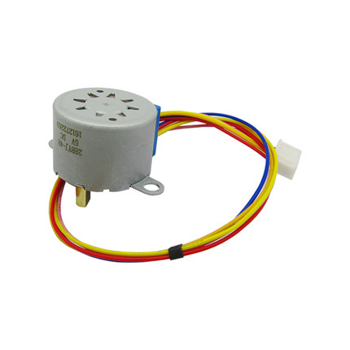
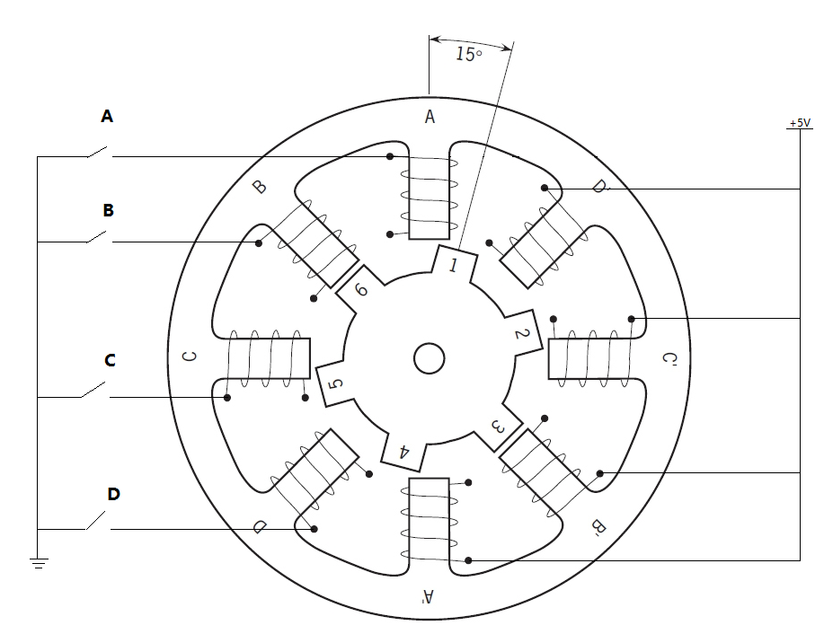
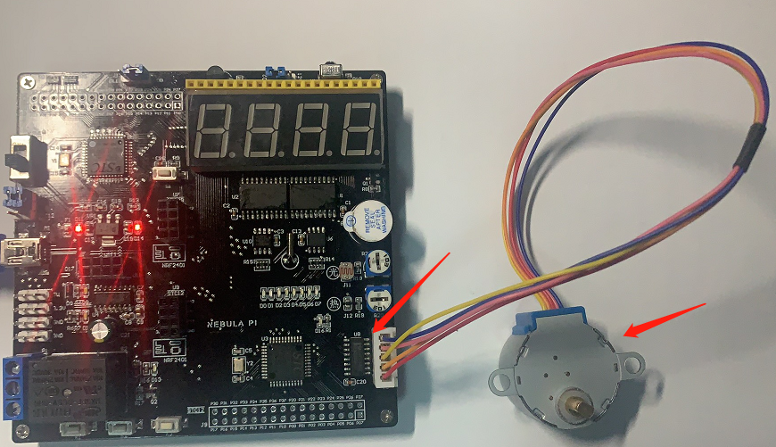

#  第18章 步进电机实验

## 18.1 步进电机概念

步进电机是将电[脉冲](http://baike.baidu.com/view/107414.htm)信号转变为[角位移](http://baike.baidu.com/view/750215.htm)或[线位移](http://baike.baidu.com/view/1433418.htm)的开环控制电机，是现代数字程序控制系统中的重要执行元件，应用极为广泛。在非超载的情况下，[电机](http://baike.baidu.com/view/1930.htm)的转速、停止的位置只取决于脉冲信号的频率和脉冲数，而不受负载变化的影响，当步进驱动器接收到一个脉冲信号，它就驱动步进电机按设定的方向转动一个固定的角度，称为"步距角"，它的旋转是以固定的角度一步一步运行的。

可以通过控制脉冲个数来控制角位移量，从而达到准确定位的目的。同时可以通过控制[脉冲频率](http://baike.baidu.com/view/2761038.htm)来控制电机转动的[速度](http://baike.baidu.com/view/36819.htm)和[加速度](http://baike.baidu.com/view/14423.htm)，从而达到调速的目的。

  

图18-1 步进电机图

## 18.2 步进电机分类

步进电机从其结构形式上可分为反应式步进电机（Variable Reluctance，VR）、永磁式步进电机Permanent Magnet，PM）、混合式步进电机（Hybrid Stepping，HS）。

1.  **反应式：**

[定子](http://baike.baidu.com/view/509193.htm)上有[绕组](http://baike.baidu.com/view/1082654.htm)、[转子](http://baike.baidu.com/view/110429.htm)由[软磁材料](http://baike.baidu.com/view/30113.htm)组成。结构简单、成本低、步距角小，可达1.2°、但动态性能差、效率低、发热大，可靠性难保证。

2.  **永磁式**

[永磁式步进电机](http://baike.baidu.com/view/2870558.htm)的转子用[永磁材料](http://baike.baidu.com/view/961873.htm)制成，转子的[极数](http://baike.baidu.com/view/6658611.htm)与定子的极数相同。其特点是[动态性能](http://baike.baidu.com/view/625948.htm)好、输出[力矩](http://baike.baidu.com/view/36869.htm)大，但这种电机[精度](http://baike.baidu.com/view/285142.htm)差，步矩角大（一般为7.5°或15°），价格较便宜。

3.  **混合式**

[混合式步进电机](http://baike.baidu.com/view/2908007.htm)综合了反应式和永磁式的优点，其定子上有多相绕组、转子上采用永磁材料，转子和定子上均有多个小齿以提高步矩精度。其特点是输出力矩大、动态性能好，步距角小，但结构复杂、成本相对较高。

  

图18-2 4相步进电机原理图

4相步进电机内部结构如上图所示，A，B，C，D四相称为定子，内部1，2，3，4，5，6为永磁铁，称为转子。以转子逆时针旋转为例介绍电机的工作原理。

假设初始状态如上图所示，B闭合，B相绕阻导通，产生磁性将对定子齿轮产生强有力的吸引，使得B对6吸引，B'对3进行吸引，形成如上图所示的初始状态。而此时转子齿轮1将与定子齿轮A形成一个15°的夹角，2与D'之间形成一个30°的夹角。紧接着我们断开B，闭合A相，A对1产生最大的吸引力，A'对4产生最大的吸引力。最终，A与1对齐，A'与4对齐。相当于转子逆时针转动了15°。此时，2与D'之间的夹角由30°变成了15°。紧接着断开A，闭合D，2与D'对齐，5与D对齐，转子将逆时针再旋转15°。接着断开D，闭合C，转子逆时针旋转15°。因此可以总结为：经过B-A-D-C转子旋转了45°。这个过程称为四节拍。旋转一圈360°需要360°/45°=8个四节拍。因此，可以计算出一个节拍旋转的角度为：360°/(8\*4)=11.25°。上述工作模式称为单四拍模式。

下面在上述的基础之上进行一下改进，假设在两个节拍之间插入一个新的节拍，例如在B断开，A闭合之间插入一个AB同时闭合的节拍，即B-BA-A。此时B对6与A对1具有相同的吸引力，最终将导致6和1之间的中心线将与B和A之间的中心线对齐，相当于转子转了5.625°。 在每个节拍之间插入了一个节拍，即旋转45°由原来的4拍变成了8拍，B-AB-A-AD-D-DC-C-CB。因此，旋转一周360°需要360°/45°\*8=64个节拍，每个节拍旋转5.625°。上述模式称为八拍模式，与四拍模式相比，由于增加了拍数使得电机扭矩更大，驱动力更强了，旋转精度提高了一倍。

表18-1 相步进电机真值表

+-------------+------+------+------+------+------+------+------+------+
| 节拍        | 1    | 2    | 3    | 4    | 5    | 6    | 7    | 8    |
|             |      |      |      |      |      |      |      |      |
| 四相        |      |      |      |      |      |      |      |      |
+=============+======+======+======+======+======+======+======+======+
|             | B    | BA   | A    | AD   | D    | DC   | C    | CB   |
+-------------+------+------+------+------+------+------+------+------+
| 粉B（P2.5） | 闭合 | 闭合 |      |      |      |      |      | 闭合 |
+-------------+------+------+------+------+------+------+------+------+
| 蓝A（P2.4） |      | 闭合 | 闭合 | 闭合 |      |      |      |      |
+-------------+------+------+------+------+------+------+------+------+
| 橙D（P2.7） |      |      |      | 闭合 | 闭合 | 闭合 |      |      |
+-------------+------+------+------+------+------+------+------+------+
| 黄C（P2.6） |      |      |      |      |      | 闭合 | 闭合 | 闭合 |
+-------------+------+------+------+------+------+------+------+------+
| 红VCC       | 5V   | 5V   | 5V   | 5V   | 5V   | 5V   | 5V   | 5V   |
+-------------+------+------+------+------+------+------+------+------+
| P2          | 0xDF | 0xCF | 0xEF | 0x5F | 0x7F | 0x3F | 0xBF | 0x9F |
+-------------+------+------+------+------+------+------+------+------+

  

图18-3 步进电机驱动模块

驱动电机需要一定的驱动电流，一般有两种比较简单的驱动电路。一种为使用三极管驱动，一种为采用专用的驱动芯片，我们这里采用的是第二种方法。如上图所示，采用ULN2003A来驱动动直流电机，芯片U8的1-4为输入端，通过锁存器U1连接到单片机的I/O口P2.4\~P2.7，OUT_A\~OUT_D为输出端连接到电机。输入端为高电平时，输出端为高电平，反之亦然。按照上表的时间顺序来驱动电机。那么这里有一个问题大家可能会问，每个节拍的持续时间是多少呢？理论上将节拍持续时间越小电机的转动速度越快。

表18-2 相步进电机参数

--------------------------------------------------------------------------------------------------
供电电压   相数   相电阻Ω   步进角度   减速比   起动频率P.P.S   转矩g.cm   噪声dB   绝缘介电常数
---------- ------ --------- ---------- -------- --------------- ---------- -------- --------------
5V         4      50±10%    5.625/64   1：64    ≥550            ≥300       ≤35      600VAC

--------------------------------------------------------------------------------------------------

该电机的参数表中有一个叫起动频率的参数，≥550 P.P.S，表示，在每秒550个脉冲的情况下，电机可以正常启动。相当于每个脉冲，即每个节拍的持续时间大于等于1/550 = 1.8ms的情况下，电机可以正常转动。按照上述学到的相关内容我们接下来就可以使直流电机转起来了。

## 18.3 步进电机试验

这里我们利用定时器来实现电机转动的功能，设置一个2ms的定时，每2ms执行一个节拍。根据上面的介绍64个节拍转动一周，一次，转动一周需要2ms\*64=128ms，那么可以得到1s可以转7.8周。编写代码如下：

1.  /\*\*\*\*\*\*\*\*\*\*\*\*\*\*\*\*\*\*\*\*\*\*\*\*\*\*\*\*\*\*\*\*\*\*\*\*\*\*\*\*\*\*\*\*\*\*\*\*\*\*\*\*\*\*\*\*\*\*\*\*\*\*\*\*\*\*\*

2.  \*   步进电机转动试验

3.  \* \*\*\*\*\*\*\*\*\*\*\*\*\*\*\*\*\*\*\*\*\*\*\*\*\*\*\*\*\*\*\*\*\*\*\*\*\*\*\*\*\*\*\*\*\*\*\*\*\*\*\*\*\*\*\*\*\*\*\*\*\*\*\*\*\*\*

4.  \* 【主芯片】：STC89SC52/STC12C5A60S2

5.  \* 【主频率】: 11.0592MHz

6.  \*

7.  \* 【版  本】： V1.0

8.  \* 【作  者】： stephenhugh

9.  \* 【网  站】：https://rymcu.taobao.com/

10. \* 【邮  箱】：

11. \*

12. \* 【版  权】All Rights Reserved

13. \* 【声  明】此程序仅用于学习与参考，引用请注明版权和作者信息！

14.           

15. \*

16. \*\*\*\*\*\*\*\*\*\*\*\*\*\*\*\*\*\*\*\*\*\*\*\*\*\*\*\*\*\*\*\*\*\*\*\*\*\*\*\*\*\*\*\*\*\*\*\*\*\*\*\*\*\*\*\*\*\*\*\*\*\*\*\*\*\*\*/

17. #include\<reg52.h>  

18. #include\<reg52.h>  

19.   

20. unsigned **char** code MotorCode\[8\]={0xDF,0xCF,0xEF,0x5F,0x7F,0x3F,0xBF,0x9F};

21.   

22. #define FOSC 11059200 //单片机晶振频率  

23. #define T_2ms (65536 - FOSC/12\*2/1000)  //定时器初始值计算  

24.   

25. sbit DU = P0\^6;//数码管段选定义

26.   

27. **void** main(**void**)

28. {

29.         P2 = 0x00;//关闭所有数码管

30.         DU = 1;

31.         DU = 0;//锁存段

32.       

33.         TMOD = 0x01;  //定时器工作模式配置

34.         TL0  = T_2ms;

35.         TH0  = T_2ms>\>8;

36.       

37.         TR0  = 1;//启动定时器

38.         ET0  = 1;//允许定时器中断

39.         EA   = 1;//开总中断

40.       

41.         **while**(1);

42. }

43.   

44. //定时器1中断函数

45. **void** timer0() interrupt 1

46. {

47.     **static** unsigned **char** index = 0;

48.           

49.         TL0  = T_2ms;//重装初始值

50.         TH0  = T_2ms>\>8;

51.       

52.         P2 =MotorCode\[index\];

53.         index++;

54.         **if**(index >= 8) index = 0;

55.       

56. }

图18-4 电机试验代码

电机连接及驱动芯片如下图所示：

  

图18-5 电机试验

将程序下载到单片机中，连接好电机。电机转起来了，但是好像有点不对劲，得8s左右才能转一圈，和我们预想的不一致。我们回过头来看电机参数表中有一个减速比1：64，速度减为原来的1/64。把这个考虑进去就和我们的现象吻合了。

下面我们写一个程序，让电机转动指定的角度，前面我们讲过转动一圈需要64个节拍，而减速比为1：64，因此，电机实际转动一圈需要64\*64=4096个节拍。所以转动angle度所需的节拍数beats = (angle \*4096)/360。根据这个公式编写程序如下：

1.  /\*\*\*\*\*\*\*\*\*\*\*\*\*\*\*\*\*\*\*\*\*\*\*\*\*\*\*\*\*\*\*\*\*\*\*\*\*\*\*\*\*\*\*\*\*\*\*\*\*\*\*\*\*\*\*\*\*\*\*\*\*\*\*\*\*\*\*

2.  \*   步进电机转动试验

3.  \* \*\*\*\*\*\*\*\*\*\*\*\*\*\*\*\*\*\*\*\*\*\*\*\*\*\*\*\*\*\*\*\*\*\*\*\*\*\*\*\*\*\*\*\*\*\*\*\*\*\*\*\*\*\*\*\*\*\*\*\*\*\*\*\*\*\*

4.  \* 【主芯片】：STC89SC52/STC12C5A60S2

5.  \* 【主频率】: 11.0592MHz

6.  \*

7.  \* 【版  本】： V1.0

8.  \* 【作  者】： stephenhugh

9.  \* 【网  站】：https://rymcu.taobao.com/

10. \* 【邮  箱】：

11. \*

12. \* 【版  权】All Rights Reserved

13. \* 【声  明】此程序仅用于学习与参考，引用请注明版权和作者信息！

14.           

15. \*

16. \*\*\*\*\*\*\*\*\*\*\*\*\*\*\*\*\*\*\*\*\*\*\*\*\*\*\*\*\*\*\*\*\*\*\*\*\*\*\*\*\*\*\*\*\*\*\*\*\*\*\*\*\*\*\*\*\*\*\*\*\*\*\*\*\*\*\*/

17. #include\<reg52.h>  

18. #include\<reg52.h>  

19.   

20. unsigned **char** code MotorCode\[8\]={0xDF,0xCF,0xEF,0x5F,0x7F,0x3F,0xBF,0x9F};

21.   

22. #define FOSC 11059200 //单片机晶振频率  

23. #define T_2ms (65536 - FOSC/12\*2/1000)  //定时器初始值计算  

24.   

25. sbit DU = P0\^6;//数码管段选定义

26.   

27. unsigned **long** angle  = 180;//转动角度

28. unsigned **long** beats = 0; //节拍初始值

29.   

30. **void** main(**void**)

31. {

32.         P2 = 0x00;//关闭所有数码管

33.         DU = 1;

34.         DU = 0;//锁存段

35.       

36.         beats = (angle\*4096)/360; //计算节拍数

37.       

38.         TMOD = 0x01;  //定时器工作模式配置

39.         TL0  = T_2ms;

40.         TH0  = T_2ms>\>8;

41.       

42.         TR0  = 1;//启动定时器

43.         ET0  = 1;//允许定时器中断

44.         EA   = 1;//开总中断

45.       

46.         **while**(1);

47. }

48.   

49. //定时器1中断函数

50. **void** timer0() interrupt 1

51. {

52.     **static** unsigned **char** index = 0;

53.           

54.         TL0  = T_2ms;//重装初始值

55.         TH0  = T_2ms>\>8;

56.         **if**(beats != 0)

57.         {

58.             P2 =MotorCode\[index\];

59.             index++;

60.             **if**(index >= 8) index = 0;

61.             beats\--;

62.         }

63. }

图18-6 任意角度程序代码

## 18.4 本章小结

本章学习了步进电机的驱动原理，并编写了驱动，后续可直接使用了。
