#  第2章 软件安装

欲毕其功于一役，必先利其器。开发单片机必然用到诸多工具软件，安装好软件，为后续开发奠定坚实基础。

本章将详细介绍 Nebula-Pi 单片机开发板开发过程中用到的软件、驱动程序的安装方法。通过本章的学习，你将了解到以下内容：

**1.C语言编程软件 Keil 的安装；**

**2.串口转 USB 驱动的安装；**

**3.51单片机程序下载软件 STC-ISP 的使用教程。**

## 2.1 C语言编程软件 Keil 的安装

在开发单片机程序过程中，我们首先用到的软件就是适合51单片机的C语言编程软件，编程软件采用 Keil C51 版本，简称 Keil 或 keilC51 ，接下来我们讲解软件的详细安装过程。

1. 首先找到 keil 软件源文件

可以到网络上搜索 "keil vision5" ',或到官网[下载](https://www.keil.com/download/product/) 。在我们提供的资料 **"工具软件 "->" 编写程序软件"**
文件夹下也可找到。下载好后，双击源文件开始安装，如图2.1所示：

图2.1 keil5安装

2. 点击 "Next>>" 继续进行安装

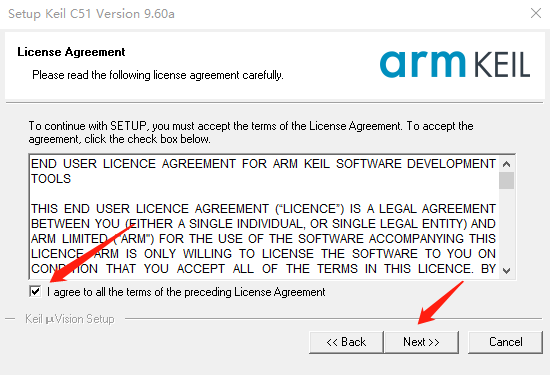

图2.2 keil安装

3. 勾选同意协议复选框，并单击 "Next>>" 按钮

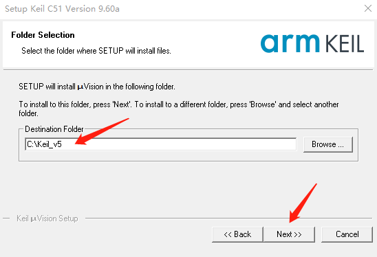

图2.3 keil软件安装

4. 选择默认安装在 "C:\Keil" 目录下，并单击 "Next>>"

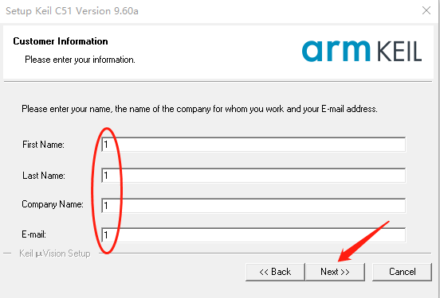

图2.4 keil软件安装

5. 填写任意字母或你感兴趣的字符，并单击 "Next>>"

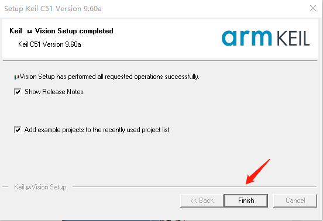

图2.5 keil软件安装

6. 点击 "Finsh" ，桌面出现软件快捷方式，即完成软件安装。

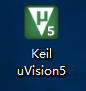

图2.6 keil快捷方式

## 2.2串口转 USB 驱动的安装

Nebula-Pi 开发板是通过 USB 接口与计算机连接的，而开发板上 USB 接口与单片机之间是通过串口转 USB 芯片 CH340C 连接，若要实现计算机与单片机之间的通信，需要在计算机上安装串口转 USB 驱动软件"
CH340SER.exe"。驱动软件可在工具软件文件夹下找到，安装详细步骤如下：

1.  双击源文件进行安装

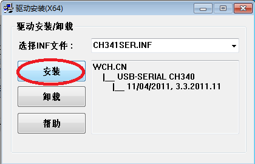

图2.7 驱动安装

2.  点击"安装"

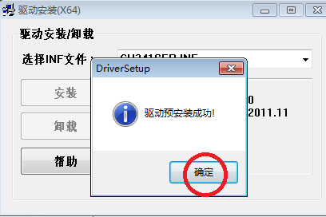

图2.8驱动安装

3. 点击"确定"，完成安装，将开发板连接到计算机任意 USB 接口，并打开设备管理器界面，找到端口并点开：

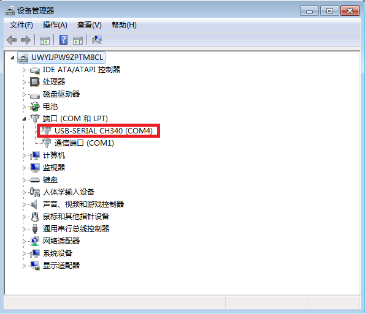

图 2.9 驱动安装

4. 若出现图2.9方框中内容 "USB-SERIAL CH340 （ COMx ）"，则表明驱动软件安装成功。其中， " COMx " 不同的计算机会出现不同的值，需记住此端口号，在下载程序时能用到，本台计算机为 "COM4"
   。若未出现上述内容，可重新安装程序，重启电脑并按照上述流程查看端口。

5. **注：**打开设备管理器的方式为：右击"我的电脑"在"属性"中即可找到"设备管理器"。

## 2.3 STC-ISP软件使用教程

当我们使用编程软件 keil5 完成软件的编写并生成".Hex"格式的文件后，通过 STC-ISP 软件将该文件下载到单片机中。下面讲解 STC-ISP 软件使用：

1.  该软件为免安装软件，双击源程序"stc-isp-15xx-v6.57.exe"，打开软件界面

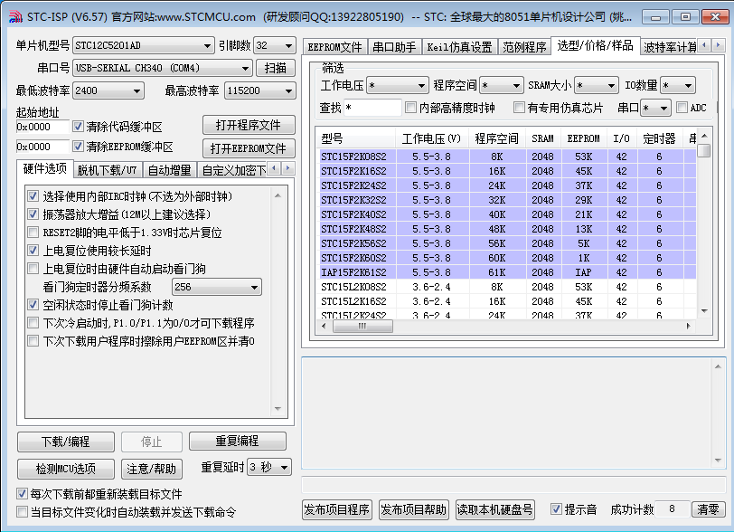

图2.10 STC-ISP启动界面

2. 进行参数配置，在配置之前确保单片机开发板与计算机 USB 口连接好，首先进行单片机型号选择，在下拉框中选择： "STC89C/LE52RC" ，如下图所示：

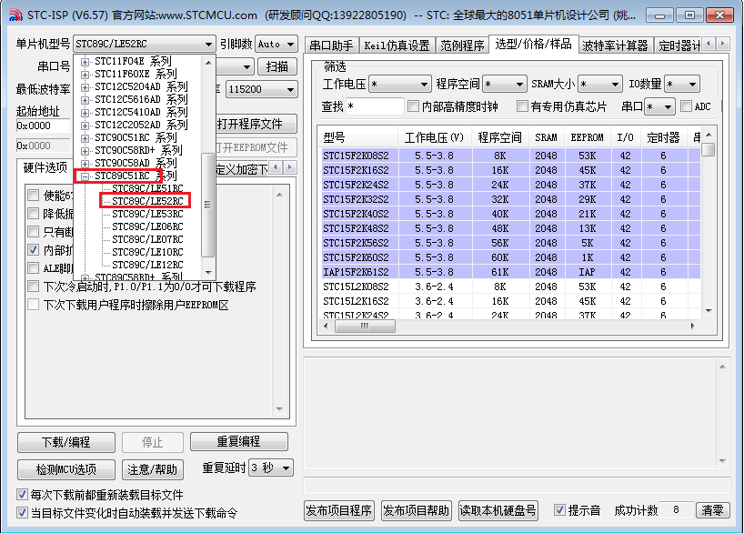

图2.11 单片机型号选择

3. 串口号选择，在下拉框中选择 "USB-SERIAL CH340 （ COMx ）"，注意：必须确保开发板已经于计算机连接好，该串口号才会出现。

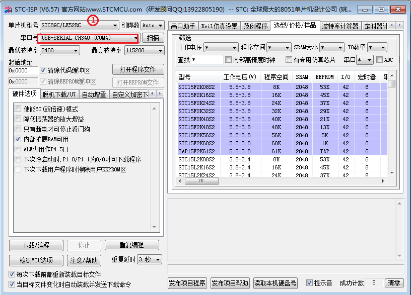

图2.12 串口号选择

4.  点击"打开程序文件"，选择所要下载的".HEX"格式的文件，这里以"LED.hex"为例，选择该文件，点击"打开"，该文件便加载到软件中去了。

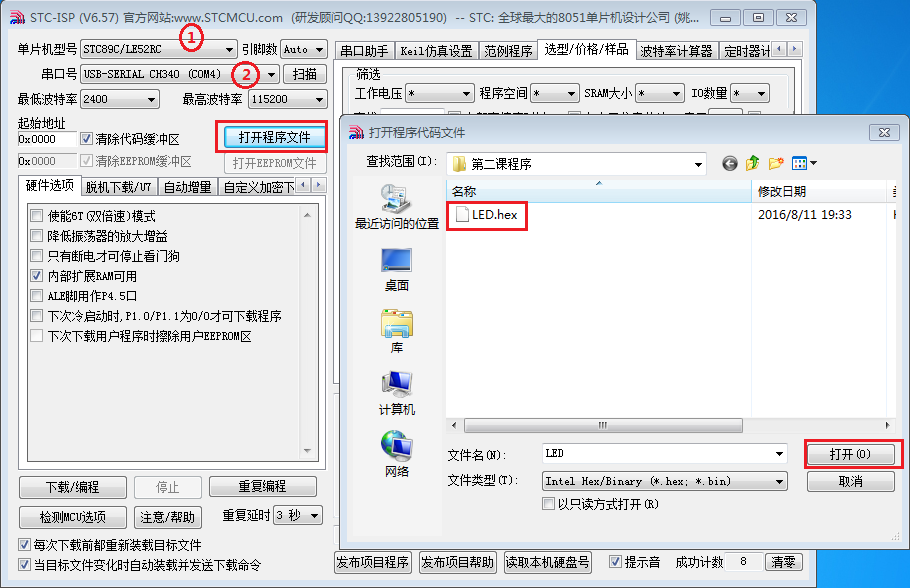

图2.13 下载文件的选择

5.  其他设置均默认值，点击"下载/编程"，准备进行程序下载，点击完后，右下侧会出现"正在检测目标单片机......"

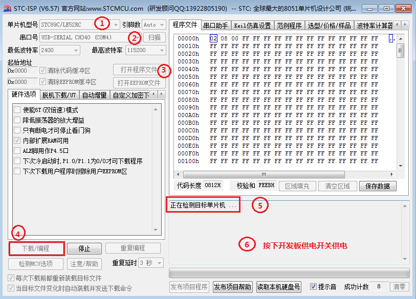

图2.14 下载准备

6. 拨动开发板左上角的供电开关（ SW1 ），给开发板供电，程序开始自动下载

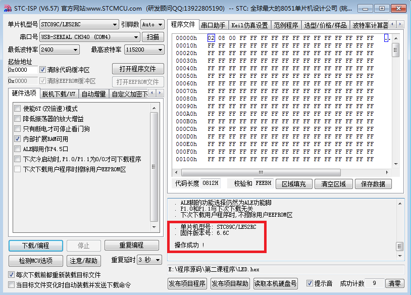

图 2.15 程序下载成功

若程序下载成功，则会出现图2.15方框中"操作成功"字样。

**下载过程注意事项：**

首先，确保开发板与计算机连接可靠。

其次，确保在点击了"下载/编程"，并出现了"正在检测目标单片机......"字样之后，再按下开关给单片机供电。

再次，单片机型号一定要选择 "STC89C/LE52RC"

**以上三点是单片机下载程序成功的必要条件。**

## 2.4 本章小结

本章完成了51单片机开发的三个必备的软件安装，安装完一次即可，后续我们需要反复不断的使用他们。
