#  第20章 0.96 OLED使用

OLED应用场合非常的多。我们这里选用中景园的0.96 OLED作为实例，讲解OLED的驱动与使用。

## 20.1 OLED介绍

     

图20-1 0.96 OLED外形图

0.96 OLED外形，正反面如上图所示，除了屏幕用于显示之外，反面有4个插针引脚。引脚定义如下表所示：

表20-1 接口定义

----------------------------------------------------------------------------------
**0.96 OLED 接口定义**
------------------------ ------------------------ --------------------------------
序号                     符号                     说明

1                        GND                      电源地

2                        VCC                      电源正3.3\~5V

3                        SCL                      I^2^C时钟线

4                        SDA                      I^2^C数据线
----------------------------------------------------------------------------------

由上表可知，我们这里使用的OLED，采用I^2^C通信协议。因此，只需要研究OLED的驱动芯片的I^2^C协议，再结合前面课程学习过的I^2^C通信，即可实现对显示器的控制了。

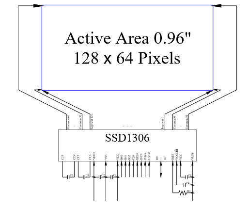  

图20-2 0.96 OLED 驱动

该款OLED使用了SSD1306作为液晶的驱动芯片，如上图。

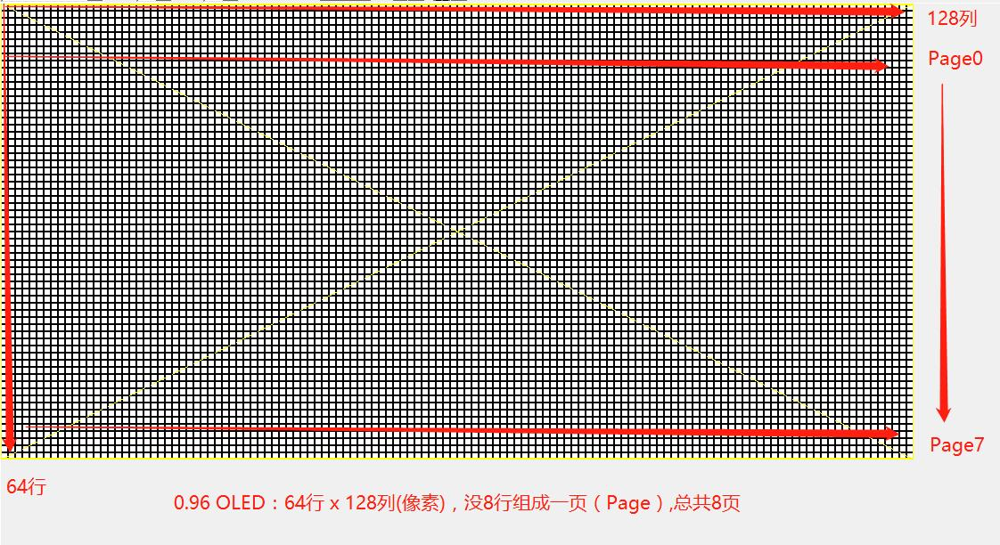  

图20-3 0.96 OLED像素布局

液晶显示器的布局如上图所示，每一个方块就是一个像素：

1.  总共有64行，128列，共计128\*64 = 8192像素，每个像素可以有两种状态，亮或灭。

2.  每8行组成一页，总共64/8=8页，页也称为Page。

3.  左上角的第一个像素，为第0行，第0列。右下角的最后一个像素，为第63行，第127列。

4.  前8行称为Page0，最后8称为Page7。

## 20.2 OLED 最小操作单位

驱动芯片SSD1306规定：

1.  每次写入数据的最小单位为1个字节，即8位；

2.  而且每次写入必须是在同一页内，不能跨页；

3.  写入的数据按列写入，下面举例说明。

**例子：**

往page0的第0列写入一个字节的数据0x01= 0b0000,0001，显示结果如下图所示：

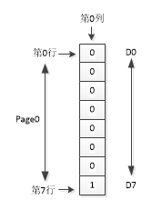

图20-4 0.96 写入一个字节的数据

如上图所示，Page0对应屏幕的第0-7行。第0行、第0列将写入数据的最低位D0，即0。第7行、第0列将写入数据的最高位D7，即1。因为写入的数据为0x01，显示屏的第7行，第0列的单个像素将点亮，整个屏幕效果为，只有一个像素点亮。

上面是0.96 OLED的最小操作单位，我们可以选择0-127列中的任意列，0-7页的任意页写入一个字节的数据。

这里值得注意的是，OLED的最小操作单位，并不是单个像素，而是一次最小操作某一列的8个像素。我们可以组合最小操作单位，实现字符、数字、中文、字符串以及图像的显示。

## 20.3 OLED 驱动

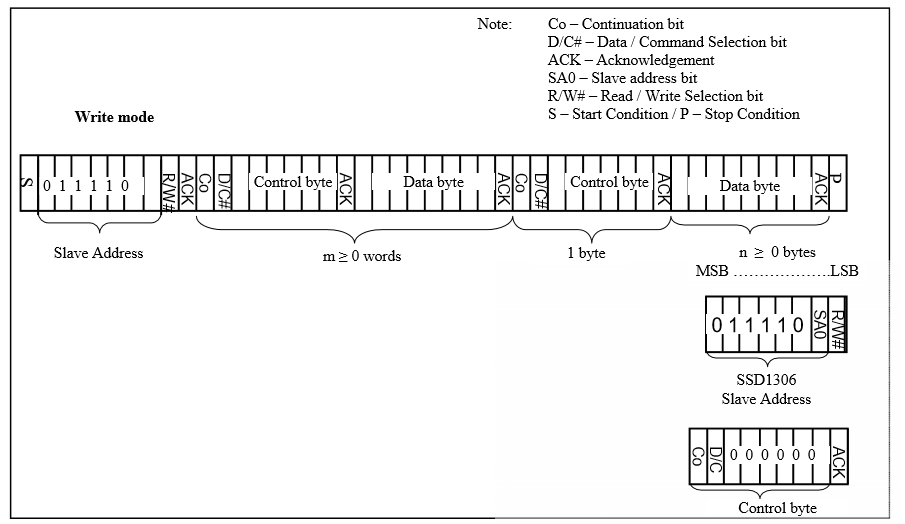  

图20-5 OLED驱动SSD1306写数据时序

如上图所示，驱动步骤入下：

1.  启动I^2^C通信；

2.  写入从设备地址；

3.  写入控制字节，可选；

4.  写入一个字节数据，可选；

5.  写入控制字节，1Byte；

6.  写入数据，≥0Byte；

7.  结束I^2^C通信。

如上述步骤所示，其中步骤3，4可选，我们使用最精简的模式跳过步骤3，4。根据步骤5中控制字的不同，步骤6的内容将表示数据或者命令。

1.  当步骤5写入0x00，表示6为命令；

2.  当步骤5写入0x40，表示6为数据。

根据上述内容，我们编写OLED的驱动函数如下，I^2^C的底层驱动在前面章节学习过，我们这里直接调用：

1.  /\*\*\*\*\*\*\*\*\*\*\*\*\*\*\*\*\*\*\*\*\*\*\*\*\*\*\*\*\*\*\*\*\*\*\*\*\*\*\*\*\*\*\*\*\*\*

2.  // IIC Write Command

3.  \*\*\*\*\*\*\*\*\*\*\*\*\*\*\*\*\*\*\*\*\*\*\*\*\*\*\*\*\*\*\*\*\*\*\*\*\*\*\*\*\*\*\*\*\*\*/

4.  **void** Write_IIC_Command(unsigned **char** IIC_Command)

5.  {

6.     Start_I2C();

7.     Wr_I2C(0x78);      //Slave address,SA0=0

8.     Wr_I2C(0x00);            //write command

9.     Wr_I2C(IIC_Command);

10.    Stop_I2C();

11. }

12. /\*\*\*\*\*\*\*\*\*\*\*\*\*\*\*\*\*\*\*\*\*\*\*\*\*\*\*\*\*\*\*\*\*\*\*\*\*\*\*\*\*\*\*\*\*\*

13. // IIC Write Data

14. \*\*\*\*\*\*\*\*\*\*\*\*\*\*\*\*\*\*\*\*\*\*\*\*\*\*\*\*\*\*\*\*\*\*\*\*\*\*\*\*\*\*\*\*\*\*/

15. **void** Write_IIC_Data(unsigned **char** IIC_Data)

16. {

17.    Start_I2C();

18.    Wr_I2C(0x78);            //D/C#=0; R/W#=0

19.    Wr_I2C(0x40);            //write data

20.    Wr_I2C(IIC_Data);

21.    Stop_I2C();

22. }

23. /\*\*\*\*\*\*\*\*\*\*\*\*\*\*\*\*\*\*\*\*\*\*\*\*\*\*\*\*\*\*\*\*\*\*\*\*\*\*\*\*\*\*\*\*\*\*

24. // Write OLED

25. \*\*\*\*\*\*\*\*\*\*\*\*\*\*\*\*\*\*\*\*\*\*\*\*\*\*\*\*\*\*\*\*\*\*\*\*\*\*\*\*\*\*\*\*\*\*/

26. **void** OLED_WR_Byte(unsigned dat,unsigned cmd)

27. {

28.     **if**(cmd) Write_IIC_Data(dat);

29.   **else**    Write_IIC_Command(dat);

30. }

图20-6 OLED驱动代码编写

上图中 Write_IIC_Command() ，Write_IIC_Data()分别写命令和数据函数，并将其组合成了OLED的最小操作函数OLED_WR_Byte()，后续所用的操作均以这个函数为基础。

### 20.3.1 OLED初始化及清除屏幕

通过写入相应的值来初始化OLED以及清除屏幕。相应的指令从驱动SSD1306的技术文档可以查阅，我们这里直接上代码OLED_Init()、OLED_Clear() ：

1.  /\*\*\*\*\*\*\*\*\*\*\*\*\*\*\*\*\*\*\*\*\*\*\*\*\*\*\*\*\*\*\*\*\*\*\*\*\*\*\*\*\*\*\*\*\*\*\*\*\*\*\*\*\*\*\*\*\*\*\*\*\*\*\*\*\*

2.  \* OLED初始化

3.  \* 为OLED正常工作做准备

4.  \*\*\*\*\*\*\*\*\*\*\*\*\*\*\*\*\*\*\*\*\*\*\*\*\*\*\*\*\*\*\*\*\*\*\*\*\*\*\*\*\*\*\*\*\*\*\*\*\*\*\*\*\*\*\*\*\*\*\*\*\*\*\*/

5.  **void** OLED_Init(**void**)

6.  {

7.     

8.      OLED_WR_Byte(0xAE,OLED_CMD);//\--display off

9.      OLED_WR_Byte(0x00,OLED_CMD);//\-\--set low column address

10.     OLED_WR_Byte(0x10,OLED_CMD);//\-\--set high column address

11.     OLED_WR_Byte(0x40,OLED_CMD);//\--set start line address

12.     OLED_WR_Byte(0xB0,OLED_CMD);//\--set page address

13.     OLED_WR_Byte(0x81,OLED_CMD); // contract control

14.     OLED_WR_Byte(0xFF,OLED_CMD);//\--128

15.     OLED_WR_Byte(0xA1,OLED_CMD);//set segment remap

16.     OLED_WR_Byte(0xA6,OLED_CMD);//\--normal / reverse

17.     OLED_WR_Byte(0xA8,OLED_CMD);//\--set multiplex ratio(1 to 64)

18.     OLED_WR_Byte(0x3F,OLED_CMD);//\--1/32 duty

19.     OLED_WR_Byte(0xC8,OLED_CMD);//Com scan direction

20.     OLED_WR_Byte(0xD3,OLED_CMD);//-set display offset

21.     OLED_WR_Byte(0x00,OLED_CMD);//

22.     OLED_WR_Byte(0xD5,OLED_CMD);//set osc division

23.     OLED_WR_Byte(0x80,OLED_CMD);//

24.     OLED_WR_Byte(0xD8,OLED_CMD);//set area color mode off

25.     OLED_WR_Byte(0x05,OLED_CMD);//

26.     OLED_WR_Byte(0xD9,OLED_CMD);//Set Pre-Charge Period

27.     OLED_WR_Byte(0xF1,OLED_CMD);//

28.     OLED_WR_Byte(0xDA,OLED_CMD);//set com pin configuartion

29.     OLED_WR_Byte(0x12,OLED_CMD);//

30.     OLED_WR_Byte(0xDB,OLED_CMD);//set Vcomh

31.     OLED_WR_Byte(0x30,OLED_CMD);//

32.     OLED_WR_Byte(0x8D,OLED_CMD);//set charge pump enable

33.     OLED_WR_Byte(0x14,OLED_CMD);//

34.     OLED_WR_Byte(0xAF,OLED_CMD);//\--turn on oled panel

35. }

图20-7 OLED初始化

1.  /\*\*\*\*\*\*\*\*\*\*\*\*\*\*\*\*\*\*\*\*\*\*\*\*\*\*\*\*\*\*\*\*\*\*\*\*\*\*\*\*\*\*\*\*\*\*\*\*\*\*\*\*\*\*\*\*\*\*\*\*\*\*\*\*\*

2.  \* OLED 清屏，无任何显示

3.  \*\*\*\*\*\*\*\*\*\*\*\*\*\*\*\*\*\*\*\*\*\*\*\*\*\*\*\*\*\*\*\*\*\*\*\*\*\*\*\*\*\*\*\*\*\*\*\*\*\*\*\*\*\*\*\*\*\*\*\*\*\*\*\*\*\*/

4.  **void** OLED_Clear(**void**)

5.  {

6.      u8 i,n;

7.      **for**(i=0;i\<8;i++)

8.      {

9.          OLED_WR_Byte (0xb0+i,OLED_CMD);//设置页地址（0\~7）

10.         OLED_WR_Byte (0x00,OLED_CMD);  //设置显示位置---列低地址

11.         OLED_WR_Byte (0x10,OLED_CMD);  //设置显示位置---列高地址

12.         **for**(n=0;n\<128;n++)OLED_WR_Byte(0,OLED_DATA);

13.     } //更新显示

14. }

图20-8 OLED清屏

### 20.3.2 OLED显示一个字符

如何在显示屏上显示一个字符？首先，我们需要制作一个字符的点阵。以字符"1"为例子讲解，字符点阵的制作。

  

图20-9 字符"0"的显示效果

如上图所示，字符"1"大小为8x16像素，即占用空间为8列，16行。结合前面讲解的内容，我们可以按列整理成数据，第一列可以整合成两个字节的数据，依次类推按列整合成数据如下：

0x00,0x10,0x10,0xF8,0x00,0x00,0x00,0x00,0x00,0x20,0x20,0x3F,0x20,0x20,0x00,0x00

调用OLED的最小操作函数把上述字节写入OLED即可。为了方便，我们把所有可打印字符的数据整理成一个数组，在数组中查表即可，如下图所示。

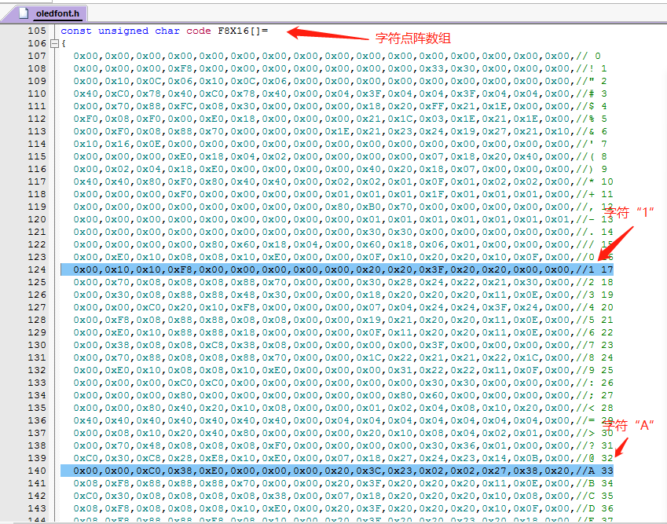  

图20-10 字符点阵数组

1.  /\*\*\*\*\*\*\*\*\*\*\*\*\*\*\*\*\*\*\*\*\*\*\*\*\*\*\*\*\*\*\*\*\*\*\*\*\*\*\*\*\*\*\*\*\*\*\*\*\*\*\*\*\*\*\*\*\*\*\*\*\*\*\*\*\*

2.  \* 0.96 OLED 128\*64像素，即:128列 x 64行

3.  \* 64行被均分成了8页，最开始8行为第0页，最后8行为第7页。

4.  \*

5.  \* 函数功能为:从x列，y页开始显示一个字符,Char_Size为字体大小。

6.  \*

7.  \* x:0-127(列)

8.  \* y:0-7  (页)

9.  \* Char_Size: 16(字体大小为：8列 x 16行)，其他(6列 x 8行)

10. \* flag,反白显示，默认为0，正常显示。1：反白显示。

11. \*\*\*\*\*\*\*\*\*\*\*\*\*\*\*\*\*\*\*\*\*\*\*\*\*\*\*\*\*\*\*\*\*\*\*\*\*\*\*\*\*\*\*\*\*\*\*\*\*\*\*\*\*\*\*\*\*\*\*\*\*\*\*\*\*/

12. **void** OLED_ShowChar(u8 x,u8 y,u8 chr,u8 Char_Size,bit flag)

13. {

14.     unsigned **char** c=0,i=0;

15.         c=chr-\' \';//得到偏移后的值

16.         **if**(x>Max_Column-1){x=0;y=y+2;}

17.         **if**(Char_Size ==16)

18.         {

19.             OLED_Set_Pos(x,y);

20.             **for**(i=0;i\<8;i++)

21.             {

22.             **if**(flag == 0) OLED_WR_Byte( F8X16\[c\*16+i\],OLED_DATA);

23.             **else**  OLED_WR_Byte(\~F8X16\[c\*16+i\],OLED_DATA);

24.             }

25.             OLED_Set_Pos(x,y+1);

26.             **for**(i=0;i\<8;i++)

27.          {

28.           **if**(flag == 0) OLED_WR_Byte( F8X16\[c\*16+i+8\],OLED_DATA);

29.       **else**  OLED_WR_Byte(\~F8X16\[c\*16+i+8\],OLED_DATA);

30.             }

31.         }

32.         **else**

33.         {

34.             OLED_Set_Pos(x,y);

35.             **for**(i=0;i\<6;i++)

36.             {

37.          **if**(flag == 0) OLED_WR_Byte( F6x8\[c\]\[i\],OLED_DATA);

38.          **else** OLED_WR_Byte(\~F6x8\[c\]\[i\],OLED_DATA);

39.             }

40.         }

41. }

图20-11 写字符函数

上述函数中，可以选择两种字符，大小分别为8x16像素和6x8像素，分别放在数组符F8x16\[\]和F6x8\[\]中。

同样的道理，可以制作不同的字体放入数组中。

### 20.3.3 使用字模软件制作字符点阵

使用工具软件PCtoLCD2002生成字符点阵，使用方法如下：

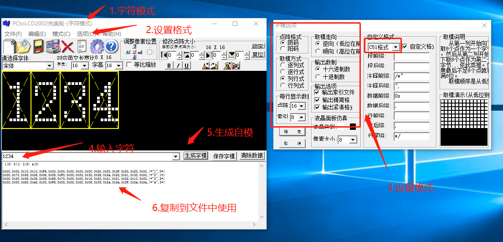  

图20-12 字模软件生成字符点阵

### 20.3.4 OLED显示数字

有了前面的基础，写入数字就比较简单了，即把数字各个位转换成字符，然后写入即可，OLED_ShowNum()代码如下：

1.  /\*\*\*\*\*\*\*\*\*\*\*\*\*\*\*\*\*\*\*\*\*\*\*\*\*\*\*\*\*\*\*\*\*\*\*\*\*\*\*\*\*\*\*\*\*\*\*\*\*\*\*\*\*\*\*\*\*\*\*\*\*\*\*\*\*

2.  \*

3.  \* 函数功能为:m的n次方

4.  \*

5.  \*\*\*\*\*\*\*\*\*\*\*\*\*\*\*\*\*\*\*\*\*\*\*\*\*\*\*\*\*\*\*\*\*\*\*\*\*\*\*\*\*\*\*\*\*\*\*\*\*\*\*\*\*\*\*\*\*\*\*\*\*\*\*\*\*/

6.  u32 oled_pow(u8 m,u8 n)

7.  {

8.      u32 result=1;

9.      **while**(n\--)result\*=m;

10.     **return** result;

11. }

12.   

13. /\*\*\*\*\*\*\*\*\*\*\*\*\*\*\*\*\*\*\*\*\*\*\*\*\*\*\*\*\*\*\*\*\*\*\*\*\*\*\*\*\*\*\*\*\*\*\*\*\*\*\*\*\*\*\*\*\*\*\*\*\*\*\*\*\*

14. \* 0.96 OLED 128\*64像素，即:128列 x 64行

15. \* 64行被均分成了8页，最开始8行为第0页，最后8行为第7页。

16. \*

17. \* 函数功能为:从x列，y页开始显示数字。

18. \*

19. \* x:0-127(列)

20. \* y:0-7  (页)

21. \* len:数字长度

22. \* Char_Size: 16(字体大小为：8列 x 16行)，其他(6列 x 8行)

23. \*

24. \*\*\*\*\*\*\*\*\*\*\*\*\*\*\*\*\*\*\*\*\*\*\*\*\*\*\*\*\*\*\*\*\*\*\*\*\*\*\*\*\*\*\*\*\*\*\*\*\*\*\*\*\*\*\*\*\*\*\*\*\*\*\*/

25. **void** OLED_ShowNum(u8 x,u8 y,u32 num,u8 len,u8 Char_Size,bit flag)

26. {

27.     u8 t,temp,RowChar,CharSize;

28.     u8 enshow=0;

29.       

30.     **if**(Char_Size==16)//判断字体大小

31.     {

32.         RowChar = 8;

33.         CharSize= 16;

34.     }

35.     **else**

36.     {

37.         RowChar = 6;

38.         CharSize= 8;

39.     }

40.       

41.     **for**(t=0;t\<len;t++)

42.     {

43.         temp=(num/oled_pow(10,len-t-1))%10;

44.         **if**(enshow==0&&t\<(len-1))

45.         {

46.             **if**(temp==0)

47.             {  //第一个非0数字之前用空格替代

48. OLED_ShowChar(x+RowChar\*t,y,\' \',CharSize,flag);

49.                ** continue**;

50.             }

51.             **else** enshow=1;

52.                

53.         }

54.         OLED_ShowChar(x+RowChar\*t,y,temp+\'0\',CharSize,flag);

55.     }

56. }

图20-13 显示数字

### 20.3.5 OLED显示中文

同样利用字模软件生成中文字模，并放入数字Hzk\[\]\[\]中，显示中文函数如下所示：

1.   /\*\*\*\*\*\*\*\*\*\*\*\*\*\*\*\*\*\*\*\*\*\*\*\*\*\*\*\*\*\*\*\*\*\*\*\*\*\*\*\*\*\*\*\*\*\*\*\*\*\*\*\*\*\*\*\*\*\*\*\*\*\*\*\*\*\*\*\*

2.  \* 0.96 OLED 128\*64像素，即:128列 x 64行

3.  \* 64行被均分成了8页，最开始8行为第0页，最后8行为第7页。

4.  \*

5.  \* 函数功能为:从x列，y页开始显示汉字，汉字大小16x16

6.  \*

7.  \* x:0-127(列)

8.  \* y:0-7  (页)

9.  \* \*chr:字符串首地址

10. \* Num:第Num个汉字，汉字定义在oledfont.h的数组HzK\[\]中。

11. \*

12. \*\*\*\*\*\*\*\*\*\*\*\*\*\*\*\*\*\*\*\*\*\*\*\*\*\*\*\*\*\*\*\*\*\*\*\*\*\*\*\*\*\*\*\*\*\*\*\*\*\*\*\*\*\*\*\*\*\*\*\*\*\*\*\*/

13. **void** OLED_ShowCHinese(u8 x,u8 y,u8 Num,bit flag)

14. {

15.     u8 t,adder=0;

16.       

17.     OLED_Set_Pos(x,y);

18.     **for**(t=0;t\<16;t++)

19.         {

20.             **if**(flag == 0) OLED_WR_Byte( Hzk\[2\*Num\]\[t\],OLED_DATA);

21.              **else**         OLED_WR_Byte(\~Hzk\[2\*Num\]\[t\],OLED_DATA);

22.                 adder+=1;

23.      }

24.         OLED_Set_Pos(x,y+1);

25.     **for**(t=0;t\<16;t++)

26.         {

27.          **if**(flag == 0) OLED_WR_Byte( Hzk\[2\*Num+1\]\[t\],OLED_DATA);

28.          **else**       OLED_WR_Byte(\~Hzk\[2\*Num+1\]\[t\],OLED_DATA);

29.                 adder+=1;

30.       }

31. }

图20-14 显示中文

### 20.3.6 OLED显示字符串

将字符组合，实现字符串显示，函数如下：

1.  /\*\*\*\*\*\*\*\*\*\*\*\*\*\*\*\*\*\*\*\*\*\*\*\*\*\*\*\*\*\*\*\*\*\*\*\*\*\*\*\*\*\*\*\*\*\*\*\*\*\*\*\*\*\*\*\*\*\*\*\*\*

2.  \* 0.96 OLED 128\*64像素，即:128列 x 64行

3.  \* 64行被均分成了8页，最开始8行为第0页，最后8行为第7页。

4.  \*

5.  \* 函数功能为:从x列，y页开始显示字符串。

6.  \*

7.  \* x:0-127(列)

8.  \* y:0-7  (页)

9.  \* \*chr:字符串首地址

10. \* Char_Size: 16(字体大小为：8列 x 16行)，其他(6列 x 8行)

11. \*

12. \*\*\*\*\*\*\*\*\*\*\*\*\*\*\*\*\*\*\*\*\*\*\*\*\*\*\*\*\*\*\*\*\*\*\*\*\*\*\*\*\*\*\*\*\*\*\*\*\*\*\*\*\*\*\*\*\*\*\*\*\*\*\*\*/

13. **void** OLED_ShowString(u8 x,u8 y,u8 \*chr,u8 Char_Size,bit flag)

14. {

15.     u8 CharSize,RowChar,j=0;

16.       

17.     **if**(Char_Size==16)

18.     {

19.         RowChar = 8;

20.         CharSize= 16;

21.     }

22.     **else**

23.     {

24.         RowChar = 6;

25.         CharSize= 8;

26.     }

27.       

28.     **while** (chr\[j\]!=\'\\0\')

29.     {

30.         OLED_ShowChar(x,y,chr\[j\],CharSize,flag);

31.         x+=RowChar;

32.         **if**(x>(120-RowChar))//行尾不足一个字，换行

33.         {

34.             x=0;

35.             y+=2;

36.         }

37.             j++;

38.     }

39. }

图20-15 显示字符串

### 20.3.7 OLED显示图片

利用字模软件将128x64像素的图片生成字模，并存储于BMP\[\]数组中，图片显示函数如下：

1.  /\*\*\*\*\*\*\*\*\*\*\*\*\*\*\*\*\*\*\*\*\*\*\*\*\*\*\*\*\*\*\*\*\*\*\*\*\*\*\*\*\*\*\*\*\*\*\*\*\*\*\*\*\*\*\*\*\*\*\*\*\*\*\*\*

2.  \* 0.96 OLED 128\*64像素，即:128列 x 64行

3.  \* 64行被均分成了8页，最开始8行为第0页，最后8行为第7页。

4.  \*

5.  \* 函数功能为:从x0列，y0页开始显示图片，坐标

6.  \*

7.  \* x:0-127(列)

8.  \* y:0-7  (页)

9.  \* \*chr:字符串首地址

10. \* BMP\[\]:图片字模数组

11. \*

12. \*\*\*\*\*\*\*\*\*\*\*\*\*\*\*\*\*\*\*\*\*\*\*\*\*\*\*\*\*\*\*\*\*\*\*\*\*\*\*\*\*\*\*\*\*\*\*\*\*\*\*\*\*\*\*\*\*\*\*\*\*\*\*/

13. **void** OLED_DrawBMP(u8 x0,u8 y0,u8 BMP\[\],bit flag)

14. {

15.  unsigned **int** j=0;

16.  unsigned **char** x,y;

17.     

18.     **for**(y=y0;y\<8;y++)

19.     {

20.         OLED_Set_Pos(x0,y);

21.     **for**(x=x0;x\<128;x++)

22.         {

23.             **if**(flag == 0) OLED_WR_Byte( BMP\[j++\],OLED_DATA);

24.                 **else**     OLED_WR_Byte(\~BMP\[j++\],OLED_DATA);

25.         }

26.     }

27. }

图20-16显示图片

## 20.4 OLED 显示综合应用

将上述代码放入oled.c，oled.h，字符字模和图片字模数组分别放入oledfont.h和bmp.h文件中。建立工程，在main()函数中进行功能测试，部分代码如下：

1.  /\*\*\*\*\*\*\*\*\*\*\*\*\*\*\*\*\*\*\*\*\*\*\*\*\*\*\*\*\*\*\*\*\*\*\*\*\*\*\*\*\*

2.      \*

3.      \*0.96 OLED 字符显示测试

4.      \*

5.  \*\*\*\*\*\*\*\*\*\*\*\*\*\*\*\*\*\*\*\*\*\*\*\*\*\*\*\*\*\*\*\*\*\*\*\*\*\*\*\*\*\*\*/

6.      OLED_ShowChar( 0,0,\'A\',16,0);

7.      OLED_ShowChar( 8,0,\'B\',16,0);

8.      OLED_ShowChar(16,0,\'C\',16,0);

9.      OLED_ShowChar(24,0,\'D\',16,0);

10.       

11.     OLED_ShowChar( 0,2,\'A\',8,0);

12.     OLED_ShowChar( 8,2,\'B\',8,0);

13.     OLED_ShowChar(16,2,\'C\',8,0);

14.     OLED_ShowChar(24,2,\'D\',8,0);

15.       

16.     OLED_ShowString(25,6,\"Char Test!\",16,1);

17.   

18.     delayms(5000);

19.     OLED_Clear();//清除屏幕

20.       

21. /\*\*\*\*\*\*\*\*\*\*\*\*\*\*\*\*\*\*\*\*\*\*\*\*\*\*\*\*\*\*\*\*\*\*\*\*\*\*\*\*\*

22.     \*

23.     \*0.96 OLED 数字显示测试

24.     \*

25. \*\*\*\*\*\*\*\*\*\*\*\*\*\*\*\*\*\*\*\*\*\*\*\*\*\*\*\*\*\*\*\*\*\*\*\*\*\*\*\*\*\*\*/

26.   

27.     OLED_ShowNum(  0,1,12,2,16,0);

28.     OLED_ShowNum( 48,1,34,2,16,0);

29.     OLED_ShowNum( 96,1,56,2,16,0);

30.       

31.     OLED_ShowString(25,6,\"Num Test!\",16,1);

32.       

33.     delayms(5000);

34.     OLED_Clear();//清除屏幕

35.   

36. /\*\*\*\*\*\*\*\*\*\*\*\*\*\*\*\*\*\*\*\*\*\*\*\*\*\*\*\*\*\*\*\*\*\*\*\*\*\*\*\*\*

37.     \*

38.     \*0.96 OLED 中文显示测试

39.     \*

40. \*\*\*\*\*\*\*\*\*\*\*\*\*\*\*\*\*\*\*\*\*\*\*\*\*\*\*\*\*\*\*\*\*\*\*\*\*\*\*\*\*\*\*/

41.     OLED_ShowCHinese(22   ,3,1,0);//不

42.     OLED_ShowCHinese(22+16,3,2,0);//见

43.     OLED_ShowCHinese(22+32,3,3,0);//不

44.     OLED_ShowCHinese(22+48,3,4,0);//散

45.     OLED_ShowCHinese(22+64,3,5,0);//！

46.       

47.     OLED_ShowString(25,6,\"CHN Test!\",16,1);

48.       

49.     delayms(5000);

50.     OLED_Clear();//清除屏幕

51.       

52. /\*\*\*\*\*\*\*\*\*\*\*\*\*\*\*\*\*\*\*\*\*\*\*\*\*\*\*\*\*\*\*\*\*\*\*\*\*\*\*\*\*

53.     \*

54.     \*0.96 OLED 字符串显示测试

55.     \*

56. \*\*\*\*\*\*\*\*\*\*\*\*\*\*\*\*\*\*\*\*\*\*\*\*\*\*\*\*\*\*\*\*\*\*\*\*\*\*\*\*\*\*\*/

57.   

58.     OLED_ShowString(0,2,\"Nebula-Pi,RYMCU!\",16,0);

59.       

60.     OLED_ShowString(25,6,\"Str Test!\",16,1);

61.       

62.     delayms(5000);

63.     OLED_Clear();//清除屏幕

64. /\*\*\*\*\*\*\*\*\*\*\*\*\*\*\*\*\*\*\*\*\*\*\*\*\*\*\*\*\*\*\*\*\*\*\*\*\*\*\*\*\*

65.     \*

66.     \*0.96 OLED 图片显示测试

67.     \*

68. \*\*\*\*\*\*\*\*\*\*\*\*\*\*\*\*\*\*\*\*\*\*\*\*\*\*\*\*\*\*\*\*\*\*\*\*\*\*\*\*\*\*\*/

69.   

70.     OLED_DrawBMP(0,0,Logo,0);//显示图片

71.       

72.     OLED_ShowString(25,6,\"PIC Test!\",16,1);

73.       

74.     delayms(5000);

图20-17综合显示部分代码

### 20.4 .1 OLED与开发板连接关系

OLED与开发板Nebula Pi连接关系如下图所示，将OLED靠左插入LCD1602的前4个排孔中。另外，左上角的跳线帽选择OLED。

OLED的I^2^C总线与单片机I/O口连接情况，如图20-19所示。需要将I^2^C的SCL，SDA定义更新，如图 20-20所示。

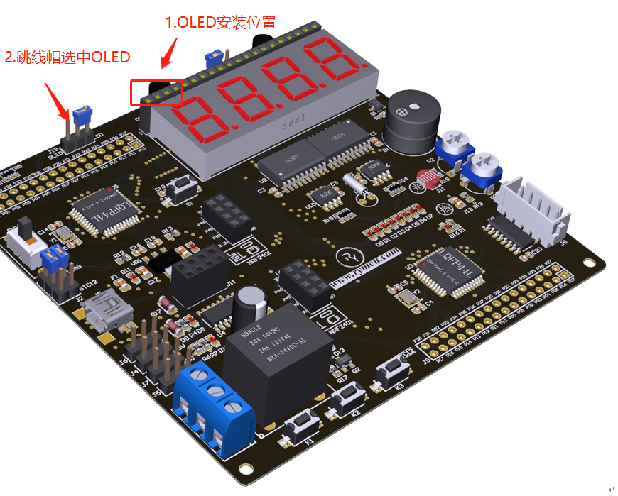  

图20-18 OLED与开发板连接

  

图20-19 OLED与开发板硬件连接关系

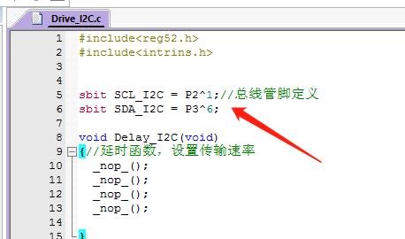  

图20-20 OLED的II2C引脚定义

### 20.4 .2 综合应用试验结果

字符显示与数字显示如下：

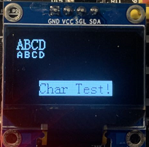   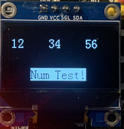  

图20-21 OLED字符及数字显示结果

中文显示与字符串显示如下：

   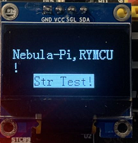  

图20-22 OLED中文及字符串显示结果

图片显示如下：

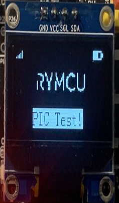  

图20-23 OLED图片显示

### 20.4 .3 综合应用

将DS18B20采集的温度，DS1302的时间分别显示在OLED上，并实现三个按键可设置时间，蜂鸣器整点报时功能，编写相应代码，代码详细见本章程序工程。编译后，自行下载测试功能，部分综合显示结果如下图所示：

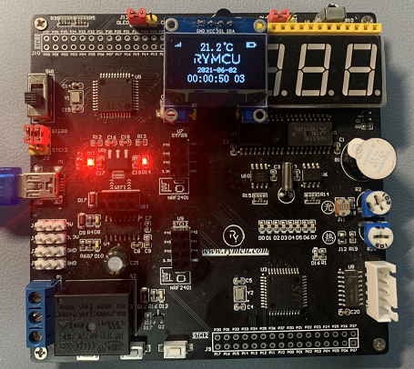  

图20-24 综合显示结果

## 20.5 本章小结

本章讲解了0.96 OLED显示原理，驱动编写。
