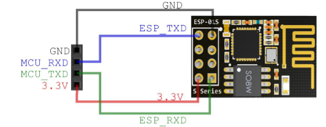
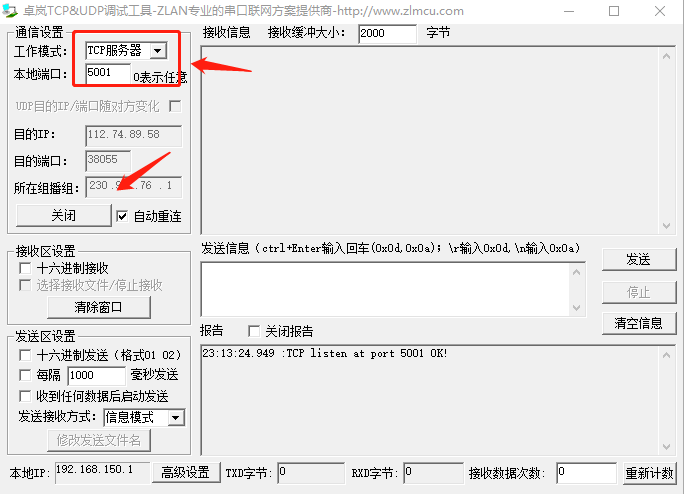
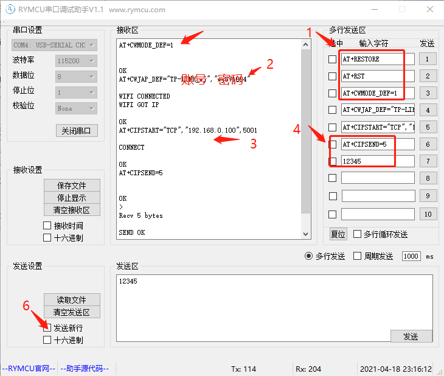
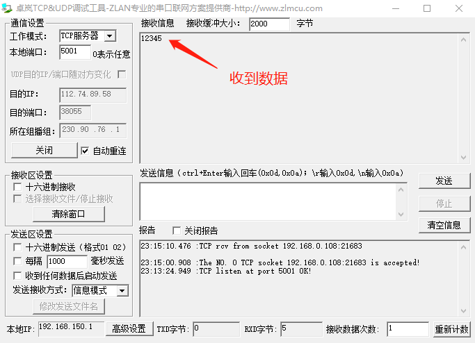
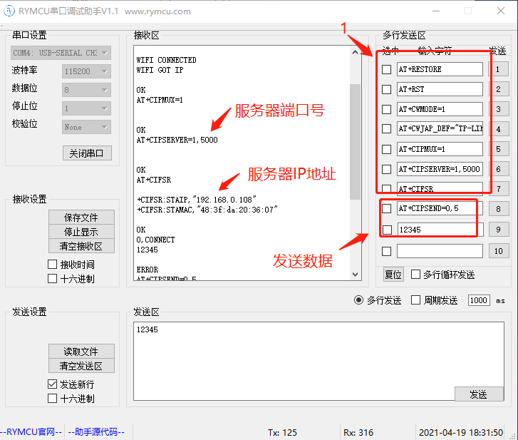
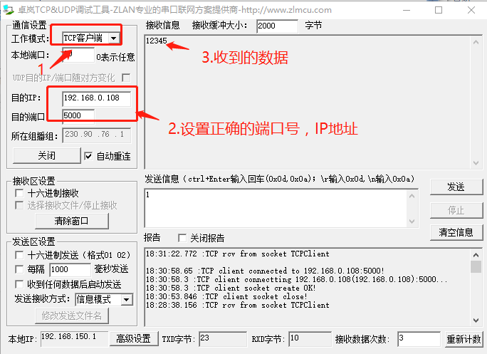

#  第21章 ESP8266使用

OLED应用场合非常的多。我们这里选用中景园的0.96 OLED作为实例，讲解OLED的驱动与使用。

## 21.1 ESP-01S介绍

  

5.1.1AT

指令 AT 说明 测试 AT 是否 OK 示例 AT OK

5.1.2AT+GMR

指令 AT+GMR 说明 返回固件版本信息

示例

AT+GMR

ATversion:1.2.0.0(Jul 1201620:04:45) SDKversion:1.5.4.1(39cb9a32) Ai-ThinkerTechnologyCo.Ltd. Dec 2201614:21:16 OK

5.1.3AT+RST

指令 AT+RST 说明 软重启模组

示例

AT+RST

OK

5.1.4AT+RESTORE

指令 AT+RESTORE

说明 重置模组为出厂设置

示例

AT+RESTORE

OK

AP，也就是无线接入点，是一个无线网络的创建者，是网络的中心节点。一般家庭或办公室使用的无线路由器就一个AP。

STA站点，每一个连接到无线网络中的终端(如笔记本电脑、PDA及其它可以联网的用户设备)都可称为一个站点

AT+CWMODE=2 //配置为 AP 模式

AT+CWMODE---设置 Wi-Fi 模式 (Station/SoftAP/Station+SoftAP) \[\@deprecated\] 本指令不不建议使⽤用，请使⽤用 AT+CWMODE_CUR 或者 AT+CWMODE_DEF 代替

4.2.2. AT+CWMODE_CUR---设置当前 Wi-Fi 模式，不不保存到 Flash

指令

测试指令：

AT+CWMODE=?

查询指令：

AT+CWMODE?

功能：查询 ESP8266 当前 Wi-Fi 模 式。

设置指令：

AT+CWMODE=\<mode>

功能：设置 ESP8266 当前 Wi-Fi 模 式。

响应

+CWMODE:\<mode> 取值列表

OK

+CWMODE:\<mode>

OK

OK

参数说明

\<mode>： ‣ 1：Station 模式 ‣ 2：SoftAP 模式 ‣ 3：SoftAP+Station 模式 注意 本设置将保存在 Flash 的系统参数区。

示例例 AT+CWMODE=3

指令

测试指令：

AT+CWMODE_CUR=?

查询指令：

AT+CWMODE_CUR?

功能：查询 ESP8266 当前 Wi-Fi 模 式。

设置指令：

AT+CWMODE_CUR=\<mode>

功能：设置 ESP8266 当前 Wi-Fi 模 式。

响应

+CWMODE_CUR:\<mode> 取值 列表 OK

+CWMODE_CUR:\<mode>

OK

OK

参数说明

\<mode>： ‣ 1：Station 模式 ‣ 2：SoftAP 模式 ‣ 3：SoftAP+Station 模式 注意 本设置不不保存到 Flash。 示例例 AT+CWMODE_CUR=3

Espressif ! /! 20 61 2017.05

!

4\. Wi-Fi 功能 AT 指令

4.2.3. AT+CWMODE_DEF---设置当前 Wi-Fi 模式并保存到 Flash

指令

测试指令：

AT+CWMODE_DEF=?

查询指令：

AT+CWMODE_DEF?

功能：查询 ESP8266 当前 Wi-Fi 模 式。

设置指令：

AT+CWMODE_DEF=\<mode>

功能：设置 ESP8266 当前 Wi-Fi 模 式。

响应

+CWMODE_DEF:\<mode> 取值 列表 OK

+CWMODE_DEF:\<mode>

OK

OK

参数说明

\<mode>： ‣ 1：Station 模式 ‣ 2：SoftAP 模式 ‣ 3：SoftAP+Station 模式 注意 本设置保存到 Flash system parameter 区域。 示例例 AT+CWMODE_DEF=3

**连接到服务器并通信**

AT+RESTORE

AT+RST

AT+CWMODE_DEF=1 //STA模式

AT+CWJAP_DEF=\"wifi账号\",\"wifi密码\"

AT+CIPSTART=\"TCP\",\"192.168.0.100\",5001

AT+CIPSEND=5 //发送5个字节

  

  

  

**服务器模式：**

AT+RESTORE

AT+RST

AT+CWMODE=1 //设置为 STA 模式

AT+CWJAP_DEF=\"wifi账号\",\"wifi密码\" //连接无线网络wifi

AT+CIPMUX=1 //开启多连接

AT+CIPSERVER=1,5000 //开启服务端

AT+CIFSR//查看 mac 地址和 IP

AT+CIPSEND=0,5//启动发送

  

  
