# 第3章 点亮你的第一个 LED

本章的标题名为 "点亮你的第一个 LED " ，从功能上讲是一项非常简单的工作。其实本章包含的内容比较多，包括单片机硬件知识的介绍、C语言程序的编写、程序的下载、 LED
功能的验证等。通过本章可以建立起对单片机开发的整套流程，培养学习单片机的兴趣。本章包括以下内容：

**1.单片机硬件知识介绍；**

**2.C语言程序的编写；**

**3.新建第一个工程；**

**4.程序下载验证。**

## 3.1单片机硬件知识介绍

### 3.1.1 单片机内部资源

这里我们讲解单片机的内部资源，作为单片机开发者最主要的工作就是要熟练的运用单片机的各种内部资源。总结起来单片机的内部资源主要包括以下几个方面：

1. 程序存储器 —— Flash
2. 数据存储器 —— RAM
3. 特殊功能寄存器 —— SFR
4. 输入输出口
5. 定时器
6. 串口
7. 中断源

Flash ，程序存储器顾名思义就是用来存储单片机应用程序的。我们在编写好代码之后，通过计算机将程序下载到程序存储器 Flash 中，功能类似于计算机的硬盘。

因此， Flash 存储器的容量大小决定了单片机应用程序的大小，容量越大能存储的代码量就越大，也就是能存储复杂度更高的程序代码，该款开发板选用的单片机 Flash 的容量为8K字节。 Flash
程序存储器的一个重要特点为断电后程序不会丢失，一旦将代码下载到了 Flash 中，将永远存留在里面。这就是为什么我们每次给单片机重新加电后，程序还会继续运行，而不需要重新下载的原因。

数据存储器 RAM ，顾名思义就是用来存储数据的。单片机在运行过程中产生的变量、数据都是存储在 RAM 当中的，功能类似于计算机的内存。

因此， RAM 的大小决定了单片机程序中能产生数据量的多少，该款开发板选用的单片机 RAM 容量为 512 字节。他的特点为断电之后数据不会保持，但是读写的速度非常快，而且寿命长，理论上读写的次数是无限的。

特殊功能寄存器 SFR ，这个是单片机特有的寄存器。单片机的每一个功能都会对应一个或多个特殊功能寄存器，我们在程序中控制这些特殊功能寄存器就能实现某些功能了。例如单片机的定时器、串口都有对应的特殊功能寄存器 SFR 。

作为初学者需要先在心中建立一个特殊功能寄存器的概念，等到后面具体实现什么功能的时候再来详细学习 SFR 的使用。

### 3.1.2 单片机最小系统

什么是单片机最小系统？最小系统指的是需要最少的硬件就能使单片机运转起来的电路。单片机通用最小系统的三要素：电源电路、晶振电路、复位电路。

Nebula-Pi 开发板单片机最小系统如图 3-1 所示。下面我们结合 Nebula-Pi 开发板原理图就三要素进行一一介绍。

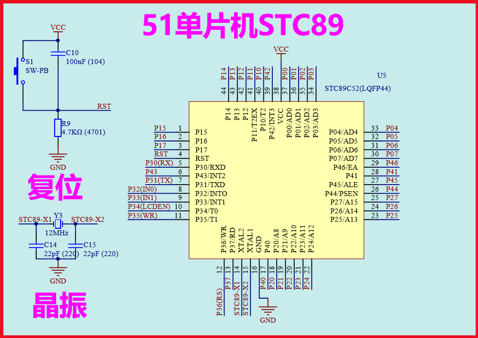

图 3-1 单片机最小系统原理图

a)  **电源**

让单片机运行起来的第一件事就是给单片机进行供电，就像我们使用电脑一样首先得按下电源开关。不同的单片机供电电压的大小是不一样的，主流的单片机的供电电压分为5V、3.3V、1.5V。我们开发板选用的单片机 STC89C52 是5V供电的，如图
3-1 所示单片机的第38引脚，16引脚分别为单片机的正极和负极。38引脚接着 VCC ，16引脚连接的 GND 。

通常我们用 VCC ， GND 分别表示电源正、负。因为开发板是直接通过 USB 接口将电源引至 VCC 的。因此， VCC 对应的5V电压。

b)  **晶振**

晶振电路为单片机提供时间基准，晶振震荡一下，单片机的程序往下运行一次。因此，在单片机上电后，需要晶振一直在不停的震荡，保证单片机程序一直在往下运行。晶振电路如图 3-1 左下角所示。由两个 22pf 的电容（ C14 、 C15
）和晶体振荡器Y3组成。晶振电路的X1，X2脚分别接到单片机的14，15两个晶振输入管脚。

晶振震荡的频率越快，单片机执行的速度就越快，所以晶振的频率决定了单片机的运行速度。我们开发板选用的晶振频率为11.0592MHz，即1秒钟震荡11.0592 x 10^6^次。

c)  **复位**

复位电路顾名思义是指该电路可以使单片机程序从头开始运行，功能类似于计算机的重启按钮。当单片机程序跑飞或者进入某个死循环后，通过复位电路可以使程序从头开始执行。

单片机的第4管脚 RST 为复位输入管脚，图 3-1 左上角为复位电路，由按键S1、电容 C10 和电阻R9组成，当按下S1时，可以使单片机进入复位状态。

### 3.1.3 LED基础知识

LED 又称发光二极管， Light-Emitting Diode 是一种将电能转换为光能的电子元器件，具有单向导通特性。 LED
的发光原理是一个很复杂的过程，根据材料的不同可以发出不同颜色的光，我们在这里只是利用发光二极管的发光特性，对原理不进行详细的介绍。实物图如 3-2
所示，左边为直插式的发光二极管，共有2个管脚，一个为正极，一个为负极。右边为贴片式发光二极管，两端分别有1个管脚。

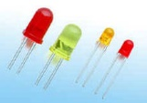

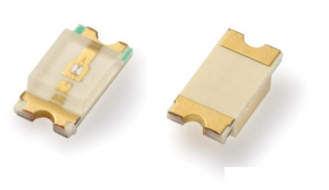

图 3-2 发光二极管实物图

通常给 LED 正向施加一个电流可以控制 LED 发光，电流越大 LED 越亮，正常发光电流一般为 1~ 20mA ，当电流超过 20mA 时容易烧毁 LED 。正向导通电压一般为：1.8~2V。 LED 的典型应用原理图如图 3-3
所示。

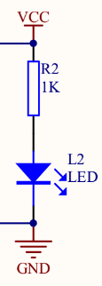

图 3-3 LED 典型应用原理图

如图 3-3 所示，在电源 VCC 与地 GND 之间串联的一个阻值1K的电阻R2， LED 小灯L2。其中，R2称之为限流电阻，选定一个合适的电阻才能使 LED 正常发光。根据 LED 正常发光的条件我们来计算R2阻值的范围。假设 VCC
为5V， LED 正向导通电压为2V， LED 发光电流为 1~20mA 。根据欧姆定理：

R2~MAX~ = (5V-2V)/1mA =3kΩ

R2~min~ = (5V-2V)/20mA = 150 Ω

经计算，限流电阻R2的范围为 150 Ω ~3K Ω，我们这里选择电阻为1K，满足正常发光的要求。

通过典型电路不难发现，只要给 VCC 上电， LED 就会一直点亮。那么怎么样才能控制 LED 小灯，根据需要点亮或者熄灭呢？如果我们在这个典型电路上进行一个小的改动，将 GND 替换成单片机的管脚P1.0，如图 3-4 右边部分所示。

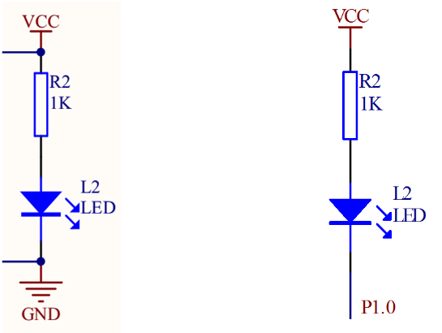

图 3-4 单片机控制 LED 电路

在单片机里面通过程序控制管脚P1.0，就可以实现 LED 亮灭的控制。如果在单片机程序中使P1.0输出低电平，0V，那么 LED 就会导通点亮。如果使P1.0输出高电平，5V，那么 LED
两端没有压差，未导通，熄灭。根据这个原理我们就可以实现对 LED 亮灭的控制了。

## 3.2 C语言程序的编写

### 3.2.1特殊功能寄存器声明

前面讲过用单片机实现某些功能的时候，实际上是在单片机程序里面，完成对应的特殊功能寄存器 SFR 的控制。那么这里首先要找出P1.0管脚对应的寄存器。寄存器对应表可以从单片机的技术文档中找到，如图 3-5 所示。

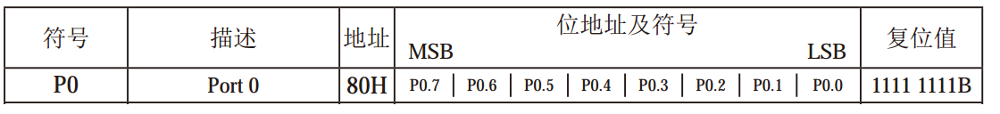

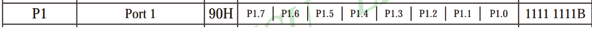

图 3-5 SFR 映射表

如图所示，端口 Port 1 为一个8位的寄存器，该寄存器的地址为 90H ，该寄存器的最高位对应单片机的P1.7管脚，依次往下排列，寄存器的最低位对应的单片机的P1.0管脚。单片机的每一个寄存器都会有一个独立的地址，例如 Port 0
对应的地址为 80H ， Port1 对应 90H ，在C语言编程中就是通过地址来找到寄存器的。单片机C语言程序的编写中需要对特殊功能寄存器进行声明，寄存器声明语句如下：

** sfr P1 = 0x90; **

该语句表示，地址为 90H 的寄存器命名为P1，声明后在程序中 "P1" 可以当作一个变量来使用。其中 "sfr" 为语句声明的关键字， "0x" 在C语言中表示十六进制， ";" 表示该语句的结束。

** sbit led0 = P1^0; **

该语句为位声明语句，表示寄存器P1的第0位，即最低位命名为 " led0 " ，这个名字不是固定的可以根据个人喜好来定义，例如也可以叫 "led" 。由图 3-5 可知，寄存器P1最低位对应的管脚为P1.0。因此，在程序中对变量 led0
进行赋值，就可以实现对 LED 小灯的控制了。

### 3.2.2程序代码设计

程序代码设计如图 3-6 所示：

```c
 //P1 端口寄存器声明
 sfr P1 = 0x90; 

// 位声明，将P1.0管脚声明为 led0 
 sbit led0 = P1^0; 

//程序主函数入口，每个C语言程序有且只有一个
 void main() {
    //赋值管脚P1.0为低电平，点亮 LED 小灯
 led0 = 0;
}
```

图 3-6 程序代码设计

下面我们就程序代码进行逐一分析：

a)  如图所示，01，02两条语句为寄存器及位声明语句，每条语句均以 ";" 结束。其中字母 "P" 必须为大写，初学者容易忽视的地方。 "//" 后面的内容为语句的注释内容，是为了方便程序阅读的，在编译过程中，编译器会自动忽略。

b)  03 为空格，作用为方便程序的阅读，是程序结构更加明朗，方便理解。因此，在编写程序中可以适当的增加空格。

c)  04 ，05，07为程序主函数入口的固定写法，每一个C语言程序都必须有一个主函数，而且是唯一的一个。程序下载到单片机内部后，就是从04这条语句开始执行的。 "void"
表示主函数没有返回值，05，07为大括号，执行的程序语句必须包含在大括号内部。 "main()" 之后是不需要 ";" 来作为结束的。

d)  06 语句为赋值语句，将0赋值给 led0 ，因此对应的单片机P1.0管脚为低电平，从而控制 LED 小灯点亮。

到这里我们就完成了点亮 LED 灯程序的编写，只需要建立工程，把程序下载到单片机中就可以了。对于有C语言基础的同学来说上面的程序是很容易理解的，对于初学者也没有关系，按照介绍一个字一个字的把程序抄一遍，慢慢的便熟能生巧了。

## 3.3 建立第一个工程

### 3.3.1 新建工程步骤

下面我们讲解如何利用 Keil5 软件建立点亮 LED 小灯的工程。首先单击桌面 Keil5 软件快捷方式启动软件，进入软件主界面，新建工程步驟：

1) 点击菜单栏 "Project"
2) 选择 "New uVision Project..."
3) 选择存储工程的路径
4) 工程名命名为 "LED"
5) 点击保存，如下图所示。


图 3-7 keil5 新建工程

6) 如下图所示， Search 处输入 "89C52" 。
7) 选择 Microchip 的 AT89C52 ，因为 Keil 没有自带 STC 的库，但 8051 的内核都是一样的，所以可使用 Microchip 公司 AT89C52 的替代。
8) 点击 "OK" ，如下图所示。


图 3-8 新建工程--芯片选择

9) 如下图所示单击，"是 (Y)" 。为系统开始代码添加选项，单击"否"编译器会自动处理，单击"是"工程中会添加相关的文件，作为初学者两个选项无所谓，我们这里选择"是"。


图 3-9 系统开始代码添加选项

### 3.3.2 新建.c文件并添加至工程中

工程已经建好了，但是里面是空的，需要新建并添加文件进去。新建LED.c文件步骤如下：

1) 点击"File" ->"New..."
2) 点击 "File" ->"Save"
3) 文件名为"LED.c"，一定要确保文件后缀为.c格式
4) 点击"保存 (S)" ，如下图所示。

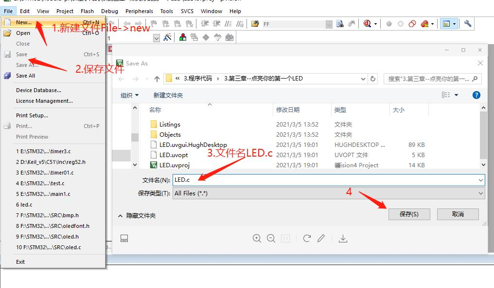

图 3-10 新建 LED.c 文件

添加 LED.c 文件至工程目录：

1) 找到工程界面左侧的 "source Group1" ，并单击右键
2) 点击 "Add Existing Files to Group ' Source Group1 '..."
3) 选中刚才新建的"LED.c"文件
4) 单击 "Add" ，如下图所示。

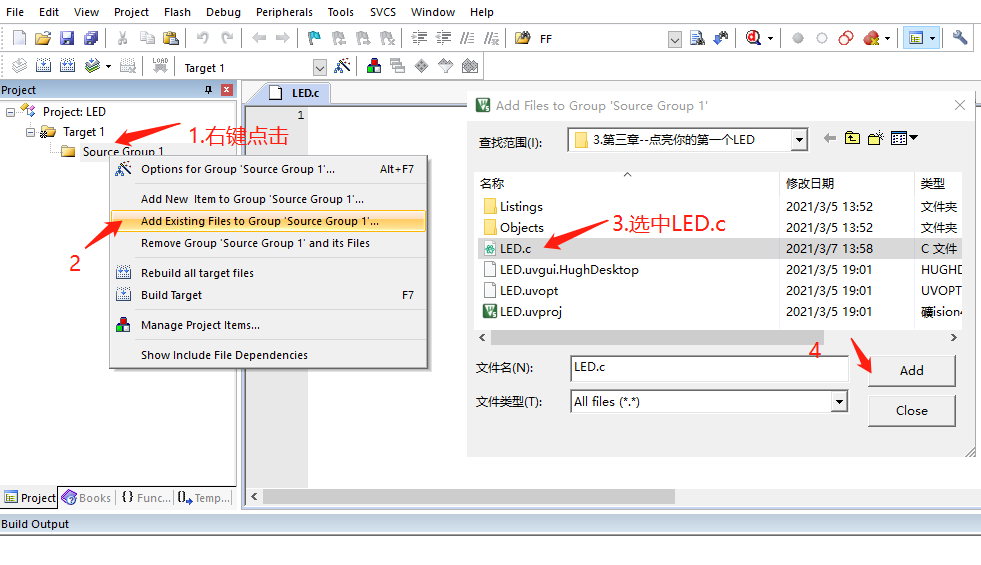

图 3-11 添加.c文件至工程

### 3.3.3 编辑代码并编译代码

编辑代码如下：

1) 选中LED.c文件，如下图
2) 将3.2.2小节的代码复制到下图所示的编辑框中
3) 注意，代码和标点符号务必要使用"英文格式"，否则会编译不通过

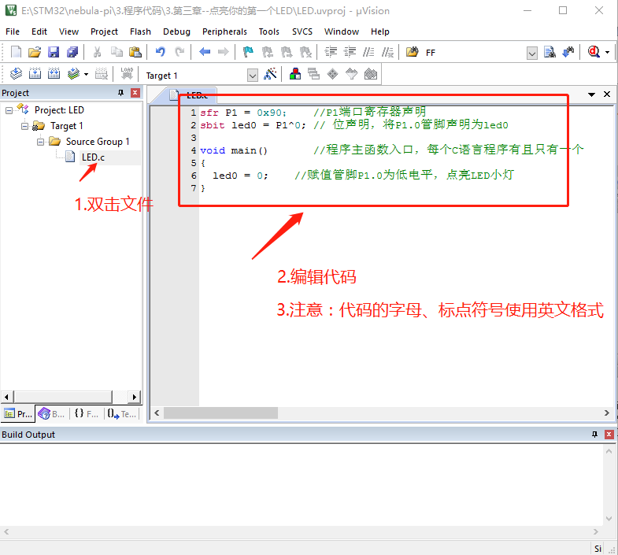

图 3-12 程序主界面并编辑代码

编译代码前需要设置一下输出文件的格式，设置一次就好，步骤如下：

1) 找到工程左侧的 Target1 ，并单击右键
2) 选择 "Options for Target ' Target 1 '..."
3) 勾选输出格式为 HEX-80
4) 单击 "OK" ，如下图所示。

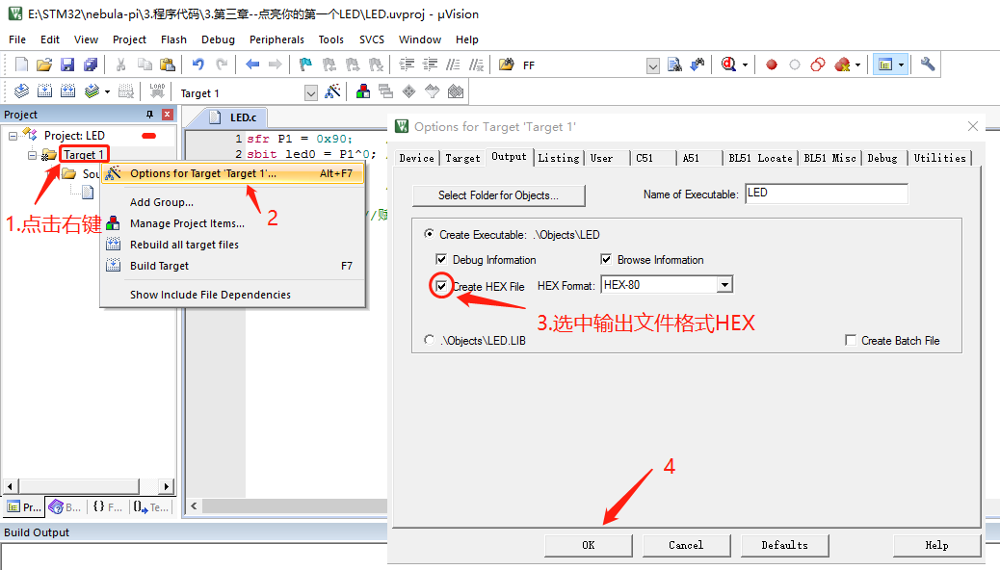

图 3-13 输出文件格式选择对话框

编译工程：

1) 如下图所示，点击"编译"
2) 编译结果如下图所示

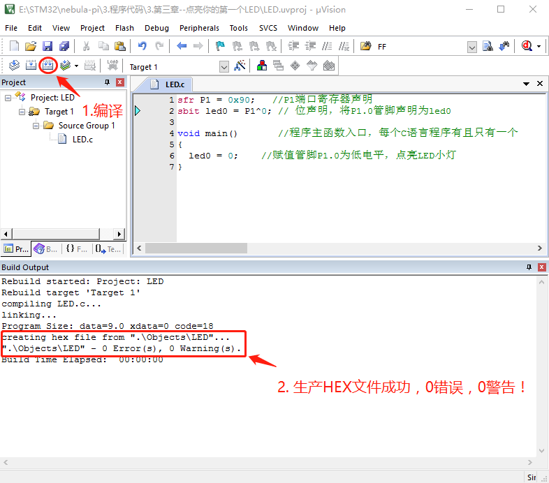

图 3-14 工程编译

如图 3-14 所示，点击左上角的编译快捷按钮，当编译完成之后，左下角会出现编译过程的相关信息，如果程序没有语法错误，会出现 "0 Error(s) ,0Warning(s)."字样。如图所示"creating hex file
from "LED"..."表明已经成功生成了LED.HEX文件了，可以打开工程目录下的 Object 文件夹，便可以找到这个文件，如下图所示。

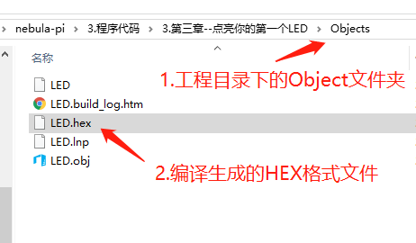

图 3-15 工程目录

**上图所示的LED.hex文件，就是我们需要下载至单片机的可执行文件了。**

将图 3-15 所示的LED.hex文件下载到单片机就完成了整个工程。接下来我们讲解程序下载。

## 3.4程序下载验证

程序下载的详细操作步骤请参考第2章第2.3小节，在下载之前务必先安装好 USB 转串口驱动软件。最终下载界面如下图所示。


图 3-16 程序下载界面

开发板实际效果如下图箭头所示的 LED 灯D0将被点亮。

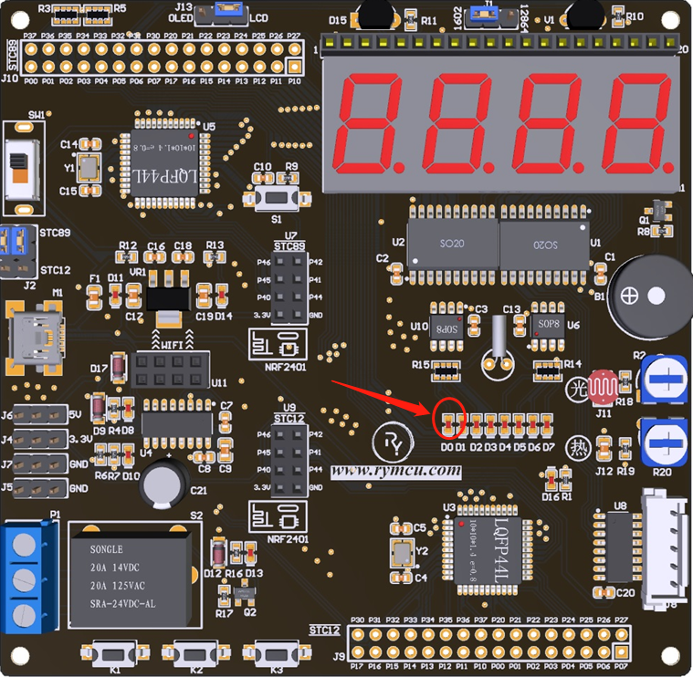

图 3-17 演示效果图

## 3.5本章小结

本章介绍了单片机的内部资源，单片机的最小系统以及 led 的基础知识。介绍了C语言程序的编写，建立了点亮 LED
小灯的程序，并将程序下载到了单片机中。虽然整个程序的功能比较简单，但让我们熟悉了整个单片机开发的流程，对单片机开发在脑海中形成了一个初步的概念。对于初学者来说可能整个过程有点枯燥乏味，随着我们后续慢慢的详细展开，会对单片机形成一个很深的理解。
