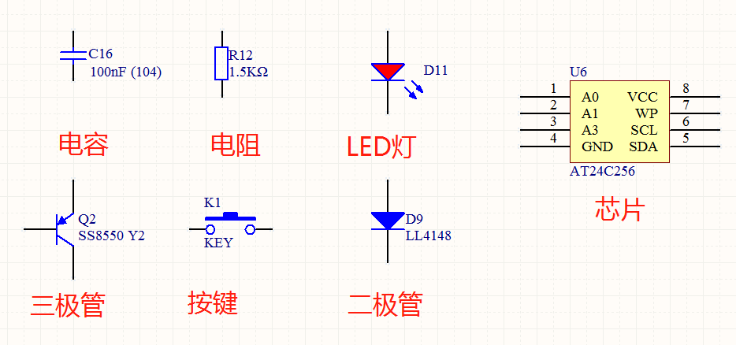
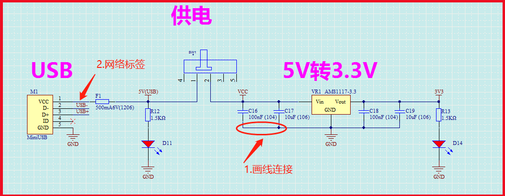
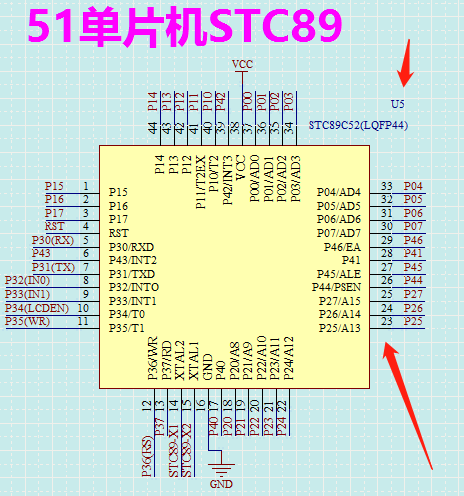
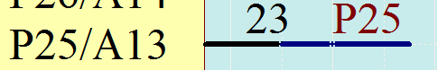
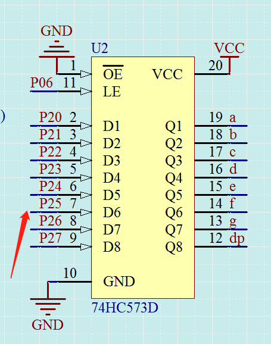
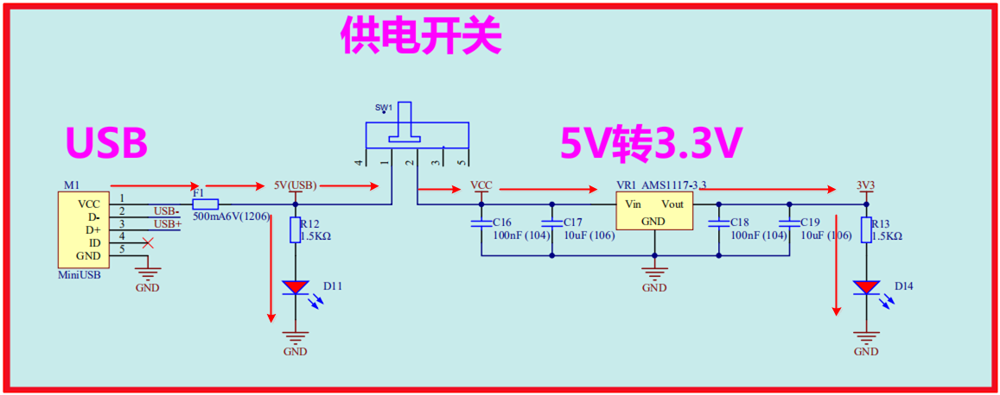
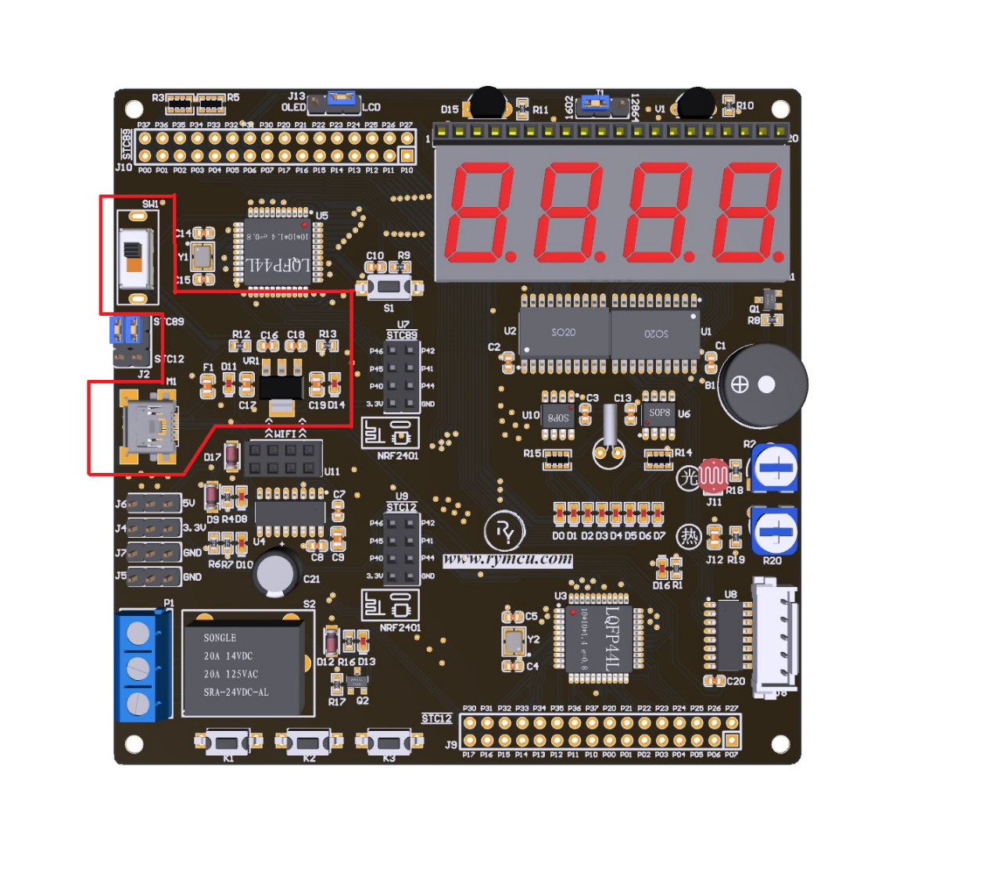
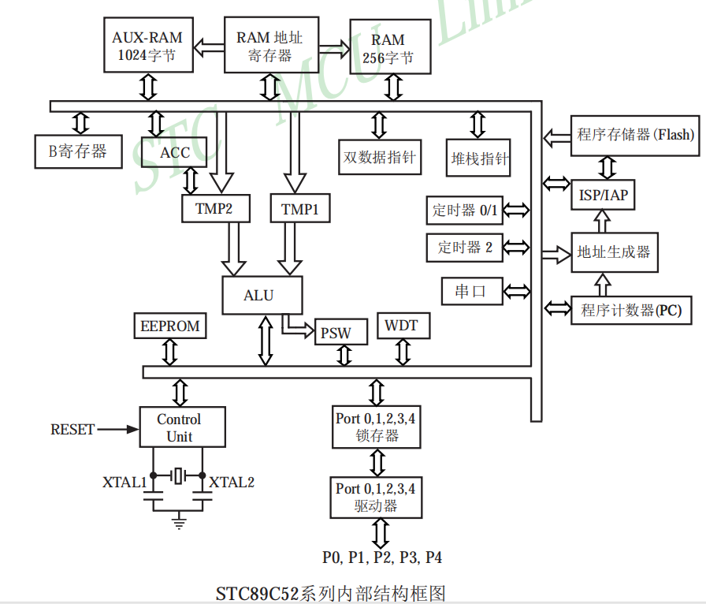
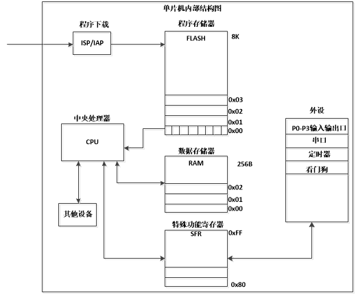
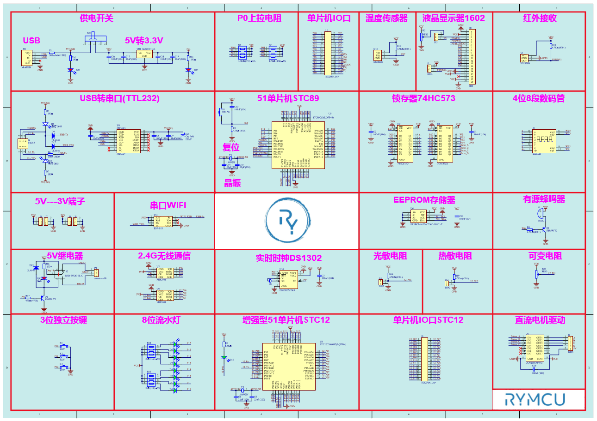

#  第4章 单片机硬件基础知识

## 4.1单片机基本历史回顾

### 4.1.1 单片机发展历史

1971年 4位微处理器intel4004由Intel研制成功，标志着芯片进入微处理器时代，同年推出了以intel4004为核心的微型计算机系统MSC-4。1973年 intel研制出第二代微处理器，即8位的intel 8080。

1976年 intel公司成功研制MCS-48系列8位单片机，标志着单片机的正式诞生。1981年intel在MCS-48基础上，研制出MCS-51系列单片机，也就是51单片机。

随后，intel采取技术授权商业模式，使得51单片机在全球范围内迅速发展，遍地开花，一直延续至今。

### 4.1.2 单片机厂家型号

**Intel**：80C31、80C51、80C32、80C52、87C52

**ATMEL**：AT89C51、AT89C52、AT89C2051等；

**Philips**：P80C54、P80C58、P87C54

**华邦**：W78C54、W78C58、W78E54

**Siemens**：C501-1R、C513A-H

**STC**：89C51、89C52、90C51、STC15w

## 4.2认识电路原理图和PCB

Nebula-Pi 开发板电路原理图和PCB布局图详见本章最后。看懂电路原理图以及PCB，是学习单片机或者嵌入式的必备技能。咋一看似乎很难，只要掌握了技巧，其实很简单。那么，什么是电路原理图？

大家都知道，电路板其实是由各种各样的电子元器件组合而成的，而电路原理图就是这些电子元器件的连接关系图。例如，器件A到底是连接到了器件B，还是器件C。原理图展示的就是这些连接关系，因此，通过电路图可以知道电信号的具体走向。

那么，PCB又是什么？我们平常能接触到的，如电脑主板、手机主板、拆开各种各样的家用电器里面的电路板，都称之为PCB。通过PCB可以看到各种电子元器件的布局，例如，电容、电阻、芯片的具体位置，甚至还可以知道芯片的具体型号。虽然，通过PCB可以知道电子元器件的具体位置，但是无法看出他们之间的连接关系。因此，还需要配合电路原理图。

所谓硬件工程师，核心工作便是设计电路原理图以及PCB。当硬件工程师接到任务后，例如设计一个蓝牙音箱，首先需要分析任务功能需求。然后，选择相应功能的电子元器件，并设计电路原理图，再根据原理图设计PCB。完成PCB生产和电子元器件焊接之后，硬件工程师开始调试，确保自己设计的PCB功能没问题。

因此，作为一个硬件工程师，需要掌握大量的电子元器件的工作原理、性能指标，才有可能设计出满足客户要求的PCB产品。而这些都需要通过长时间的学习、以及大量项目的积累，所以说硬件工程师越老越值钱。

当硬件工程师完成设计、调试之后，嵌入式软件工程师该登场了。产品的许多功能是由软件定义的，软件设计好之后，下载到PCB，才能算是一个相对完整的产品。在很多场合，只需要设计一套通用的硬件PCB平台，你可以设计不同的软件来实现不同的功能。有这么一句话感觉有点道理，即硬件工程师决定产品功能下限，软件工程师的能力决定产品功能上限。当然，你也可以成为软、硬皆通的人才，既能自己设计PCB，又能写代码、编软件，独自一人完成产品设计。

好了，再回顾一下我们前面讲的内容，其实就一句话：电路图就是**连接关系图**，PCB就是**电子元器件布局图**。

### 4.2.1认识电子元器件

51单片机开发平台Nebula-Pi完整电路图在本章最后。我们按功能将原理图划分为各个模块，如图中的"供电开关"、"P0上拉电阻"、"单片机IO口"等。

首先，我们要学会认识电子元器件，常用电子元器件原理图如下所示，包括：**电容、电阻、LED灯、三极管、按键、二极管，芯片等。**

根据如下图所示的外形，可识别出常用电子元器件，其中LED灯和二极管非常相似，只是LED灯多了两个表示发光的小箭头。每个元器件都有线条引出，要么是2个，如电容、电阻，要么是3个，如三极管，要么是多个，如芯片等。这些引出线，表示元器件的实际引脚，可在电路图上通过画线，将各个元器件之间的引脚连接起来。

图4-1 常用电子元器件原理图

在一张电路原理图上，一般都会有多个电容，电阻，或同型号的芯片，那么是怎么区分它们的呢？通过元器件**编号**来区分，如上图所示的C16，R12，D11等等，每一个电子元器件都有一个独一无二的编号，当然这些编号是由电路原理图设计者规定的，可以根据不同喜好编写，但必须保证每一元器件的编号都是独一无二的。

另外，电子元器件的编号有一些约定俗成的方法，电容一般以字母C开头，例如C1，C2，C3等，电阻习惯以R开头，例如R1，R2，R3等。LED灯和二极管以D开头，三极管、按键分别以Q，K开头，芯片通常以U开头。请对照Nebula-Pi的原理图，每一个电子元器件都有一个独一无二的编号。

### 4.2.2元器件之间的连接

电路图中元器件之间的连接通过两种方式：**1.画线连接，2.网络标签。**

画线连接很好理解，在两个元器件的引脚上用线连，即表示他们在电气上是联通的，如下图中1所示，C16，C17两个电容之间便是通过画线连接，大部分情况均可用画线的方式连接，这种方式非常的清晰明了，一眼便可看出谁和谁之间有连接关系。

但在元器件比较多的时候，都用画线连接的话，可能会出现交叉，连线过多等情况，反而不利。因此有了**"网络标签"**连接方式，如下图的2所示，在元器件M1的第2个引脚上放置了一个**"网络标签"**，并取名为"USB-"，当在其他的器件引脚上放入一个名为"USB-"的标签时，表示他们电气上是连通的。可以查看Nebula-Pi的原理图放置许多的**"网络标签"**来实现连接。

图4-2 元器件连接方式

### 4.2.3认识芯片原理图

原理图上有很多的芯片，设计原理都是一样的，我拿一个进行分析，其他的举一反三就可以了。我们以主单片机STC89C52为例，进行分析。如下图右上角所示，U5表示它的编号，并且是独一无二的，在电路图上再也找不到同名的元器件了。在黄色的外框引出来了很多的引脚，每一个引脚上面均有一个数字编号，如下图所示为1到44。表示单片机有44个引脚，并且编号和实际的单片机是一一对应的。

图4-3 单片机芯片原理图

在黄色框内每一个引脚都有文字描述，表示这个引脚的功能，例如上图第4管脚，描述为RST，即Reset，表示这个管脚为复位引脚。第16引脚描述为GND，表示这是接地引脚，第38引脚描述为VCC，表示该引脚为供电电源引脚。电路图中通常使用VCC、GND分别表示电源和地。

如上图所示，我们几乎在所有引脚上都放置了"网络标签"，只要电路图中有其他地方放置了相同的"网络标签"，就表示他们是连在一起的。我们以右下角的第23脚为例进行讲解，它的"网络标签"是P25，引脚编号是23，功能描述是P25/A13，放大图如下图所示。

图4-4 单片机原理图局部放大

我们再来看原理图上的另外一个芯片，如下图所示，它的编号为U2，如图中左侧所示，编号7引脚的"网络标签"为P25，也就是说芯片U2的引脚7和单片机U5的引脚23是连接在一起的。

总结一下，芯片原理很简单，无非就是在一个方框周围放置它的引脚，里面描述引脚功能，外面数字表示引脚编号，并且外面可以连线或者放置"网络标号"来连接其他芯片引脚。

图4-5 锁存器芯片原理图

### 4.2.4供电分析

我们选取Nebula-Pi电路图上的供电电路进行分析。图中的信号流向如下图红色箭头所示。

M1为USB接口，当通过USB线连接至电脑时，M1的第1引脚和电脑的5V接通，5V首先经过一个保险丝F1，随后分两个方向。

方向一，经过电阻R12->LED小灯D11->GND，此时D11将被点亮。方向二，5V流动至开关SW1。当我们拨动开关后，SW1的引脚1,2连通，5V继续往下流，接下来将会遇到两个电容C16，C17。

这里有一个方法，当遇到电容时，我们忽略不看，也就是当他们不存在，继续往下分析。5V电压进入芯片VR1的Vin引脚，从Vout引脚出来。VR1这个芯片的功能就是将5V电压转换成3.3V，也就是说5V从Vin引脚进入后，Vout出来的电压为3.3V。紧接着要经过两个电容C18，C19，同样我们忽略不看，随后3.3V经过电阻R13，再经过LED小灯D14再到GND，此时D14将被点亮。

  

图4-6 Nebula-Pi供电原理分析

其实，整个电信号的流动速度是非常快的，即电子在导体中的流动速度，也就是光速了。所以，整个供电的效果为：连接好USB线后D11小灯立即点亮，拨动开关后D14点亮。关断开关后D14将熄灭。实际的电路板并不能看到连接关系，我们就是通过观看这两个LED，才能知道电路的5V和3.3V是否接通。如上图所示，我们分别在电路上放置了"网络标号"5V(USB)、VCC、3.3V，也就是说只要这里供上电了，其它放置了这些"网络标号"的地方也供上电了。

供电电路实际的PCB布局如下图红色方框所示，红色框中无法看出元器件之间的具体连接关系，PCB和电路图通过元器件的编号进行一一对应。为了便于识别，往往会在元器件旁边添加文字内容，即元器件的编号信息，如下图方框中所示的白色文字便是，通过文字编号便可以将PCB和原理图联系起来了。

图4-7 Nebula-Pi供电电路布局

## 4.3单片机的内部结构

在开始学习单片机编程之前，我们需要先了解单片机内部的结构。了解内部结构最权威的方法当然是直接查看单片机生产厂商的官方文档了。我们直接把它的结构图拷贝过来，如下图所示。

图4-8 51单片机内部结构

咋一看，东西很多，内容很丰富！对于新手来说绝对是一个噩梦，上面的新名词很多，相互之间的连接关系也很复杂。为了突出重点，便于理解，我们整理了简化版的内部结构如下图所示。

图4-9 简化版单片机内部结构

分成了几大功能模块分别为：程序下载、程序存储器、中央处理器、数据存储器、特殊功能寄存器、外设和其他设备。从上到下，一一进行介绍！

**"程序下载"模块**：这个很好理解，用户编写好的程序代码就是经过他下载到单片机内部的。程序代码具体是存到单片机内部的什么地方呢？**程序存储器**，也叫Flash，便是用来存储程序代码的，相当于电脑的硬盘，自然程序存储器的大小决定了可以装多大的代码，即决定了程序的复杂程度。STC89C52单片机程序存储器的大小为8K，相比于电脑动不动就240G、1T的容量来说，简直不值得一提。但两者应用场景不同，不可相提并论了。

程序下载到单片机后，这时**"中央处理器"**，即CPU要开始工作了，它把Flash中的代码逐条拿出来进行计算，CPU的核心功能便是计算，计算的结果或中间量存储到**"数据存储器"**，即RAM中。数据存储器相当于电脑的内存，内存的大小同样会限制可以运行程序的大小，例如，电脑的内存太小了，无法运行一些大型游戏。STC89C52单片机的通用RAM为512字节。

单片机程序的功能当然不只是让上面的CPU计算计算就完事了，它最主要的目的是要控制单片机内部的**"外设"**工作的。这里的"外设"，如上图所示，它其实是一些可以实现特定功能的电路，只不过这些电路被制作的很小，并且集成在单片机内部了。例如可以实现输入输出口、定时器、串口等功能的外设。

从上图可以看出，CPU并不能直接控制"外设"，而是需要通过中间模块**"特殊功能寄存器"**，即SFRs，来实现控制。SFRs其实也是"数据存储器"，CPU可以读或者写每一个"特殊功能寄存器"，而这些"特殊功能寄存器"和"外设"是关联的，因此，CPU可以间接的控制这些"外设"了。

好了，我们再来总结一下前面的内容，程序下载到单片机之后，CPU从程序存储器Flash中取出代码进行计算，并将计算的结果或中间量存储到RAM中，根据程序的功能要求，CPU读、写一些"特殊功能寄存器"，从而控制"外设"实现特定的功能。

听起来有点绕，但所有51单片机的基本工作原理都是这样的！我们不必去深究里面的各个模块是如何实现的，因为我们的重点不是去设计单片机，而是应用单片机，理解他的运作方式即可。

对于不同型号的单片机，不同的地方在于，上面所描述的几大模块的容量、样式、功能有所差异。因此，我们只需要学会了一款单片机的开发，其他便可以依葫芦画瓢。

通过上面的讲解，我们可以轻松的得出结论：**单片机开发无非就是写程序控制这些"特殊功能寄存器"实现相应的功能罢了。**

是的，我们后续的重点，便是学习这些寄存器，并通过程序控制他们，实现我们想要的功能。STC89C52总共128个寄存器，当你玩转了他们，可以说已经掌握了51单片机90%的内容。

## 4.4本章小结

本章讲解了如何认识原理图和电路图，浅析了单片机内部原理图，为后续奠定基础。

图4-10 Nebula-Pi PCB布局图

