# 第5章 单片机C语言基础

## 5.1进制转换基础知识

进制实际是一个非常简单易懂的概念，对于初学者来说也很容易上手。我们接触最多的就是十进制了，它的特点为逢十进一，包含0，1，2，3，4，5，6，7，8，9共十个元素。

在生活中我们用到的基本都是十进制了，所以大家对它已经非常熟悉并能应用自如，但是在计算机（包括单片机）世界里，所有都是以二进制为基础的。二进制的特点为逢二进一，包含0,1共两个元素。计算机中的数据都是以二进制存储的，这就是我们所说的0，1世界。

通常我们讲的32位或64位操作系统这里的位指的就是二进制位数。因为我们实际多用十进制，那么我们在和计算机系统沟通过程中，十进制与二进制之间的转换就变得很重要了。进制之间的转换如下表所示。

表5-1 常用进制转换表

|十进制|                  二进制|                  十六进制|
|---|---|---|
|0|                       0b0|                     0x00|
|1|                       0b1|                     0x01|
|2|                       0b10|                    0x02|
|3|                       0b11|                    0x03|
|4|                       0b100|                   0x04|
|5|                       0b101|                   0x05|
|6|                       0b110|                   0x06|
|7|                       0b111|                   0x07|
|8|                       0b1000|                  0x08|
|9|                       0b1001|                  0x09|
|10|                      0b1010|                  0x0A|
|11|                      0b1011|                  0x0B|
|12|                      0b1100|                  0x0C|
|13|                      0b1101|                  0x0D|
|14|                      0b1110|                  0x0E|
|15|                      0b1111|                  0x0F|
|16|                      0b10000|                 0x10|
|17|                      0b10001|                 0x11|

二进制转换十进制公式如下：

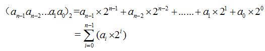  

其中，n表示二进制的位数。

下面我们举个例子来更加直观的说明这个公式：

例如：0b1101，这是一个4位的二进制数，0b表示二进制，计算如下：

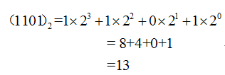  

大家可以利用这个公式计算的结果和表4-1进行一一对照。

十六进制也是我们常用的进制，它的特点为逢十六进一，包括0，1，2，3，4，5，6，7，8，9，A，B，C，D，E，F共十六个元素。实际上十六进制是二进制的一种特殊形式，十六进制的1位等价于二进制的4位，在C语言编程中我们常用十六进制来表示二进制数。在实际应用中我们常常在数字之前加一个前缀来表示他的进制："0b"表示二进制，"0x"表示十六进制。下面我们举例说明：

0b1001,0010 = 0x92

上面一个八位的二进制数转换为一个两位的十六进制数。二进制的前4位等于十六进制的第1位：

0b1001 = 0x9

二进制数的后4位等于十六进制的第2位：

0b0010 = 0x2

在计算机中，我们通常所说的二进制的1位也叫1bit，8位表示1个字节，也叫1Byte。根据二进制与十六机制的关系，一个2位的十六进制数则可表示1个字节。在运用的过程中牢记0~15的十进制与二进制、十六进制之间的转换关系，对程序的编写有很大的好处。

## 5.2字节表示法

我们通常用下图所示的方式来表示1个字节，也就是1Byte。8个连续的方框，每一个方框表示1位，即1bit，总共8bit组成1个字节。从左往右，第一个方框表示字节的最高位，也称为bit7,或者叫MSB。最后一个方框表示字节的最低位，也称为bit0，或者叫LSB。方框内的值要么是0，要么是1。

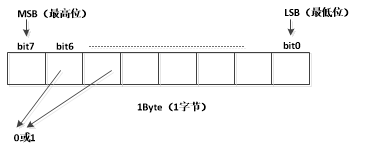

图5-1 字节表示法

注：MSB：Most Significant Bit，LSB：Least Significant Bit。

下面我们举两个例子，并熟悉一下进制之间的转换。1个字节能表示的最大值，自然是每一个方框中的值都为1，转换成十进制等于255，十六进制表示为0xFF。最小值能表示的自然是每个方框中的值都为0，如下图所示。


图5-2 进制转换

上面这两个算是比较特殊的值，很容易记住，其他的值靠记忆似乎不太好办，我们可以利用电脑的计算器工具快速计算。例子如下：

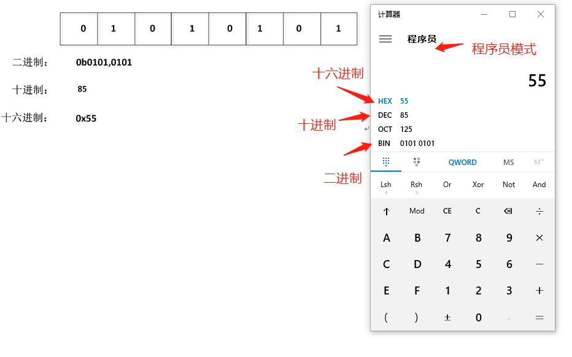  

图5-3 进制转换实例

打开电脑计算器，选择**程序员**模式，输入数字可以在各个进制之间自由转换。

## 5.3简便转换法

记住 8 个数 128，64，32，16，8，4， 2，1，分别对应 1Byte 中的 8个 位，二进制如果是 1，那么表示那个位上的值，如果为 0 那值就为 0，最后相加即是 10 进制。

例如 0b1001, 0110 转换成 十进制

1 0 0 1 0 1 1 0

128 0 0 16 0 4 2 0

最后得出 128+16+4+2 = 150

二进制转 十六 进制记住 4 个数 8，4，2，1，将 8 位拆成两个 4 位，相加然后转换成 十六进制贴在一起即可：

1 0 0 1 0 1 1 0

8 0 0 1 0 4 2 0

96

最后得出：0x96

## 5.4数据存储方式

上一章的单片机内部结构讲到过程序存储器Flash，他数据存储方式按照下面讲的方式存储。

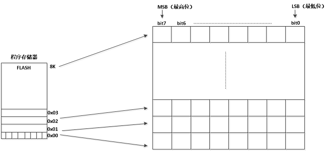

图5-4 单片机存储结构

如上图所示，存储器就是一个个字节叠加起来，类似于盖楼房。每一层表示一个字节，每一层给一个地址，相当于楼层号码一样。如上图所示，第一、二、三层的地址分别是0x00，0x01，0x02，一般情况下地址都是连续增加的。

因此，我们只要知道地址，就能找到指定的字节了，单片机正是通过地址来实现对存储器的读写的。例如，我们STC89C52单片机的程序存储器的大小为8K字节，也就是8*1024=8192个字节，每一个字节有一个地址，而且从0开始的话，那么它的地址范围为0~8191，转换为十六进制的话，地址范围为0x00~0x1FFF。

现实中的硬盘，内存条的硬件内部的结构就如上图所示，只不过每一个方框就是一个晶体管，一个晶体管可以存储0或者1，也就是1bit。

接着上面的讲，一个晶体管能存储1bit的数据，也就是说芯片上集成的晶体管越多，能存储的数据就更大，运行的程序可以更复杂，某种意义上也就是芯片的运算能力越强了。所以，许多芯片或者手机厂商经常宣传说他的芯片有多少亿个晶体管，比同行性能强多少倍，就是这个道理。

另外一个就是芯片制造工艺，有的是16纳米，有的是5纳米，3纳米，这里的纳米指的就是能把晶体管做的多小，所以在相同面积的芯片上，3纳米工艺自然能比5纳米工艺多集成晶体管数量了。那5纳米工艺制造的手机芯片自然没有3纳米工艺制造的有竞争力了。

## 5.5 第一个C语言程序

C 语言是一种通用的、面向过程式的计算机程序设计语言。1972 年，丹尼斯·里奇在贝尔电话实验室设计开发了 C 语言。

我们的第一个C语言程序的功能为：编写一个能够在桌面上显示 "Hello,World!"的程序，通过这例子掌握C语言程序的基本结构。

### 5.5.1 C环境设置

想让C语言编写的程序能够正常运行，需要安装两种软件，分别为文本编辑器和C编译器，编译器的作用就是把我们写的C语言代码转成成计算机可识别的代码，相当于翻译员。

Window自带文本编辑器，无需安装。 C语言编译器我们使用GCC+MinGW，软件可以从网络上下载或者在Nebula-Pi资料包获得，如下图所示：

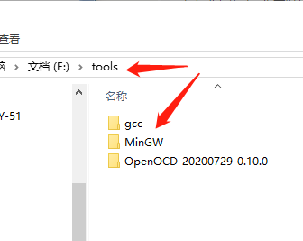  

图5-5 编译器工具路径

将工具软件解压至电脑即可，无需安装！ 同时将GCC、MinGW 的 bin 子目录到添加到您的 PATH 环境变量中，右键我的电脑，在"高级系统设置"中找到"系统属性"，添加步骤如下图所示。

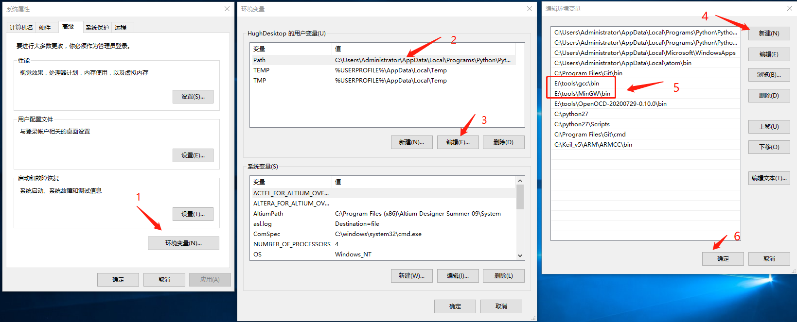  

图5-6 添加环境变量

至此，工具软件准就绪了，打开windows系统命令提示符，输入"gcc -v"如下图所示，如果出现了gcc版本信息表明我们上面的操作无误。接下来开始撸第一段C语言代码了。

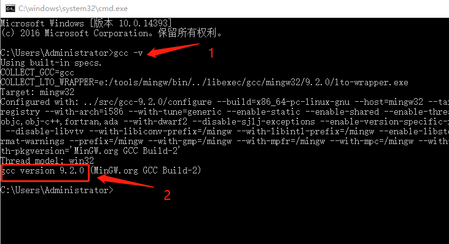  

图5-7 GCC版本检查

### 5.5.2 编写第一段C代码

新建文本hello.txt，并输入如下代码，存储为hello.c，**务必要将后缀改成.c**

# include <stdio.h>

void main()

{

    /* 第一段C语言代码 */

    printf("Hello, World! \n");

    //返回

    return;

}

图5-8 第一行C代码

代码很简单，总共只有8行，下面逐行进行解释：

a)  程序的第1行 #include <stdio.h> 是预处理器指令，告诉 C 编译器在实际编译之前要包含 stdio.h 文件。

b)  第2行void main()为C语言的主函数，程序从这里开始执行。在整个代码中有且只能有一个main()函数，是程序的唯一入口，和第3行，第8行的"{ }"是一体的，所有代码放在这对双括号里面。

c)  第4行为注释，放置在/*\...*/之间的内容会被编译器忽略，这就是注释内容，方便程序员看的。

d)  第5行 printf(\...) 是 C 中另一个可用的函数，会在屏幕上显示消息 "Hello, World!"。

e)  第6行也是注释，放在//后面的内容会被编译器忽略，这个是单行注释，下一行的内容不会注释掉。

f)  第7行return为C语言关键字，表示main()函数运行结束。

g)  第5,7行语句后面都有一个分号，表明语句结束，C语言要求在每条语句之后添加";"。

h)  代码编写完成，下面编译并执行。

### 5.5.3 编译执行C代码

操作步骤如下：

a)  新建文本文件，添加上述代码；

b)  文件保存为hello.c，一定要确保文件格式为.c；

c)  打开系统命令提示符CMD窗口，并进入保存hello.c的目录下，切换目录可以使用"cd /d +目录地址"；

d)  输入gcc hello.c，按回车，开始编译代码；

e)  如代码编译成功，将会在目录下生产a.exe的可执行文件；

f)  命令行输入a.exe，执行程序；

g)  屏幕将出现"Hello World!"字样，如下图所示。

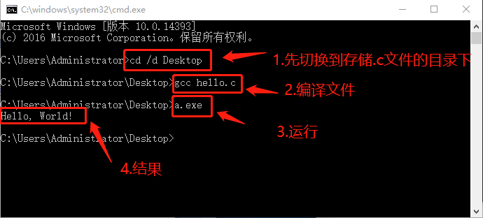  

图5-9 第一行C代码执行结果

## 5.6 C语言语法

通过上一节掌握C语言程序的基本结构，本节开始讲解C语言的基本语法。

### 5.6.1标识符与关键字

标识符其实就是一个代号，就像人的名字一样。在C语言中，常量、变量、函数的名称都是标识符。

标识符可以根据你个人的喜好来决定，前提条件是必须遵守C语言的一些规则：

1)  标识符只能是由英文字母（A-Z，a-z），数字（0-9），下划线（_）组成的字符串，并且第一个字符不能是数字。除此之外的特殊字符如@，\$等不能出现在标识符中，例子如下：

```{=html}
<!-- -->
```
int LED_0; //定义了一个标识符，即名称为LED_0的整型变量

```{=html}
<!-- -->
```
2)  C语言区分大小写，下面表示两个不同的变量：

```{=html}
<!-- -->
```
int LED_0;  //LED_0、led_0为两个不同的变量

int led_0;

```{=html}
<!-- -->
```
3)  关键字不能作为标识符使用。

关键字是C语言程序中保留的一些字符串，有特定的用途，不能用来当做标识符。例如语句"int for;"是错误的，会在编译的时候报错。因为for是关键字，不能用来当做变量名。C语言关键字如下：

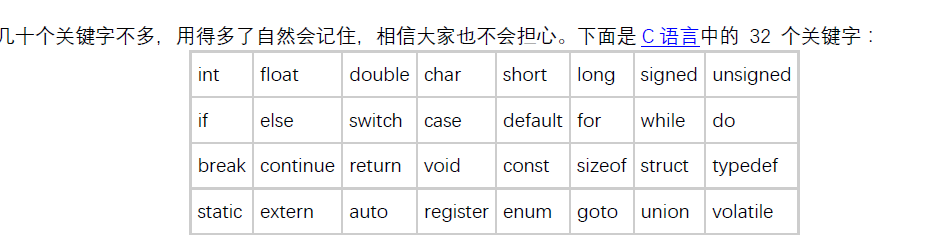  

图5-10 C语言关键字

上图为32个关键字，量不大，不用死记硬背，用多了自然能烂熟于胸。各个标识符功能介绍如下：

表5-2 C语言关键字
| **序号** | **标识符**  | **功能**                                                      | |---|---|---| | 1.       | int         | 声明整型变量或函数                                            |
| 2.       | float       | 声明浮点型变量或函数返回值类型                                |
| 3.       | double      | 声明双精度浮点型变量或函数返回值类型                          |
| 4.       | char        | 声明字符型变量或函数返回值类型                                |
| 5.       | short       | 声明短整型变量或函数                                          |
| 6.       | long        | 声明长整型变量或函数返回值类型                                |
| 7.       | signed      | 声明有符号类型变量或函数                                      |
| 8.       | unsigned    | 声明无符号类型变量或函数                                      |
| 9.       | if          | 条件语句                                                      |
| 10.      | else        | 条件语句否定分支（与 if 连用）                                |
| 11.      | switch      | 开关语句分支                                                  |
| 12.      | case        | 开关语句分支                                                  |
| 13.      | default     | 开关语句中的"其它"分支                                      |
| 14.      | for         | 一种循环语句                                                  |
| 15.      | while       | 循环语句的循环条件                                            |
| 16.      | do          | 循环语句的循环体                                              |
| 17.      | break       | 跳出当前循环                                                  |
| 18.      | continue    | 结束当前循环，开始下一轮循环                                  |
| 19.      | return      | 子程序返回语句（可以带参数，也可不带参数）                    |
| 20.      | void        | 声明函数无返回值或无参数，声明无类型指针                      |
| 21.      | const       | 定义常量，如果一个变量被 const 修饰，那么它的值就不能再被改变 |
| 22.      | sizeof      | 计算数据类型或变量长度（即所占字节数）                        |
| 23.      | struct      | 声明结构体类型                                                |
| 24.      | typedef     | 用以给数据类型取别名                                          |
| 25.      | static      | 声明静态变量                                                  |
| 26.      | extern      | 声明变量或函数是在其它文件或本文件的其他位置定义              |
| 27.      | auto        | 声明自动变量                                                  |
| 28.      | register    | 声明寄存器变量                                                |
| 29.      | enum        | 声明枚举类型                                                  |
| 30.      | goto        | 无条件跳转语句                                                |
| 31.      | union       | 声明共用体类型                                                |
| 32.      | volatile    | 说明变量在程序执行中可被隐含地改变                            |

### 5.6.2常量与变量

在程序中有些数据是不需要改变的，我们把这些不需要改变的固定值称为常量。例如，我们前面程序用到的"hello world!"就是一个字符串常量。常量的类型包括：整数常量、浮点数常量、字符常量、字符串常量。下面举例说明：
```c
int  a =55;   // 55为整数常量
float  b = 1.23;  //1.23为浮点数常量，即常说的小数
char   mychar = 'a';   //a为字符常量，需把字符常量需放在单引号里面
printf("hello world"); //hello world为字符串常量，需用双引号括起来
```

有些特殊字符常量是无法通过字母来表示的，例如回车、换行等。C语言通过转义字符来实现，即反斜杠加字符的方式，例如'\n'，表示换行符。如果我们前面的hello.c程序中想要把hello和world分别显示在两行，修改程序如下：
```c
#include <stdio.h>  

void main()

{
    /* 第一段C语言代码 */
    printf("Hello\nWorld");  // \n表示换行
    //返回
    return;

}
```

运行结果如下：

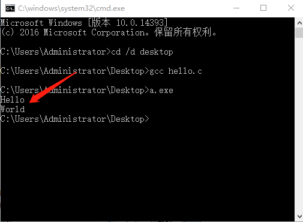  

图5-11 运行结果

常用转义字符列表如下：

表5-3 C转义序列

| **序号**  | **转义序列**           | **含义**                        |
|---|---|---|
| 1.        | \n                    | 换行符                          |
| 2.        | \r                    | 回车符                          |
| 3.        | \b                    | 退格符                          |
| 4.        | \\                   | \ 字符                         |
| 5.        | \'                   | ' 字符                         |
| 6.        | \"                   | " 字符                         |
| 7.        | \a                    | 警报铃声                        |
| 8.        | \f                    | 换页符                          |
| 9.        | \t                    | 水平制表符                      |
| 10.       | \v                    | 垂直制表符                      |

单片机C编程中最常用的转义字符为**换行符（\n）**和**回车符(\r)**。

在C语言中最常用的常量定义法为使用关键字#define，我们通过一个计算圆的周长的例子来说明，编辑代码，存储为perimeter.c，如下所示：
```c
/*
程序功能：计算圆的周长
*/
#include <stdio.h>  

//定义两个常量PI，R
#define PI 3.14     
#define r  10  

void main()
{
  float L; //定义周长变量
  L = 2 * PI * r;//周长计算公式：L=2πr
  printf("圆的周长为: %f", L);//显示结果
  return;
}
```

图5-12 使用#define

运行结果如下：

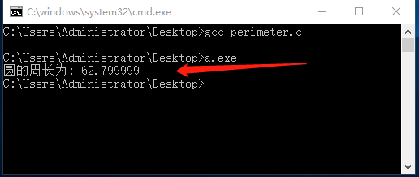  

图5-13 define使用试验

上述代码中第6、7行，我们用#define定义了两个常量PI和r。定义完后，标识符PI就等于3.14，标识符r就等于10，在程序中可以直接使用标识符进行运算，使用标识符能够直观的表示它具体代表什么意思，极大的减轻了程序员的负担。

程序中不能改变数据的称为常量，相对的，能改变的称为变量。变量用来存储程序运行过程产生的中间数据。这些数据实际是存储在内存当中的，变量的定义就是给这些内存取一个名字，编写程序的时候通过这个变量名就可以操作这些内存。变量定义的基本形式如下：

**变量类型名** 变量名；

举类说明如下：
```c
int a;
char b;
float c;
```

定义了int，char，float三种类型的变量，变量名分别为a，b，c。

变量定义的另一种形式：

**变量类型名** 变量名1，变量名2，变量名3；

类型相同的变量可放在同一行，变量名之间用逗号隔开，如下：
```c
int  a,b,c;
char  d,e,f;
```

变量定义好之后，可以进行变量的初始化，格式如下：

**变量名** = 值；

举例说明：
```c
//变量定义
int a;
char b;
float c;

//变量赋值
a = 1;
b = 'x';
c = 1.23;
```

上述语句中，第2-4行是变量的定义，第6-8行为变量赋值：将1赋值给int类型的变量a，执行完这条语句之后a就等于1了。字符x赋值给char类型变量b，3.14赋值给了float类型的变量c。还可以在变量定义的时候直接赋值，即变量的初始化，格式如下：

**变量类型名 变量名 = 值；**

**变量类型名 变量名1 = 值1，变量名2 = 值2，变量名3 = 值3......；**

举例说明：
```c
//变量定义,并初始化
int  a =1;
char b = 'x';
float c = 1.23,d=4.56,e=7.89;
```

值得注意的是，只有变量的数据类型相同时，才可以在同一行语句里进行初始化。

### 5.6.3数据类型

前面我们定义了变量，那么变量在内存实际占用了多大空间呢？数据类型指定变量占用空间的大小。常用数据类型以及所占内存大小如下表所示：

表5-4 数据类型

| **序号** | **数据类型**   | **位数** | **占内存字节数** | **十进制取值范围**         |
|---|---|---|---|---|
| 1.       | bit            | 1        |                  | 0~1                       |
| 2.       | signed char    | 8        | 1                | -128~127                  |
| 3.       | unsigned char  | 8        | 1                | 0~255                     |
| 4.       | enum           | 16       | 2                | -32768~32767              |
| 5.       | signed short   | 16       | 2                | -32768~32767              |
| 6.       | unsigned short | 16       | 2                | 0~65535                   |
| 7.       | signed int     | 16       | 2                | -32768~32767              |
| 8.       | unsigned int   | 16       | 2                | 0~65535                   |
| 9.       | signed long    | 32       | 4                | -2147483648~2147483648    |
| 10.      | unsigned long  | 32       | 4                | 0~4294967295              |
| 11.      | float          | 32       | 4                | 0.175494E-38~0.402823E+38 |
| 12.      | **sbit**       | **1**    |                  | **0~1**                   |
| 13.      | **sfr**        | **8**    | **1**            | **0~255**                 |
| 14.      | **sfr16**      | **16**   | **2**            | **0~65535**               |

在单片机C语言编程中，上述代码中的char，int相当于表格中的unsigned char，unsigned int。表格中**第12-14行为单片机特有的数据类型**。sbit存储空间为1bit，取值范围为0或者1。sfr为特殊功能寄存器类型，8bit，即一个字节，可表示的范围为0-255。
	@@ -571,205 +544,149 @@ g)  屏幕将出现"Hello World!"字样，如下图所示。 |---|---|---|---| | **算数运算符** |            |          |                                                                            |
| 1.             | \+         | a+b      | a变量值和b变量值相加                                                       |
| 2.             | \-         | a-b      | a变量值和b变量值相减                                                       |
| 3.             | *         | a*b     | a变量值乘以b变量值                                                         |
| 4.             | /          | a/b      | a变量值除以b变量值                                                         |
| 5.             | \%         | a%b      | a变量值除以b变量值的余数                                                   |
| 6.             | ++         | a++      | 等同于a=a+1,a值自加1                                                       |
| 7.             | --        | a--     | 等同于a=a-1,a值自减1                                                       |
| **赋值运算符** |            |          |                                                                            |
| 8.             | =          | a=1      | 将1赋值给变量a                                                             |
| 9.             | +=         | a+=b     | 等同于a=a+b，将a加b的结果赋值给a                                           |
| 10.            | -=         | a-=b     | 等同于a=a-b，将a减b的结果赋值给a                                           |
| 11.            | *=        | a*=b    | 等同于a=a*b，将a乘b的结果赋值给a                                          |
| 12.            | /=         | a/=b     | 等同于a=a/b，将a除b的结果赋值给a                                           |
| 13.            | %=         | a%=b     | 等同于a=a%b，将a除b的余数赋值给a                                           |
| **关系运算符** |            |          |                                                                            |
| 14.            | >         | a>b      | 测试a是否大于b                                                             |
| 15.            | <         | a<b     | 测试a是否小于b                                                             |
| 16.            | ==         | a==b     | 测试a是否等于b                                                             |
| 17.            | >=        | a>=b     | 测试a是否大于等于b                                                         |
| 18.            | <=        | a<=b    | 测试a是否小于等于b                                                         |
| 19.            | !=         | a!=b     | 测试a是否不等于b                                                           |
| **逻辑运算符** |            |          |                                                                            |
| 20.            | &&         | a&&b     | 变量a与变量b作逻辑"与"操作，两个变量都为"真"，结果才为"真"，否则为"假"     |
| 21.            | ||       | a||b   | 变量a与变量b作逻辑"或"操作，只要任何一个变量为"真"，结果为"真"，否则为"假" |
| 22.            | ！         | ！a      | 将变量a值取反，即原来为"真"，结果为"假"，原来为 "假"，结果为"真"           |
| **位运算符**   |            |          |                                                                            |
| 23.            | >>       | a>>b    | 将a变量值右移b位                                                           |
| 24.            | <<       | a<<b   | 将a变量值左移b位                                                           |
| 25.            | |         | a|b     | 将变量a和变量b按位作"或"运算                                               |
| 26.            | &          | a&b      | 将变量a和变量b按位作"与"运算                                               |
| 27.            | ^         | a^b     | 将变量a和变量b按位作"异或"运算                                             |
| 28.            | ~         | ~a      | 将a的每一位取反                                                            |
| **其他运算符** |            |          |                                                                            |
| 29.            | &          | a=&b     | 将b变量的地址存入a变量                                                     |
| 30.            | *         | a=*b    | 将地址b中的内容赋值给a                                                     |

下面通过程序代码operator.c，并举例介绍常用运算符的操作。
```c
/*******************************************************************
* 运算符实例
*******************************************************************/
#include <stdio.h>  

void main()    //程序主函数入口，每个C语言程序有且只有一个
{
    int a = 10;
    int b = 5;
    int c;
    /*********************************************
    * 算术运算符实例
    **********************************************/
    printf("\-\-\---算术运算符实例\-\---\n\n");
    printf("初始值：a=10,b=5\n\n");
    c = a + b; //a加b,并将结果赋值个变量c
    printf("a+b = %d\n",c);
    c = a - b; //a减b,并将结果赋值个变量c
    printf("a-b = %d\n",c);
    c = a * b; //a乘b,并将结果赋值个变量c
    printf("a*b = %d\n",c);
    c = a / b; //a除以b,并将结果赋值个变量c
    printf("a/b = %d\n\n",c);


    a=10;
    a++;
    printf("a=10,a++之后，a= %d\n",a);


    a=10;
    a--;
    printf("a=10,a--之后，a= %d\n\n",a);


    /*********************************************
    * 关系运算符实例
    **********************************************/
    printf("\-\-\---关系运算符实例\-\---\n\n");
    
    
    a = 10;//改变a,b的值下面语句会输出不同结果
    b = 5;
    printf(" == 运算符实例\n\n");
    printf("初始值：a=%d,b=%d\n",a,b);
    if(a==b) //如果a等于b,执行下面{}里面的语句，否则执行else的{}里面的语句
    {
        printf("a等于b\n");
    }
    else
    {
        printf("a不等于b\n");
    }


    printf("\n < 运算符实例\n\n");
    printf("初始值：a=%d,b=%d\n",a,b);
    if(a<b) //如果a小于b,执行下面{}里面的语句，否则执行else的{}里面的语句
    {
        printf("a小于b\n");
    }
    else
    {
        printf("a不小于b\n");
    }

    printf("\n其他关系运算符情况类似！\n");
    return;
}
```
图5-14 运算符练习代码

运行结果如下：

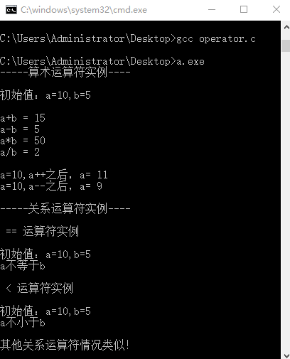

图5-15 运算符练习结果

**单片机C语言编程中，位运算符用的相对较多，位的3个基本运算符，分别为：&：按位与，|：按位或，^：按位异或，真值表如下：**

表5-6 位运算真值表

-------------------------------------------------------------------------
a              b             a&b            a|b           a^b
-------------- ------------- -------------- -------------- --------------
0              0             0              0              0

0              1             0              1              1

1              0             0              1              1

1              1             1              1              0
-------------------------------------------------------------------------

假设A =55，B=21，选转换为二进制，查上表便可计算：

> A = 0011 0111
>
> B = 0001 0101

---

A&B = 0001 0101

A| B = 0011 0111

A^ B = 0010 0010

~：按位取反操作符，即0变1,1变0：

A = 0011 0111

---

~A = 1100 1000

>>:右移运算符

如A>>3，将A右移动3位，并在左边补3个0

A = 0011 0111

---

= 0 0110 先右移动3位

A>>3 = 0 0110 左边补3个0

<<:左移运算符，与右移类似

如A>>3，将A左移动3位，并在右边补3个0

A = 0011 0111

---

= 1011 1 先左移动3位

A<<3 = 1011 1000 右边补3个0

上面讲解的都是在一条语句中只有一个运算符，如果有多个运算符的情况下该怎么计算呢？例如下面的赋值语句：

`a = 1 + 2 * 3;`

//运算结果应该为7，即先算2*3，再加1，原因为" * "的优先级比" + "更高

各运算符的优先级如下表所示：

表5-7 运算符优先级

------------------------------------------------------------------------------
类别            运算符                                    结合性
--------------- ----------------------------------------- --------------------
后缀            () [] -> . ++ - -                      从左到右

一元            \+ - ! ~ ++ - - (type)* & sizeof        从右到左

乘除            * / %                                    从左到右

加减            \+ -                                      从左到右

移位            << >>                                 从左到右

关系            < <= > >=                             从左到右

相等            == !=                                     从左到右

位与 AND        &                                         从左到右

位异或 XOR      ^                                        从左到右

位或 OR         |                                        从左到右

逻辑与 AND      &&                                        从左到右

逻辑或 OR       ||                                      从左到右

条件            ?:                                        从右到左

赋值            = += -= *= /= %=>>= <<= &= ^= |=    从右到左

逗号            ,                                         从左到右 
------------------------------------------------------------------------------

### 5.6.5流程控制

C语言的程序执行方式为，一条一条语句按顺序往下执行，在程序中加入流程控制语句，可以将程序跳转至指定的地方运行。下面讲解C语言常用的流程控制语句。

**if语句**

表达式如下：

> if(条件表达式)
>
> {动作}

语法：

如果"条件表达式"的值为真（非零的数），则执行{ }内"动作"，如果"条件表达式"为假，则跳过该"动作"而继续往下执行。

举例说明编写，if.c文件如下：
```c
/********************************************************
* 程序功能：
*使用if语句判断，按键输入的是否为数字
*********************************************************/
#include <stdio.h>  

void main()
{
    int number;
    printf("\n请按下键盘的一个按键，并按回车键：");
    scanf("%d",&number);
    if(number<=9) //先判断按的按键是否小于等于9，是的话，执行{}里的内容
    {
        printf("\n输入了数字：%d\n",number);
    }
    printf("\n程序结束！\n");
    return;
}
```

图5-16 if语句代码

运行结果如下，可尝试输入非数字的按键。

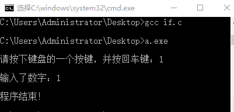

图5-17 if语句运行结

**if --else语句**

表达式如下：

if(条件表达式)

{动作1}

else

{动作2}

语法：

如果条件表达式为真，则执行动作1，跳过else部分的动作2，接着往下执行。如果条件表达式为假，则跳过动作1，执行动作2，然后继续往下执行。

举例说明编写，if-else.c文件如下：
```c
/********************************************************
* 程序功能：
*使用if-else语句判断，按键输入的是否为数字或字符
*********************************************************/
#include <stdio.h>  

void main()
{
    int number;
    printf("\n请按下键盘的一个按键，并按回车键：");
    scanf("%d",&number);
    
    if(number<=9) //先判断按的按键是否小于等于9，是的话，执行{}里的内容
    {
        printf("\n输入了数字：%d\n",number);
    }
    else
    {
        printf("\n输入的不是数字，是一个字符!\n");
    }

    printf("\n程序结束！\n");
    return;
}
```

图5-18 if-else语句代码

2次运行程序，输入的分别是数字1和字符e，程序执行结果如下：

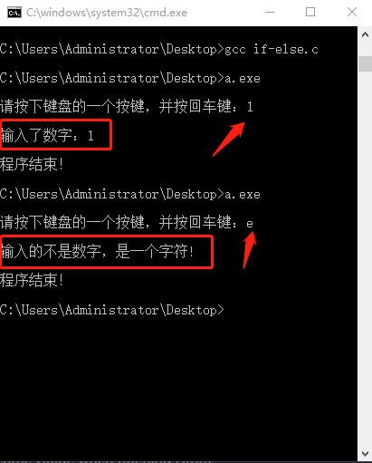

图5-19 if-else试验结果

**switch-case语句**

表达式如下：
```c
switch（条件表达式）
{
    case 条件值 1：
        动作1
        break;
    case 条件值 2：
        动作2
        break;
    ...
    default:
        动作N;
        break;
}
```

语法：

先计算"条件表达式"的值，然后逐个和case后面的"条件值"比较，如果不相等，则顺序往下比较，如果一直不相等，则执行default后面的语句。如果等于执行这个"条件值"后面的语句，并且后续所有case后的语句都不执行。

举例说明编写，caseswitch.c文件如下：
```c
/********************************************************
* 程序功能：
*使用switch-case语句判断，根据输入的数字，显示星期几。
*1-7分别对应星期一-星期日
*其他数字无效
*********************************************************/
#include <stdio.h>  

void main()
{
    int a;
    printf("请输入数字，回车结束: ");
    scanf("%d",&a);

    switch(a) //输入数字a,和下面case后面的数字对比
    {
        case 1:printf("\n星期一\n");
            break;
        case 2:printf("\n星期二\n");
            break;
        case 3:printf("\n星期三\n");
            break;
        case 4:printf("\n星期四\n");
            break;
        case 5:printf("\n星期五\n");
            break;
        case 6:printf("\n星期六\n");
            break;
        case 7:printf("\n星期日\n");
            break;
        default:printf("\n输入错误！\n");
    }

    return;
}
```
图5-20 case语句代码

运行3次，分别输入不同数字，结果如下图所示：

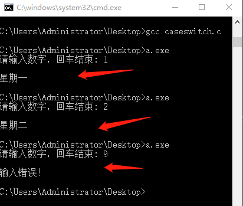

图5-21 case语句运行结果

**while循环语句**

表达式如下：

while(条件表达式)

> {动作}

语法：

先执行while后面的"条件表达式"，如果为真，则执行{}里面的"动作"，执行完之后，再次回去执行"条件表达式"。如此，一直循环，直到"条件表达式"不为真，才结束while循环。

举例说明编写，while.c文件如下：
```c
/********************************************************
* 程序功能：
*使用whie 语句
* 循环打印变量值
*********************************************************/
#include <stdio.h>  

void main ()
{
    int a = 0;//变量定义，并初始化为0

    /**********************************
        1.先判断a是否小于10，成立的话,执行{}
        里面的语句，{}里面语句执行完之后，在判断
        a是否小于10,成立的话，继续执行{}内语句，
        如此循环，直到a不小于10.
        2.下面程序中，{}内没执行一次a的值加1，因此，
        执行10次之后，a不小于10，循环结束。
    **********************************/
    while( a < 10 )
    {
        a=a+1;
        printf("a 的值：%d\n", a);
    }

    printf("\n程序结束！\n", a);
    return;
}
```

图5-22 while语句代码

程序运行结果如下：

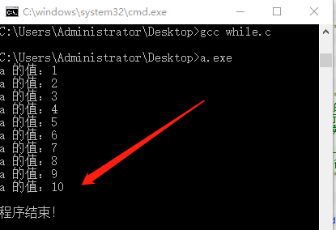

图5-23 while运行结果

**for循环语句**

表达式如下：

for(初始化；条件1；表达式2)

{ 动作 }

语法：

"初始化"首先被执行，并且只会执行一次；

判断"条件1"，如果为真，执行后续{}中的"动作"，如果不为真，则结束for循环；

执行完"动作"后，执行"表达式2"，这里的"表达式2"往往会更新"条件1"的状态；

回到2继续执行。

举例说明编写，for.c文件如下：
```c
/********************************************************
* 程序功能：
*使用for语句
* 循环打印变量值
*********************************************************/
#include <stdio.h>  

void main ()
{
    int a;//变量定义
    
    /**********************************
        1.for循环首先出初始化a=0
        2.执行第二条语句判断a<10是否成立，不成立直接结束
        3.如果2成立
        4.执行{}内的所有内容
        5.执行a++
        6.跳转到2继续执行
        a每次循环都加1，因此，{}的内容将执行10次
    **********************************/
    for(a = 0;a<10;a++)
    {
        printf("a的值：%d\n", a);
    }

    printf("\n程序结束！\n", a);
    return;
}
```
图5-24 for语句代码

运行结果如下：

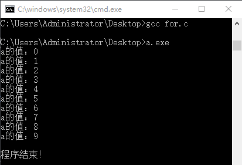

图5-25 for语句运行结果

### 5.6.6函数

函数是一组一起执行一个任务的语句，通常我们会让函数来执行一个特定的任务。如果我们在程序的不同地方需要多次执行这个任务，我们只需要调用这个函数即可，而不需要每次都重复写这段代码。

我们前面用到过得prinf()，就是标准的C语言库函数，它的功能就是打印显示指定的数据。定义函数：

返回值类型 函数名称(参数1，参数2，参数3，...)

{

> 函数主体；

}

语法：

**返回值类型：**一个函数可以返回一个值或者不返回。**"返回值类型"**就指这个值的数据类型。如果函数没有返回值，那么，"返回值类型就是"关键字 void。

**函数名称：**这是函数标识符，也就是这个函数的名字。

**参数：**参数就像是占位符。当函数被调用时，您向参数传递一个值，这个值被称为实际参数。参数列表包括函数参数的类型、顺序、数量。参数是可选的，也就是说，函数可能不包含参数。

**函数主体：**函数主体包含一组定义函数执行任务的语句。

举例说明：
```c
/********************************************************
* 程序功能：
*比较两个数的值，并显示较小的值
* 循环打印变量值
*********************************************************/
#include <stdio.h>  

void main ()
{
    int a = 1，b=2;
    int c;
    
    //a,b谁小，就把它赋值给c，然后显示c,就达到了显示较小值的目的
    if(a<b)
    {
        c=a;
    }
    else
    {
        c=b;
    }

    printf("较小值的值：%d\n",c);
    return;
}
```
图5-26 函数代码1

如上第14-21行是比较a和b大小的功能代码，下面我们使用函数替代他们。编写代码function.c,如下：
```c
/********************************************************
* 程序功能：
*比较两个数的值，并显示较小的值
* 循环打印变量值
*********************************************************/
#include <stdio.h>  

//计算较小值得函数
int Min(int num1,int num2)
{
    int result;

    if(num1<num2)
    {
        result=num1;
    }
    else
    {
        result=num2;
    }

    return result;
}


//主函数
void main()
{
    int a = 1,b=2;
    int c;
    //调用函数Min(),返回较小值
    c=Min(a,b);
    printf("\n较小值的为：%d\n",c);
    return;
}
```

图5-27 函数代码2

在第28行，通过调用函数Min()，即一条语句替换了最开始的多条语句。上图的第8-21行是我们定义的函数int Min(int num1,int num2) ，函数的返回值类型为int，函数名称为Min，函数参数为num1，num2，函数主体的功能为比较num1，num2的大小，并将小的值返回。在第28行调用函数的时候，我们使用要比较的值a，b传递到函数里面，即替换了num1，num2。所以，函数的返回值就是a，b中小的那个值。程序运行结果如下图所示：

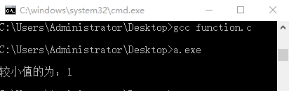

图5-28 函数代码运行结果

## 5.7本章小结

为了方便我们后续的单片机开发，本章介绍了C语言的基础知识，基本都是点到为止。更多的内容请参考专业的C语言书籍。本章中涉及的代码均放入了资料包中，如下图所示。

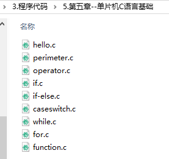

图5-29 C语言代码路径
