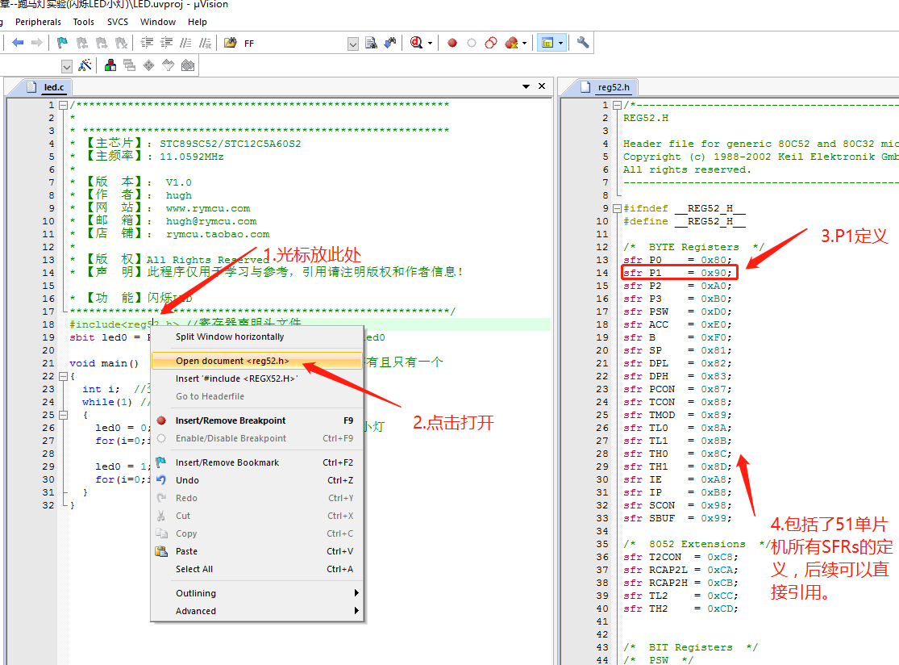
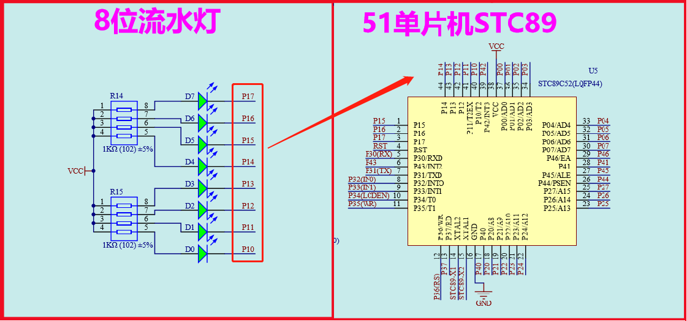
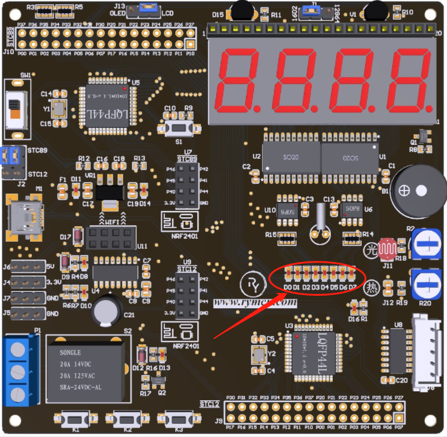
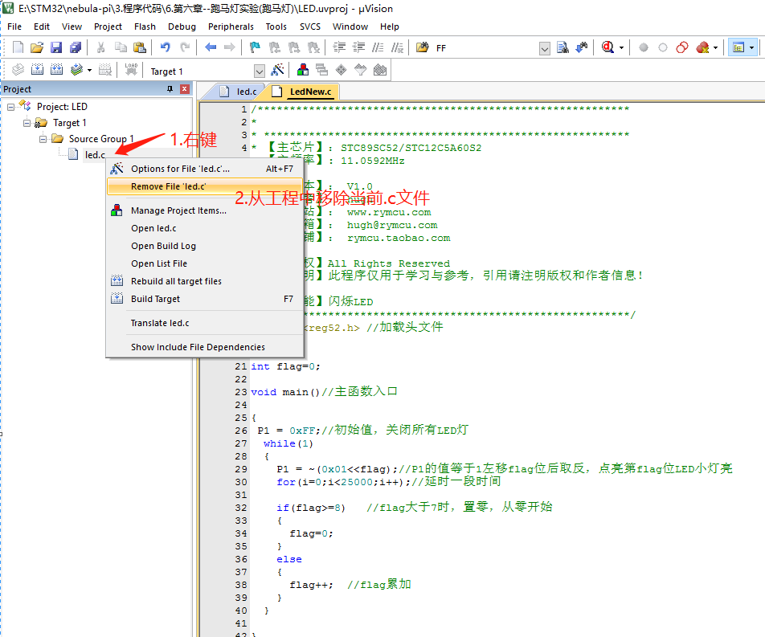
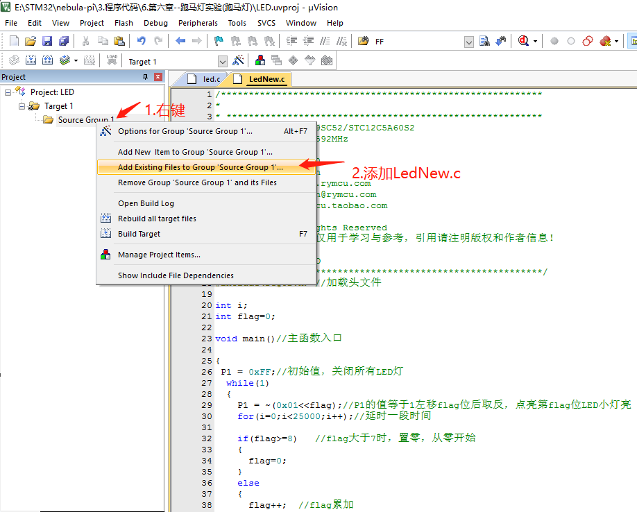

#  第6章 跑马灯实验

## 6.1闪烁 LED 小灯

怎么让 LED 小灯闪烁？我们最先想到的办法当然是先让 LED 小灯点亮，延时一段时间，熄灭 LED 小灯，再延时一段时间，一直循环上面的步骤就能实现 LED 小灯的闪烁了。根据第3章的知识我们知道点亮 LED 的语句为 "led0 =
0;",熄灭 LED 的语句为 "led0 = 1;"。按照第3章介绍我们重新建立一个 LED 小灯闪烁的工程。编写 LED .c，程序代码设计如下：

```c
/**********************************************************
*
* *********************************************************
* 【主芯片】：STC89SC52/STC12C5A60S2
* 【主频率】: 11.0592MHz
* 【版  本】： V1.0
* 【作  者】： hugh
* 【网  站】： https://rymcu.com
* 【邮  箱】： hugh\@rymcu.com
* 【店  铺】： rymcu.taobao.com
* 【版  权】All Rights Reserved
* 【声  明】此程序仅用于学习与参考，引用请注明版权和作者信息！
* 【功  能】闪烁 LED
***********************************************************/
#include <reg52.h> // 寄存器声明头文件  

sbit  led0 =  P1^0; // 位声明，将 P1.0管脚声明为 led0

void main()    // 程序主函数入口，每个C语言程序有且只有一个
{
   int i;   // 变量声明

   while(1) // 循环
   {
       led0 = 0;    // 赋值管脚 P1.0为低电平，点亮 LED 小灯

       for(i=0;i<5000;i++);// 延时一段时间
       led0 = 1; // 熄灭 LED 小灯

       for(i=0;i<5000;i++);// 再延时一段时间
   }
}
```

图 6-1 闪烁 LED 代码

**代码解析：**

a)  第1行至第 17 行为注释，无需过多解释了；

b)  第 18 行替代了 "sfr P1 = 0x90;"，稍后解释；

c)  第 21,22,32 行为主函数的固定写法；

d)  第 24 行是一个 while ()循环，里面表达式始终为真，所以程序将一直在 while 里面循环了；

e)  第 26 行，点亮 LED0；

f)  第 27 行， for 循环执行了 5000 次，而循环一次需要消耗一点时间，相当于延迟了一段时间,而这段时间内 LED0 一直点亮；

g)  第 29 行，熄灭 LED0；

h)  第 30 行，继续延时一段时间

i)  回到第 26 行循环执行，因此，现象为 LED 0 点亮一段时间，熄灭一段时间，循环往复，即 LED 闪烁功能了。

**第 18 行解析：**

"sfr P1 = 0x90;"这条语句被放到了 reg52.h文件当中，我们只需要使用#include < reg52.h>
语句就可以把它添加到我们的程序中了。这么做的原因是，单片机有许多需要使用 sfr 定义的特殊功能寄存器，我们都像第三章那样，放在程序前面的话显得很冗长， keil 很贴心的把所有定义都放到了
reg52.h文件中，后缀名为.h的文件称为头文件。下面我们看看怎么查看头文件具体内容：



图 6-2 如何打开查看.h头文件

按照2.3小节的方法，将程序编译下载至 Nebula-Pi 观察 LED 灯闪烁情况。

## 6.2跑马灯设计

在我们的开发板上设计了8个依次排列的 LED 小灯，让小灯依次点亮和熄灭实现跑马灯的效果是我们这一节的主要内容。

### 6.2.1硬件设计

8个 LED 小灯的硬件电路设计原理图如下图所示：



图 6-3 8位跑马灯设计原理图

如上图所示，8个 LED 小灯 D0 ~ D7 的正极和电源 VCC 之间均串联了一个 1K 的限流电阻， LED 小灯 D7 ~ D0 的负极与单片机的 P1.7~ P1.0管脚一一相连。因此，在单片机程序中通过控制 P1.7~
P1.0管脚的高低电平便可控制8个 LED 小灯的亮灭。

8位流水灯在开发的位置如下图所示：



图 6-4 8个 LED 灯 PCB 布局图

该实验要实现的功能为：

首先点亮 D0 ，然后延迟一段时间，熄灭 D0 点亮 D1 ，延迟一段时间，熄灭 D1 点亮 D2，延迟一段时间，一直到熄灭 D6 点亮 D7，依照上面的步骤一直循环下去，便实现了一个简单的跑马灯的效果。

### 6.2.2软件设计

前面我们试验中都是只对 P1 .0这个管脚进行赋值，来控制 LED 小灯 led0 的亮灭。实际在编写程序的过程中我们可以对 P1 寄存器进行直接赋值来同时控制8个 LED 小灯。

表 6-1 P1 寄存器对照表

|      8|位|特|殊|功|能|寄|存|器    |赋|值|
|---|---|---|---|---|---|---|---|---|---|---|
|  功能     |P1.7               |P1.6   |P1.5   |P1.4   |P1.3   |P1.2   |P1.1   |P1.0   |二进制        |十六进制|
|点亮 LED0|   1|                   1|      1|      1|      1|      1|      1|      0|      0b1111,1110|   0xFE|
|点亮 LED1|   1|                   1|      1|      1|      1|      1|      0|      1|      0b1111,1101|   0xFD|
|点亮 LED2|   1|                   1|      1|      1|      1|      0|      1|      1|      0b1111,1011|   0xFB|
|点亮 LED3|   1|                   1|      1|      1|      0|      1|      1|      1|      0b1111,0111|   0xF7|
|点亮 LED4|   1|                   1|      1|      0|      1|      1|      1|      1|      0b1110,1111|   0xEF|
|点亮 LED5|   1|                   1|      0|      1|      1|      1|      1|      1|      0b1101,1111|   0xDF|
|点亮 LED6|   1|                   0|      1|      1|      1|      1|      1|      1|      0b1011,1111|  0xBF|
|点亮 LED7|   0|                   1|      1|      1|      1|      1|      1|      1|      0b0111,1111|   0x7F|

如上表所示， P1 寄存器是一个8位的寄存器，最高位到最低位依次对应的 P1 .7管脚到 P1 .0管脚。点亮某个 LED 小灯的二进制，十六进制赋值如上表所示。

例如：

P1 = 0xFE; 表示点亮 led0

P1 = 0x7F; 表示点亮 led7

在软件代码设计时，我们想到的第一个方法为依次点亮小灯并延时，代码如下图所示。
```c
/**********************************************************
*
* *********************************************************
* 【主芯片】：STC89SC52/STC12C5A60S2
* 【主频率】: 11.0592MHz
* 【版  本】： V1.0
* 【作  者】： hugh
* 【网  站】： https://rymcu.com
* 【邮  箱】： hugh\@rymcu.com
* 【店  铺】： rymcu.taobao.com
* 【版  权】All Rights Reserved
* 【声  明】此程序仅用于学习与参考，引用请注明版权和作者信息！
* 【功  能】闪烁 LED
***********************************************************/
#include <reg52.h> // 加载头文件  

int i;

void main()// 主函数入口
{
   P1 = 0xFE; // 点亮 LED0

   for(i=0;i<5000;i++);// 延时一段时间
   P1 = 0xFD; // 点亮 LED1

   for(i=0;i<5000;i++);// 延时一段时间
   P1 = 0xFB; // 点亮 LED2

   for(i=0;i<5000;i++);// 延时一段时间
   P1 = 0xF7; // 点亮 LED3

   for(i=0;i<5000;i++);// 延时一段时间
   P1 = 0xEF; // 点亮 LED4

   for(i=0;i<5000;i++);// 延时一段时间
   P1 = 0xDF; // 点亮 LED5

   for(i=0;i<5000;i++);// 延时一段时间
   P1 = 0xBF; // 点亮 LED6

   for(i=0;i<5000;i++);// 延时一段时间
   P1 = 0x7F; // 点亮 LED7

   for(i=0;i<5000;i++);// 延时一段时间
}
```

图 6-5 跑马灯代码

**代码解析：**

第 24~39 行代码为从 LED0~LED7，依次点亮，并且每个之间延迟一段时间。按照，第三章的方法将程序下载至开发板，看看实际效果。

我们对代码进行一下小的改进，这个方法这里称之为"左移取反"法，这个方法在很多的应用中都能用到，非常实用，代码如图 6-6 所示。
```c
/**********************************************************
*
* *********************************************************
* 【主芯片】：STC89SC52/STC12C5A60S2
* 【主频率】: 11.0592MHz
* 【版  本】： V1.0
* 【作  者】： hugh
* 【网  站】： https://rymcu.com
* 【邮  箱】： hugh\@rymcu.com
* 【店  铺】： rymcu.taobao.com
* 【版  权】All Rights Reserved
* 【声  明】此程序仅用于学习与参考，引用请注明版权和作者信息！
* 【功  能】闪烁 LED
***********************************************************/
#include <reg52.h> // 加载头文件  

int i;
int flag=0;

void main()// 主函数入口
{
    P1 = 0xFF;// 初始值，关闭所有 LED 灯

    while(1)
    {
        P1 = ~(0x01<< flag );//P1 的值等于1左移 flag 位后取反，点亮第 flag 位 LED 小灯亮

        for(i=0;i<25000;i++);// 延时一段时间

        if(flag>=8)    //flag 大于等于8时，置零，从零开始
        {
            flag=0;
        }
        else
        {
            flag++;  //flag 累加
        }
    }
}
```

图 6-6 跑马灯代码改进

**代码解析：**

一整段代码的核心第 19 行的 P1 = ~(0x01 << flag);

核心就是给 P1 这个有 8 位的寄存器赋予一个 8 位的值，使得 P1.0-P1.7 都有 1 或 0 的值。

<<：往左移位

> 0x01 = 0x0000 0001  
> 0x01 << 0 = 0x0000 0001  
> 0x01 << 1 = 0x0000 0010  
> 0x01 << 2 = 0x0000 0100

~：取反， 1->0或者 0->1。

0x01 << 0 = ~0x0000 0001 = 0x1111 1110 : P1.0=0， LED0 亮

0x01 << 1 = ~0x0000 0010 = 0x1111 1101 : P1.1=0， LED1 亮

0x01 << 2 = ~0x0000 0100 = 0x1111 1011 : P1.2=0， LED2 亮

0x01 << 7 = ~0x1000 0000 = 0x0111 1111 : P1.7=0， LED7 亮

再分析第 32-39 行， flag 每循环一次+1，当 flag 大于7时，被强制归0，因此， flag 一直在 0-7 之间循环。因此，循环执行 P1 = ~(0x01 <<  flag )
;语句便实现了跑马灯的效果。赶快下载到开发板查看效果吧。

**小技巧：**

如果每次改进代码都需重新建工程，那就有点太繁琐了。我们只需要把当前的.c文件从工程移除，再添加新的.c文件，再编译即可。例如跑马灯原来的代码是 led.c，改进的代码在 LedNew.c文件中。切换的方法如下图所示：



图 6-7 移除旧文件



图 6-8 添加新文件

这里的移除，并不是直接删除.c文件，而是让它不参与工程的编译。如果要切换回来，同样用上述方法就可以了。

### 6.2.3下载验证

将程序通过 STC-isp 软件下载到单片机，观察8个 LED 小灯效果与设想的效果是否一致？至此，本章的内容讲解完毕，内容包括进制转换的基础知识、 LED
小灯闪速程序以及跑马灯的两种程序。大家在动手操作的过程中多多下载到单片机中观察现象，加深印象。

## 6.3本章小结

闪烁 LED，跑马灯功能告一段落了。
