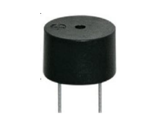
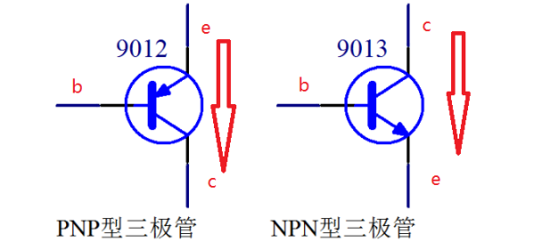
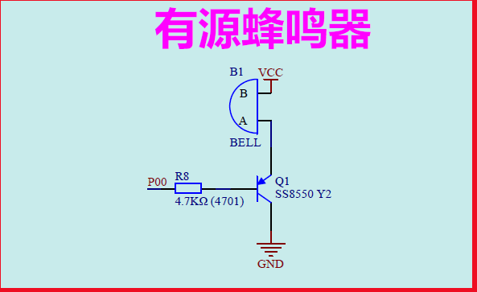
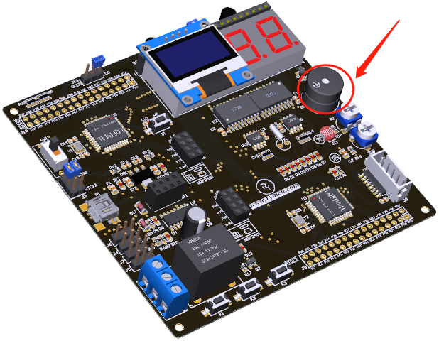

#  第7章 蜂鸣器实验

上一章我们讲解了通过 I/O 口来控制 LED 小灯的实验，本章通过讲解蜂鸣器实验来进一步加深对 I/O 口的使用。本章通过单片机的一个 I/O 口以及蜂鸣器电路实现对蜂鸣器的控制。主要内容包括：

1. 蜂鸣器原理简介  
1. 蜂鸣器实验硬件电路的设计  
2. 蜂鸣器实验软件代码的设计  
3. 下载验证  

## 7.1蜂鸣器介绍

蜂鸣器是一种一体化结构的电子讯响器，采用直流电压供电，广泛应用于计算机、打印机、复印机、报警器、电子玩具、汽车电子设备、电话机、定时器等电子产品中作发声器件。蜂鸣器主要分为压电式蜂鸣器和电磁式蜂鸣器两种类型。 Nebula-Pi
单片机开发板板载的蜂鸣器是电磁式的有源蜂鸣器，如下图所示：



图 7-1 有源蜂鸣器

这里的有源不是指电源的"源"，而是指有没有自带震荡电路，有源蜂鸣器自带了震荡电路，一通电就会发声；无源蜂鸣器则没有自带震荡电路，必须外部提供 2~5Khz 左右的方波驱动，才能发声。一般而言，驱动蜂鸣器需要较大的电流，单片机的 I/O
口不适合直接驱动，我们通过三极管电路来驱动蜂鸣器。

三极管根据结构不同分为两种，一种为 PNP 型三极管，另一种为 NPN 型三级管。如下图所示。



图 7-2 三极管型号

作为模拟电路的基本元器件，三极管的放大特性经常被使用。在数字电路中三极管的开关特性用到的尤其多。三极管包含三个管脚，分别为基级b（ base ）,发射级 e(emitter) ，集电极 c(collector) 。

对于 PNP 行的三极管而言，当e级电压大于b级电压0.7V时，e级，c级导通，否则开路。因此，可以通过控制e,b两端的电压实现对e，c两端通断的控制，这就是三极管的开关特性。

同理，对于 NPN 行的三极管而言，当b级电压大于e级电压0.7V时，e级，c级导通，否则开路。

## 7.2硬件设计

蜂鸣器硬件电路设计原理图图下图所示：



图 7-3 蜂鸣器设计原理图

图中B1为蜂鸣器，正极B接到系统5V电源 VCC ， PNP 型三极管e级接B1的负极A管脚，c级接地。B级通过电阻R8连接到单片机的P0.0管脚，如上图所示。当P0.0管脚输出为低电平 "0"
时，三极管b电平为0V，e电平为5V，e,b电平之差大于0.7V。因此e，c两端导通，蜂鸣器打开发出报警声。

当P0.0管脚输出为高电平 "1" 时，三极管b电平为5V，e电平为5V，e,b电平之差小于0.7V，因此e，c两端断开。因此，蜂鸣器关闭。

千言万语一句话：单片机P0.0=0；蜂鸣器响，P0.0=1；蜂鸣器不响。在电路板位置如下图所示：



图 7-4 蜂鸣器位置

## 7.3软件设计

程序设计的功能为让蜂鸣器发出滴滴的声音，详细代码如下图所示：
```c
/*******************************************************************
*
* ******************************************************************
* 【主芯片】： STC89SC52/STC12C5A60S2 
* 【主频率】: 11.0592MHz
* 【版  本】： V1.0
* 【作  者】： hugh 
* 【网  站】： https://rymcu.com
* 【邮  箱】： hugh\@rymcu.com
* 【店  铺】： rymcu.taobao.com
* 【版  权】 All Rights Reserved 
* 【声  明】此程序仅用于学习与参考，引用请注明版权和作者信息！
* 【功  能】蜂鸣器"滴滴"测试
*******************************************************************/
#include <reg52.h>  

 sbit FM = P0^0;// 蜂鸣器管脚位定义
 int i; 

 void main() 
{
 while(1) 
    {
        FM = 0;// 打开蜂鸣器响
 for(i = 0;i<5000;i++);// 延时一段时间
            FM = 1;// 关闭蜂鸣器

 for(i = 0;i<5000;i++);// 延时一段时间
    }
}
```  

图 7-5 蜂鸣器实验代码

如图 7-5 所示，首先打开蜂鸣器，延迟一段时间，关闭蜂鸣器，再延迟一段时间，让程序在 while 循环中一直进行，使蜂鸣器发出"滴滴"的响声。

## 7.4下载验证

程序编译好后，将代码下载到开发板单片机中，观察现象，蜂鸣器是否和我们预期的一样发出"滴滴"的报警声。
