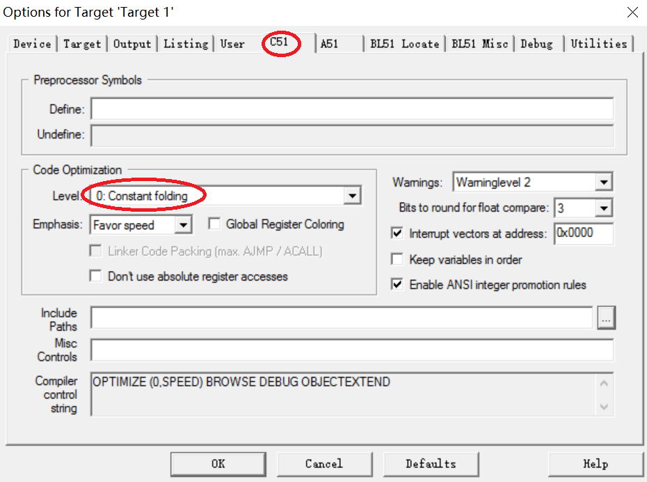
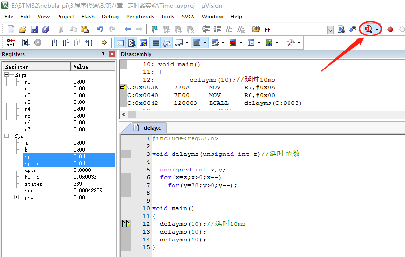
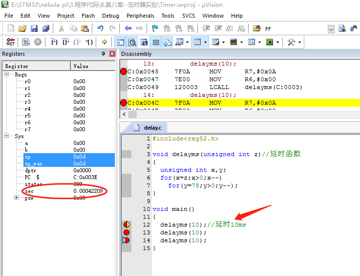
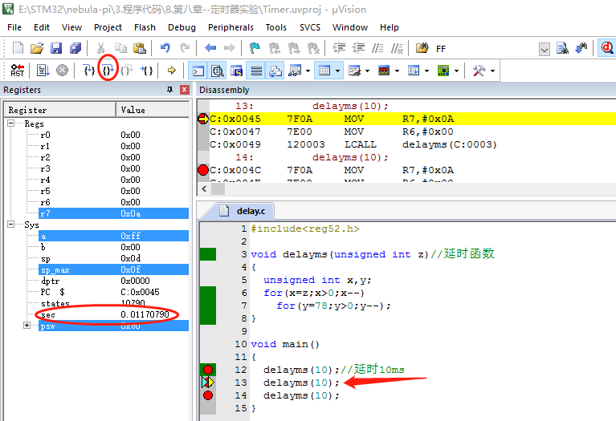
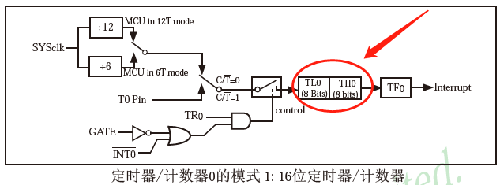
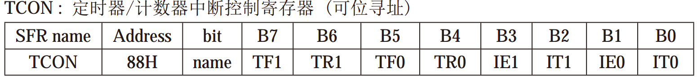
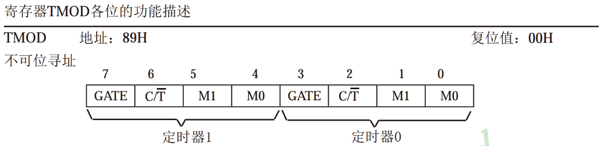

#  第8章 定时器实验

在程序设计中我们经常会用到延时，对于精度要求不高的应用来说我们一般采用插入语句等待的方式来实现，对于精度高的应用来说我们一般采用定时器中断来实现。本章主要内容包括：

1. 延时时间的调试  
2. 定时器功能介绍  
3. 定时器应用实例介绍  

## 8.1延时调试

单片机执行一条语句需要多长时间？

搞清楚这个问题之前，我们需要了解一下这三个概念：时钟周期，机器周期，指令周期。下面分别进行介绍：

**时钟周期：**

时钟周期是51单片机的最小时间单位，它的大小由单片机外接的晶振频率决定。开发板的板载晶振为11.0592MHz，时钟周期为晶振频率的倒数，即1/11.0592≈0.0942us，是51单片机的最基本，最小的时间单位。也就是说，
nebula-Pi 开发板的时钟周期为0.0942us。

**机器周期：**

单片机完成一条最基本指令操作所需要的时间，51单片机的一个机器周期等于12个时钟周期，机器周期：12*0.0942us≈1.09us，即 NEBULA-PI 开发板机器周期为1.09us。

**指令周期：**

执行一条指令所需的时间，一般由若干个机器周期组成。当然根据指令的不同所需的机器周期也不同，可以分为单周期指令，双周期指令或者多周期指令。

那么单片机执行一条语句需要多长时间？如果这条语句是单周期指令，则为1.09us，双周期指令为1.09* 2us ，多周期指令为1.09* Nus 。

以 Nebula-Pi 单片机开发板为例，执行一条最简单的语句需要至少1.09us，复杂的语句需要多个1.09us来实现。

因此，我们常常在程序中通过添加数目不等的简单语句来实现延时，但是延时的精度往往不会太高，我们可以通过 keil 软件的仿真功能来确定延时的大概数值。接下来讲解延时函数仿真功能，我们以延时 10ms 为例进行介绍。

新建工程，添加delay.c文件：

```c
#include <reg52.h>  


 void delayms(unsigned int z)// 延时函数
{
 unsigned int x ,y;
 for(x = z;x>0;x--) 
 for(y = 78;y>0;y--); 
}


 void main() 
{
 delayms(10);// 延时 10ms 
 delayms(10); 
 delayms(10); 
}
```

图 8-1 延时函数程序设计

首先，根据前面介绍的步骤建立一个工程，并编辑好如图 8-1 所示的代码。这个代码和前面讲解的代码有点不同，我们先把延时的语句写成一个函数 delayms()
，将其放在主程序之外。在主程序中调用函数来实现延时。改变延时函数的输入参数便可改变延时语句的条数，因此延时变得非常的灵活。主程序中我们对延时函数进行了三次调用，接下来我们看看执行一次函数调用需要多长时间。

在 keil 软件快捷按钮菜单栏中找到"  "点击进入如下图所示的子菜单：


图 8-2 仿真晶振频率设置

如图 8-2 所示，在 "Target" 目录先将仿真晶振设置为"11.0592"。



图 8-3 优化等级设置

如图所示，在 "C51" 目录下将代码优化等级设置为"0： Constant folding" 。

设置好如上规则后，点击菜单栏的 debug 快捷键如下图所示，进入调试模式，可以看到程序进程已经执行到了第12行代码。



图 8-4 进入调试模式

接下来给12，13，14三条语句设置断点，将鼠标移到语句处点击右键选择 "insert/Remove Breakpoint" ，如下图所示，设置好之后语句左边会出现红色的小方块。当程序执行到断点时，程序便会停止下来。


图 8-5 断点设置

如图 8-6 所示，当程序顺序执行的黄色箭头停留在第12行时，所使用的时间为：0.00042209s，如下图图左侧所示。



图 8-6 执行语句准备

点击如图 8-7 左上角的程序执行快捷键，程序进程黄色箭头停留在第13行，即执行完了一条延时函数语句 delayms(10) ，观察左下角的进程时间为：0.01170790s将执行语句前后时间相减，结果约等于11.2ms，因此与我们延迟
10ms 的要求基本相符。



图 8-7 执行延时语句

通过调用函数实现延时的方法在单片机编程中是非常常见的，经过上面的延时调试可见这种方法的精度并不是很高，对应特殊应用场合我们一般采用定时器的方式实现。

## 8.2 定时器介绍

定时器非常好理解，就像我们的闹钟一样，你先设定好时间，等时间到了，闹钟响起。单片机内部同样集成了定时器资源，功能就是定时用的。

STC89C52 系列单片机内部集成了2个定时器，分别为定时器0（T0）和定时器1（T1），与传统 8051 单片机的定时器是完全兼容的。这两个定时器都具有计数和定时的功能。我们先讲解定时的功能。

前面多次讲过，控制单片机的内部资源的方法为控制相应的特殊功能寄存器 SFRs 即可，和定时器0和定时器1有关的所有 SFRs 如下所示。

表 8-1 定时器/计数器特殊功能寄存器列表


如上所示，总共才6个 8bit 的特殊功能寄存器，想必控制起来不是那么难了，后续结合代码详细讲解各个寄存器的具体意义。

我们以定时器0为例子进行讲解，定时器1的功能举一反三即可。先看一下单片机内部的定时器原理框图，如下图所示：



图 8-8 定时器原理框图

如上图箭头所示，定时器的核心组件为 TH0 ， TL0 两个 8bit 的寄存器。下面我们详细讲解定时器是怎么计算时间的， TH0 、 TL0 两个寄存器组成了一个 16bit 的寄存器。 16bit 的二进制的最大值为：

0b 1111 , 1111 , 1111 , 1111 = 65535( 十进制)

**第一步：**

我们在程序中给这个 16bit 寄存器赋一个初值，假设为十进制的 1000 。

**第二步：**

启动定时器，让它开始工作。

**第三步：**

启动后，这个寄存器每隔一个机器周期从初始值 1000 ，开始往上+1，也就是每隔1.09us，寄存器自动+1。

**第四步：**

直到加到 65535 ，也就是 16bit 寄存器的最大值，当再加1后，定时器0就溢出了，也就是定时器时间到了。这时寄存器值从 65535 变成0，并且单片机内部会使 TF0 等于1。

**第五步：**

我们在程序中检测 TF0 ，如果它等于1了，我们就知道定时器到了。

**定时时间长度计算：**

首先，从 1000 累加到了 65535 ，再加1定时器就溢出了。因此，累加次数为：

65535-1000+1 = 65536-1000 = 64536

定时时间为：

64536 *1.09us =70.344ms

通过上面的原理，我们可以计算出能够定时的最大值和最小值：

**定时最大值：**

当初始值为0时，定时时间最大： (65536-0) *1.09us=71.4ms

**定时最小值：**

当初始值为 65535 时，定时时间最小： (65536- 65535 ) *1.09us=1.09us

**总结：**

**设置初始值，就可以设置定时器的定时长度了。初始值的取值范围为 0~65535 ，相应的定时时间长度为71.4ms~1.09us。**

举个简单的例子，我们前面学习过的闪烁 LED ，就可以使用定时器来实现，启动一个0.5s的定时器。

通过上面的介绍，我们已经知道的单片机定时器的工作原理，下面我们学习它的相关寄存器，让它实际运转起来。

## 8.3定时器使用

前面介绍了51系列单片机中定时器的工作原理，这节将重点介绍定时器的使用。前面介绍过单片机的某个功能的实现都与特殊功能寄存器 SFR 有关，当然定时器的使用也不例外。

### 8.3.1定时器中断控制寄存器 TCON

TCON 是一个8位定时器/计数器中断控制寄存器，可位寻址，即每一位可单独赋值。B7、B6为定时器T1控制位，B5、B4为定时器T0控制位， B3~B0 是和中断相关的这里不做介绍，如下表所示：

表 8-2 TCON 寄存器



|**位名称**  | **功能**|
| --- | --- |
| TR0 |定时器T0的运行控制位，该位由软件置位和清零。当 TR0 =1时就允许T0开始计数。|
| TF0 |定时器/计数器0中断溢出标志位。T0被允许计数后，从初始值开始加1计数。当最高位产生溢出时由硬件置 "1" TF0 ，向 CPU 请求中断，一直保持到 CPU 响应中断时，才由硬件清零 "0" TF0 。另外， TF0 也可由程序查询清零 "0" 。|
| TR1 |定时器T1的运行控制位，该位由软件置位和清零。当 TR1 =1时就允许T1开始计数。|
| TF1 |定时器/计数器1中断溢出标志位，功能与 TF0 类似。|

四个和定时器相关位的定义如上表所示，详细的内容可以查阅 STC89C52 的官方数据文档。

**一句话总结：**

**我们在程序中，使 TR0 =1，就是启动定时器0， TR0 =0，就是关闭定时器0。当定时时间到达时，单片机自动使 TF0 =1。**

### 8.3.2定时器模式寄存器 TMOD



图 8-9 定时器模式寄存器

TMOD 为定时器模式寄存器，寄存器的高4位为定时器1模式位，低四位为定时器0模式位，高、低位的功能类似，下面以定时器0为例：

C/T ：定时器、计数器功能选择位。清0作为定时器，置1作为计数器。

表 8-3 模式选择

|M1   |M0   |定时器/计数器模式选择位|
| --- | --- | --- |
|0    |0    |模式0：13位定时器/计数器， TL0 的8位和 TH0 的低5位组成13位定时器或计数器。|
|0    |1    |模式1： TH0 ， TL0 全用，组成一个16位定时器/计数器。|
|1    |0    |模式2：8位自动重载定时器，当定时器溢出时自动将 TH0 的数值重装入 TL0 。|
|1    |1    |模式3：作为双8为定时器/计数器， TH0 ， TL0 分别作为一个8位的定时器\计数器。|

**一段话总结：**

**通过 C/T 位来选择功能，0时定时器功能，1时计数器功能。通过M1，M0来选择定时器工作模式，其中模式1，就是我们上面讲的将 TH0 和 TL0 组合成一个 16bit 的寄存器的模式。其他模式可自行研究。**

**因此，我们在程序中让 C/T =0，M1、M0=1、0，即可。**

**值得注意的是：这个 TMOD 寄存器不能位寻址，只能对它整体赋值。**

接下来，我们以一个具体的实例讲解定时器的应用。

## 8.4定时器应用实例

功能：每隔 50ms 使 led0 小灯闪烁一次，并使用定时器T0，工作在模式1，即16位定时的模式下。

### 8.4.1程序查询方式实例

所谓查询模式是指，当我设置和启动好定时器后，一直在主程序中查询定时是否到达。

**定时器使用编程步骤：**

1. 配置定时器模式控制寄存器 TMOD ；

2. 装载定时器初始值 TH0 ， TL0 ；

3. 置位 TR0 ，启动定时器开始计时；

4. 主程序查询定时器中断标志位 TF0 。

编辑timer01.c并添加至工程，程序设计如下图所示：
```c
/*******************************************************************
*
* ******************************************************************
* 【主芯片】： STC89SC52/STC12C5A60S2 
* 【主频率】: 11.0592MHz
* 【版  本】： V1.0
* 【作  者】： hugh 
* 【网  站】： https://rymcu.com
* 【邮  箱】： hugh\@rymcu.com
* 【店  铺】： rymcu.taobao.com
* 【版  权】 All Rights Reserved 
* 【声  明】此程序仅用于学习与参考，引用请注明版权和作者信息！
* 【功  能】定时器实验（查询方式）
   设置定时长为 1ms ,在主程序中累计50次即为 50ms ,并翻转一次小灯。
*******************************************************************/
#include <reg52.h>  

# define FOSC 11059200 // 单片机晶振频率

# define T_1ms (65536 - FOSC/12/1000)  // 定时器初始值计算

 sbit led0 = P1^0; 
 unsigned char count = 0;


 void main() 
{
 TMOD = 0x01;     // 定时器工作模式配置
 TL0 = T_1ms;   // 装载初始值
 TH0 = T_1ms>>8; 
 TR0 = 1;        // 启动定时器

 while(1) 
    {
 if(TF0 == 1)// 判断 1ms 定时是否到达，到了则进入
        {
 TF0 = 0; // 首先进行清零，为下一次做准备
 TL0 = T_1ms;// 重装初始值
 TH0 = T_1ms>>8; 
 count++; 

 if(count> = 50)// 每一毫秒进入一次中断，达到50次则为 50ms ,翻转小灯。
            {
 count = 0;
 led0 = ~led0; 
            }
        }
    }
}
```

图 8-10 程序查询方式代码

如上图所示，在主程序开始阶段，对 TMOD 进行赋值来配置定时器T0为工作模式1。然后对 TL0 ， TH0 寄存器进行初始化赋值，紧接着启动定时器T0开始计数。

完成上述步骤后，进入主程序循环，在循环中不断的检测 TF0 ，当检测到定时器溢出后将 TF0 清零，重新载入定时器初始值，当溢出达到50次后翻转 led 小灯的值。

这里需要注意的地方是，当判断到溢出后需要通过软件对 TF0 进行软件清零。结合我们前面学习的知识，大家可以根据自己的需求来改变程序的功能，加深对定时器功能的理解。

上述代码中有一条语句稍微不太好理解，我们着重介绍一下：

51. # define T_1ms (65536 - FOSC/12/1000)  // 定时器初始值计算

其中， T_    1ms 表示定时 1ms 需要填入由 TH0 ， TL0 组成的16位寄存器的初始值。 FOSC 等于 11059200 ，即晶振频率11.059200MHz。也就是说晶振每1s可以计数 11059200 次，那么
1ms 可以计的次数为 11059200 /1000 ，单片机的机器周期为晶振时钟周期的12倍，周期越长，计的次数越少。因此，单片机 1ms 内可计数 11059200 /1000 /12次，因此，上述语句就是 1ms 需要填入的初始值了。

将程序编译，下载至开发板观察效果。

### 8.4.2中断响应方式实例

上述程序中，大家是否发现一个问题，主程序中一直在查询定时器，不能干别的事情了，这样有点太浪费资源了。

中断响应的方式为，不需要在主程序中查询定时器的状态，而是由单片机内部自己去查询，主程序可以执行别的任务，当定时器到来时，从当前任务直接跳转至定时器的中断函数去执行，执行完之后又回到任务继续执行。就好比我们在吃饭的时候来了一个电话，这时我们开始接电话，接完电话，继续吃饭。

中断响应方式与程序查询方式略有不同，在程序初始化处需要打开定时器中断，当定时器溢出后程序跳转到中断函数，并由硬件自动清理 TF0 ，可在中断函数中实现 led 小灯闪烁的功能。

定时器使用步骤：

1. 配置定时器模式控制寄存器 TMOD ；

2. 装载定时器初始值 TH0 ， TL0 ；

3. 置位 TR0 ，启动定时器开始计时；

4. 允许定时器中断，并开启总中断；

5. 进入中断程序。

6. 在中断程序中重载定时器初始值，并闪烁 led 小灯。

编辑timer02.c并添加至工程，程序设计如下图所示：
```c
/*******************************************************************
*
* ******************************************************************
* 【主芯片】： STC89SC52/STC12C5A60S2 
* 【主频率】: 11.0592MHz
* 【版  本】： V1.0
* 【作  者】： hugh 
* 【网  站】： https://rymcu.com
* 【邮  箱】： hugh\@rymcu.com
* 【店  铺】： rymcu.taobao.com
* 【版  权】 All Rights Reserved 
* 【声  明】此程序仅用于学习与参考，引用请注明版权和作者信息！
* 【功  能】定时器实验（中断方式）
   设置定时长为 1ms ,在中断函数中累计50次即为 50ms ,并翻转一次小灯。
*******************************************************************/
#include <reg52.h>  
 
# define FOSC 11059200 // 单片机晶振频率  
# define T_1ms (65536 - FOSC/12/1000)  // 定时器初始值计算  
 
 sbit led0 = P1^0; 
 unsigned char count = 0;


 void main() 
{
 TMOD = 0x01;     // 定时器工作模式配置
 TL0 = T_1ms;   // 装载初始值
 TH0 = T_1ms>>8; 
 TR0 = 1;        // 启动定时器
    //中断相关，后续章节会讲解
 ET0 = 1;        // 允许定时器中断
    EA   = 1;        // 开总中断

 while(1) 
    {
 //dosomething(); 执行其他任务
    }
}


 void timer0() interrupt 1 // 定时器0中断函数的固定写法
{
 // TF0 = 0; 无需这条语句，进入该中断函数后，硬件会自动清零 TF0 
 TL0 = T_1ms;// 重装初始值
 TH0 = T_1ms>>8; 
    
 count++; 
 if(count> = 50)// 每一毫秒进入一次中断，达到50次则为 50ms ,翻转小灯。
    {
 count = 0;
 led0 = ~led0; 
    }
}
```

图 8-11 中断响应方式代码

正常情况下，程序会执行第 39~41 行之间的任务，当定时器到达时，程序自动跳转到底44行的函数执行，我们在这个函数里面执行 Led0 的翻转工作，执行完之后，程序将自动调回第 39~41 行之间的任务继续执行。

快开始编译、下载，并观察效果吧！

## 8.5本章小结

本章介绍了延时函数的调试，定时器基础知识的介绍以及定时器功能的应用实例。结合我们程序的介绍，多多练习下载试验逐步的熟练掌握延时函数、定时器功能的应用。
