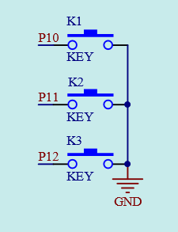
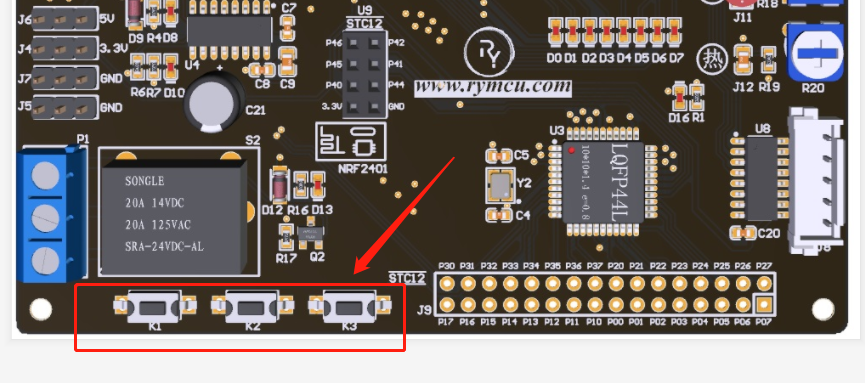

#  第9章 按键实验

前面几章讲解的都是把I/O口当成输出管脚使用，本章将通过按键实验学习I/O口的输入功能。按键作为一种输入设备，在实际应用中非常的广泛。根据按键的使用原理不同分为独立按键和矩阵按键，本章将详细介绍这两种按键的使用。

## 9.1按键原理

独立按键的原理非常简单，如下图所示：

  

图9-1 独立按键原理图

如图所示，K1~K3共3个按键分别与单片机的P10~P12管脚连接。例如，当按下按键K1后，P10管脚为低电平，在单片机中通过检测P10管脚是否为低电平，便可知道K1是否按下。按键在电路板位置如下图所示：

  

图9-2 三个按键位置布局

细心的朋友可能会发现，K1~K3和LED小灯D0~D2共用了单片机的I/O口P10~P12。当你按下按键时，相当于将I/O口拉为低电平。因此，你分别按下按键K1~K3时，D0~D2将点亮。

## 9.2按键电路软件设计

本章的按键试验功能很简单，即按下按键K1时，蜂鸣器发出报警声，编写代码如下：

1.  /*******************************************************************

2.  *

3.  * ******************************************************************

4.  * 【主芯片】：STC89SC52/STC12C5A60S2

5.  * 【主频率】: 11.0592MHz

6.  *

7.  * 【版  本】： V1.0

8.  * 【作  者】： hugh

9.  * 【网  站】： https://rymcu.com

10. * 【邮  箱】： hugh\@rymcu.com

11. * 【店  铺】： rymcu.taobao.com

12. *

13. * 【版  权】All Rights Reserved

14. * 【声  明】此程序仅用于学习与参考，引用请注明版权和作者信息！

15.           

16. * 【功  能】按键试验

17. *******************************************************************/

18. #include<reg52.h>  

19.   

20. sbit FM = P0^0;//蜂鸣器管脚位定义

21. sbit K1 = P1^0;//独立按键管脚定义

22.   

23. void main()

24. {

25.     while(1)

26.     {

27.         if(K1==0)

28.         {

29.             FM =0;//按键按下，蜂鸣器报警

30.         }

31.         else

32.         {

33.             FM =1;//按键未按下，停止报警

34.         }

35.     }

36. }

图9-3 按键试验

按下按键K1，蜂鸣器将报警，弹起按键，蜂鸣器停止报警。

## 9.3下载验证

本节首次介绍了单片机IO口的输入功能。
