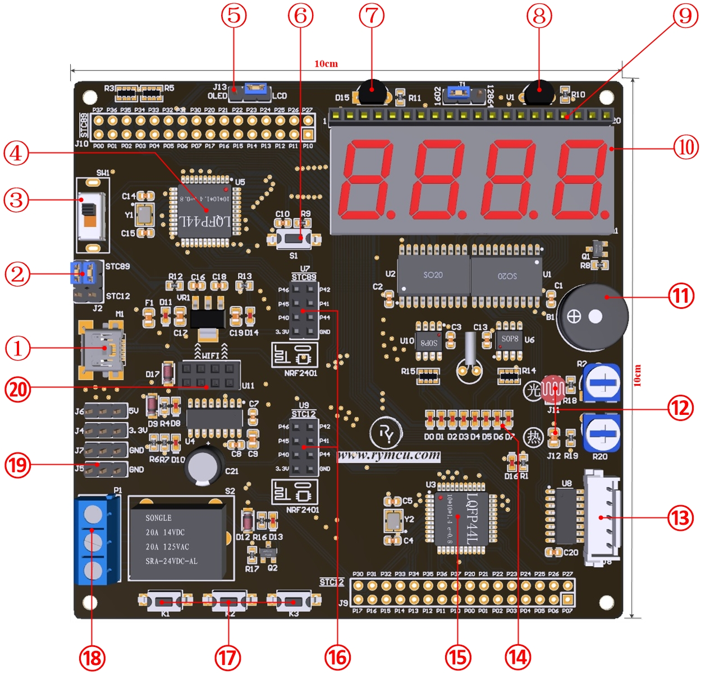
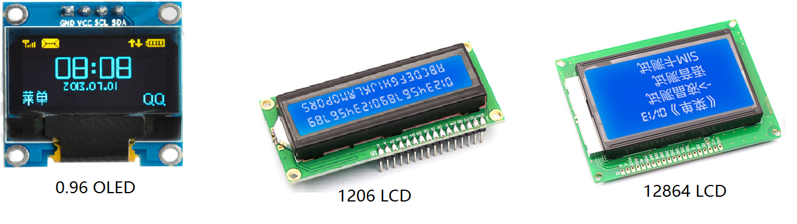
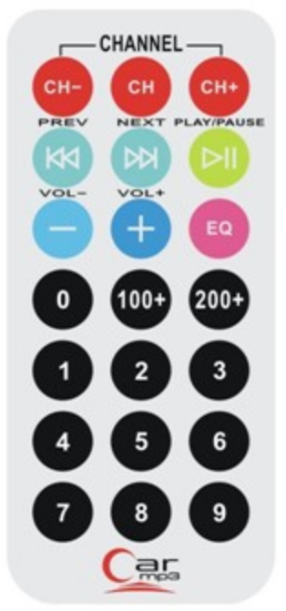
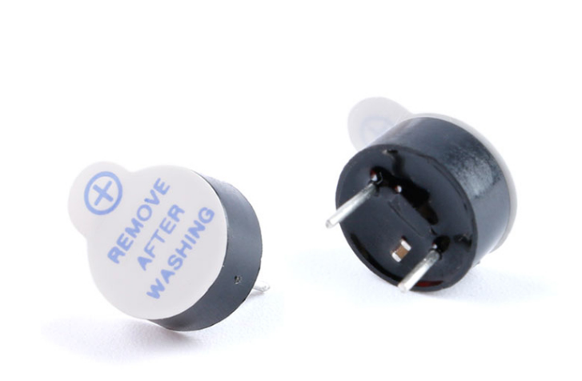
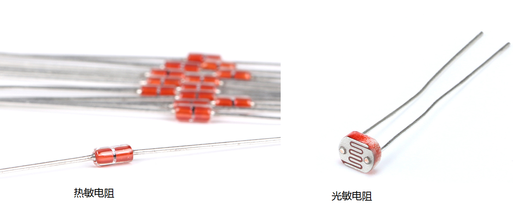
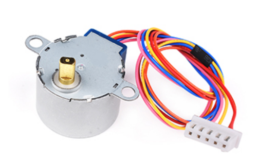
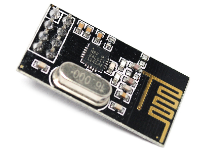
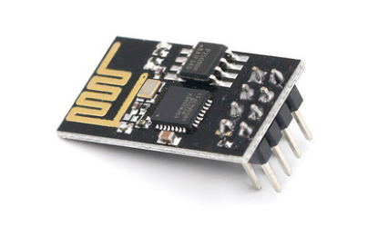

#  第1章 开发板实验平台

## 前言

初次接触开发板的朋友对这个概念会有点陌生，什么是开发板？为什么要有开发板？开发板是干什么用的？用别人的开发板行不行？

开发单片机程序，不是仅仅为了让程序在这个小黑盒里面运行，开发的最大目的就是为了用来控制其他设备。例如让数码管显示数字、点亮LED小灯、小喇叭发出"嘟嘟"的声音等等。需要实现这些功能，只在电脑上仿真是行不通的。因此，我们需要这样一种硬件设备，在它上面集成了除单片机之外，还得包括，如LED小灯、数码管等各式各样的外围设备，并且能充分的验证单片机的各项功能。

这就是开发板，开发板其实就是一块电路板或者叫线路板，有时候也叫PCB板。在开发板上有很多的设备，并且都连接到了单片机上，可以通过单片机来控制他们。评价一款单片机开发板的优劣，我们不单要看外形尺寸是不是小巧玲珑、布局布线是不是即精美又优雅，更重要的是，开发板能不能尽可能多的验证单片机的功能，也就是说包含的外围设备是否足够多。其实市面上的开发板多如牛毛，随处可见，那么我用你的程序，用别的开发板行不行？对于资深玩家来说是可行的，对于新手来说是不可行的。

因为，不同的开发板，设计是不一样的。也就是说同样的外围设备连接到具体单片机的哪个引脚是不一样的，所以，程序代码是不能通用的。对于资深玩家来说，他可以自己手动更改程序里面的配置，这样就可以适应不同的开发板；而对于初学者来说，更改配置稍有难度，不建议使用。

所以，初学者在选购开发板时，一定要选购有配套教程的。当然，学完了本套教程这些问题自然会迎刃而解。

学好单片机，动手操作是必不可少的，一套好的开发板平台是动手操作的关键所在！因此，我们设计了一套单片机开发板，产品代号为Nebula-Pi(星云派)，产品大小为10cm x 10cm，涵盖了众多外围设备，外形渲染图如下所示。为了后续更好的学习单片机的开发，本章将对Nebula-Pi(星云派)外设进行概括讲解，希望大家对总体性有一定的了解，具体技术细节不必深究。

  

Nebula-Pi开发板平台

## 1.1主板结构及布局

图1.1 Nebula-Pi单片机开发平台

## 1.2主板元件说明

从图1.1可以看出，Nebula-Pi开发板平台资源丰富，不仅涵盖了51单片机所有内部资源，还扩展了大量的外设，单片机的各项功能均可以在平台上得到验证。我们以顺时针的顺序从**①**到**⑳**，分别介绍主要模块的功能。

| 序号 | 元器件 | 功能介绍 |
| --- | --- | --- | 
| 1 | 迷你 USB 接口 | 给开发板供电，以及计算机与开发板通信 | 
| 2 | 单片机跳线帽 | 开发板上有两块独立的 51 单片机，可以通过这个跳线进行切换，选择你需要使用的单片机。 | 
| 3 | 电源开关 | 开发板电源开关 | 
| 4 | 51 单片机 STC89C52 | 这套教程的主角，51 单片机，选用 STC 公司的 STC89C52 型号进行讲解 | 
| 5 | 液晶显示器跳线帽 | 液晶显示器的跳线，可以选择 OLED 或者 LCD | 
| 6 | 主板复位按钮 | 复位按钮，相当于电脑的重启按键 | 
| 7 | 数字温度传感器 | 温度传感器，可以测量环境温度 | 
| 8 | 红外接收头 | 接收红外遥控信号专用 | 
| 9 | 液晶显示器接口 | 预留的液晶显示器 1602/12864 等的接口 | 
| 10 | 数码管 | 4 位数码管，可以同时显示 4 个数字等 | 
| 11 | 蜂鸣器 | 相当于开发板的小喇叭，可以发出"滴滴"等声音 | 
| 12 | 光敏&热敏电阻 | 两种类型的电阻，分别可以用来测量光强度和温度 | 
| 13 | 步进电机接口 | 预留给电机的接口 | 
| 14 | 8 个 LED 灯 | 8 个 LED 小灯，可实现指示灯，流水灯等效果 | 
| 15 | 增强型 51 单片机 STC12 | 开发板上的另外一块 51 单片机，比主角功能更强大，第一块用来学习，这一块用来做项目，学习、实践两不误 | 
| 16 | 2.4G 无线模块接口 | 为 2.4G 无线通信模块预留的接口，无线通信距离可以达到 1-2Km，大大扩展了开发板的功能 | 
| 17 | 3 个独立按键 | 3 个按键，可以当做开发板的输入设备，相当于迷你版键盘 | 
| 18 | 继电器接口 | 开发板上集成了继电器，这个接口预留给用户接线用的，可以用来控制 220V 设备的开关。因此，可以通过开发板來控制各种类型的家用电器 | 
| 19 | 电源端子 | 预留了 5V 和 3.3V 的电源端子，可以用来给其他设备供电 | 
| 20 | WiFi 模块接口 | WiFi 模块接口，接上 WiFi 模块，开发板可以轻松上网冲浪 | 

表1-1 主板元器件说明

### 迷你USB接口

开发板作为一个电子设备，首先得有电才能工作，给开发板供电是我们接下来所有操作的基础。怎样的供电方式是我们最容易获得又最简单？第一个想到的应该是USB供电，平常使用的手机、ipad、小型的电子设备，几乎都有USB接口用来充电，所以我们也不例外，开发板上设计了一个USB接口。

根据不同的应用场合，USB接口又分为好多种类型，包括TYPE-A、TYPE-B、TYPE-C、迷你USB等。平常生活中因为这种接口多样性造成的困扰，也许大家深有体会。小米手机的USB充电线是一种，华为手机的是一种，而苹果手机又是一种，给手机充个电还需匹配充电线，确实有点麻烦。但是归根结底他们都是USB接口，只是接口外形尺寸，即封装不一样。

而我们这里选择的是迷你USB。手机的充电线不仅可以充电，而且还可以连接至电脑，来拷贝照片，安装应用和电脑通信的功能等。同样的道理，开发板上的USB接口同样具备供电以及通信的功能。例如，单片机开发时设计的程序代码，就是通过这个USB接口从电脑上把程序下载进去的。具体怎么操作，我们后续的教程会手把手的教。

总而言之，开发板的迷你USB接口的作用就2个，给开发板供电、与电脑通信。

### 单片机跳线帽

单片机跳线帽是用来手动切换单片机的。因为我们的开发板上有两块单片机，而USB接口只有一个，所以设置了这个跳线帽，需要给哪个单片机下载程序代码，通过这个跳线帽切换一下即可。

### 电源开关

这个无需过多介绍，我们连好USB线之后，并不是直接给整个开发板都供上电，而是设置了这个电源开关，需要时拨动开关来供电或者断电。

### 51单片机STC89C52

本教程的主角，51单片机，选用STC公司的STC89C52型号进行讲解。对于刚接触单片机的朋友来说，会觉得很奇怪，明明我们这里介绍的单片机型号的后缀为C52，为什么偏偏叫51单片机？单片机又是个什么东西？没关系，有疑问说明有兴趣，有了兴趣，一切都好办了，掌握乃至精通就只是时间问题了，相关的内容我们都会在后续的教程慢慢讲来。

那我们现在先来解决51单片机叫法的由来。大名鼎鼎的 [英特尔](https://baike.baidu.com/item/%E8%8B%B1%E7%89%B9%E5%B0%94) 公司于1981年设计和制造了名为8051的微型处理器，并将8051的核心技术授权给了很多其它公司。因此，但凡是以8051为核心制造的单片机我们都称之为51单片机。得益于这种技术授权的方式，许许多多的公司开始生产各式各样的单片机，著名的公司包括因特尔（intel）、摩托罗拉（Motorola）、德州仪器（TI）、美国国家半导体（NI）、深圳宏晶科技（STC）等。

尽管众多公司生产了种类繁多的51单片机，他们的核心都是基于8051。时间在滚滚流逝，8051内核切经久不息，从1981年至今没有太多改变。因此我们只需要学习其中一款，掌握了51单片机核心的开发，其他各个51单片机便可以举一反三并融会贯通。

我们选择深圳宏晶科技（STC）的STC89C52作为我们的教学平台，是因为官方提供详细的中文文档以及例程，容易上手。网络上有众多关于他的开发内容以及专业知识的解答，可以毫不夸张的说我们开发中遇到的99%的问题都可以从网上找到答案，非常适合初学者。

对于新手而言，单片机是个什么东西？我们以STC89C52为例，当你拿到我们的开发板时，便清晰可见，就是如图**④**所示一个黑不溜秋的小芯片，尺寸为10mm x10mm的黑色小方块，周围有44个金属引脚。一句话概括我们将要学习的单片机开发，编写各式各样的程序，下载到单片机里面，用来控制连接在这些引脚上的各种外部设备。

这里的单片机看起来是一个小小的芯片，在她的内部可是集成了丰富的资源。下面我们简单列举一下她内部包含的资源，现阶段不必去深究这些资源的具体意义，有一个大概的了解即可。

STC89C52RC单片机工作电压为：5.5V\~3.8V，配备8Kbyte的FLASH程序存储器、512Byte的数据存储器SRAM、3个定时器、1个UART串行通行口、5Kbyte的EEPROM存储器、32路I/O口等。

### 液晶显示器跳线帽

由于我们开发板空间和资源有限，不能同时安装多个不同类型的显示器，因此，设置了跳线帽，可以简单通过插拔跳线帽来适配不同显示器。开发板支持的显示器包括以下三种：

### 主板复位按钮

复位按钮，相当于电脑的重启按键。如果想让单片机的程序从头开始运行，按一下复位按键即可。当单片机程序在运行过程中跑飞了，即没有按照预定的方式运行，按一下复位键从头开始运行。

### 数字温度传感器

开发板上配置了一个温度传感器，型号为DS18B20，单片机可以通过他轻松的获取环境温度。

### 红外接收头

大家是否有想过，家里的电视，空调的遥控器怎么实现的？没错，大部分使用的都是红外接收、发射技术，遥控器就是一个红外发送装置，如下图所示。电视机和空调里面都有红外接收头。

因此，为了掌握这种生活中最常用的技术，我们开发板配置了红外接收头，另外再配套一个红外发送遥控器，后续课程中我们将详细讲解红外通信的具体原理，并通过实例实现红外通信。

### 液晶显示器接口

一款优秀的开发板，怎么能少了液晶显示器的接口？就好比智能手机不能连网一样，岂不是很痛苦。为了满足**⑤**所示的三种液晶显示器接口要求，我们这里做了通用化设计，三种显示器可随时切换。如何通过单片机操作显示器，将会是我们教程的重点之一。

### 数码管

数码管的应用在现实生活中非常的广泛，比较常见的包括火车站或者机场的大型数字电子时钟、家用电器的数码显示屏、食堂刷卡机，以及各类型的仪器仪表等。

虽然，在不同的应用场景下，数码管的大小、样式、形态各异，但万不离其宗，他们的工作原理都是一样的。因此，开发板配套了4位数码管，后续专门开辟章节讲解数码管的工作原理，以及如何使用单片机控制数码管工作。

### 蜂鸣器

蜂鸣器相当于开发板的小喇叭，可以发出"滴滴"等声音。它的实际应用同样也是不胜枚举，各种电子设备的报警声，汽车转向时的"哒哒"声等，都是通过蜂鸣器发出来的。甚至可以通过单片机编程实现播放简单音乐的功能。

### 光敏&热敏电阻

从名字上就可以直观的了解到，这两个都是电阻，和常见的电阻、电容一样，都属于电子元器件的一种。光敏电阻有一种比较特殊的属性，光照在它表面，它的电阻值会随着光的强度变化而发生变化。因此，我们通过测量光敏电阻阻值的大小，便可以折算出外界光照强度。

我们举一个生活中比较常见的例子，楼梯的声控感应灯。大家是否发现了，楼梯口的声控感应灯在白天的时候并不会点亮，只有晚上的时候才能声控。原因就是里面安装了光敏电阻，通过光照强度来区分了白天和黑夜。

同样的道理，热敏电阻的特殊属性为阻值随着温度的变化而发生变化，同样可以用来测量温度用。这两种元器件最大的特点为极致性价比，非常适合用于低成本场合，具有广阔的市场空间，外形如下图所示。

### 步进电机接口

开发板上预留了步进电机接口，安装好如下图所示的电机，便可以实现单片机控制电机转动了。电机的应用同样非常的广泛，包括空调的风向控制，机器人手臂的动作，以及许多需要精确控制位置的的场合都需要用到电机。前不久我国嫦娥号月球采样土壤的过程中，电机控制便是一个非常重要的环节。如何通过单片机控制电机动作，将在本教程中进行详细讲解，敬请期待。

### 8个LED灯

LED灯的应用可以说无孔不入，就拿我手边的设备来说，键盘有指示灯，鼠标有指示灯，显示器电源有指示灯，台式机主机同样有好几个指示灯，街角树上寻彩夺目的节日氛围灯，其实也是LED小灯。但凡是电子设备，似乎都离不开LED灯。因此，离开了LED灯的开发板是不讲究的。开发板上设计了8个LED小灯，专门用来实现各种各样的效果。掌握了LED灯的基本应用后，可以尽情挥洒你的聪明才智，创造LED灯的精彩新视界。

### 增强型51单片机STC12

开发板上另外一块51单片机，比主角功能更强大，第一块用来学习，这一块用来做项目，学习、实践两不误。经过多年的实践，我们发现，第一块单片机是初学者入门的最佳选择，并不是实际项目的最佳选择。真正做项目时，往往需要单片机具有更加丰富的资源。而一款开发板，如果只适合学习，而不适合实际项目的仿真，我们认为这是一种资源的浪费。因此，我们综合考虑，在本来空间就不是很宽裕的开发板上增加了这款STC12单片机，尽管这样提高了研制成本。

而为什么选择的是STC12 ？STC12单片机内部集成资源比第一块51单片机丰富许多，非常适合做项目，而且它们俩的引脚布局定义是可以兼容的，因此，51单片机的程序代码可无缝对接，直接下载至STC12运行，过程丝滑无障碍。

### 2.4G无线模块接口

随着物联网的不断发展，无线通信已经成为了人们生产、生活的基础设施。开发板为2.4G无线通信模块NRF2401预留了2个接口，一个用来发送，一个用来接收！因此，在一块开发板上便可实现无线通信收发功能。NRF2401无线通信距离可以达到1-2Km，大大的扩展了开发板的功能。

### 3个独立按键

3个按键，可以当做开发板的输入设备，相当于迷你版本的键盘。

### 继电器接口

前面介绍过，我们的单片机其实是通过USB进行供电的，USB输出的电压为直流电压5V，因此，我们开发板上最大电压不会超过5V。通常来说，只要电压小于36V，对人体来说都是安全的，不会担心有触电危险。对于这种低于安全电压的系统我们都称之为弱电系统，否则叫强电系统。而开发板就属于弱电系统，因此，我们在进行单片机开发的时候，无论你怎么折腾都不会有触电等安全问题，尽管放心操作。

大家都知道我国家庭用电是220V交流电，属于强电系统，是非常危险的，因此，如果没有相应的技能和安全措施，千万不要私自去拆装拖线板、插座面板、以及更换白炽灯泡等等。

同样的道理，弱电系统也不能直接和强电系统相连，否则弱电系统将遭受灭顶之灾。也就是说，我们的开发板不能直接连接到家用电器上。那我们又想用单片机来控制自己的家电设备，比如台灯的打开与关闭、空调的开启与停止。这个时候我们就需要一种中间装置，来连通两种类型的系统，他就是我们这里讲的继电器。

开发板上集成了继电器，这个接口预留给用户接线用，可以用来控制220V设备的开关。因此，可以通过开发板控制各种类型的家用电器。

虽然，我们的开发板具备了控制强电设备的能力，但是大家一定要注意，在没有掌握相关知识和技能前，千万别试图去使用它，**安全第一！**

### 电源端子

为了方便开发和调试，开发板上预留了5V和3.3V的电源端子，直接可以使用杜邦线引出来，用来给其他设备供电。

### WiFi模块接口

WiFi想必大家已非常熟悉，开发板预留了WiFi模块ESP8266的接口，接上WiFi模块，开发板可以轻松上网冲浪。

假设我想通过手机控制开发板的数码管显示数字、或者让液晶屏播放图片、蜂鸣器发出"嘟嘟"的声音，或者想要在电脑网页上实时显示环境温度等等。只要给开发板安装好WiFi模块，这一切都可以轻松实现。

## 1.3 本章小结

本章详细介绍了51单片机开发板Nebula-Pi(星云派)资源，后续章节将会对资源的组合及使用进行详细的介绍。
